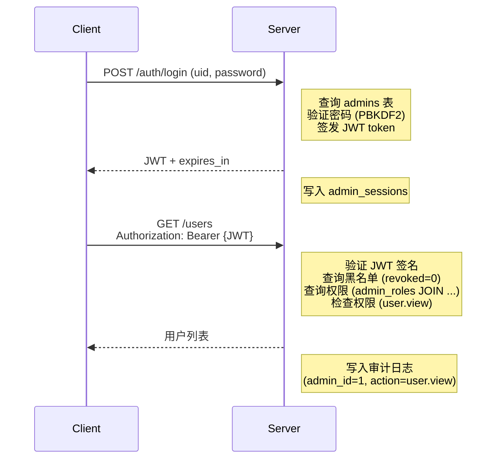

# Admin API 设计

> Base URL: `http://{host}:9091/api/v1`  
> Auth: `Authorization: Bearer {JWT_TOKEN}`  
> Content-Type: `application/json`  
> 最后更新：2026-04-16

---

## 1. 统一响应格式

**成功响应：**
```json
{
  "code": 0,
  "msg": "success",
  "data": { /* ... */ }
}
```

**错误响应：**
```json
{
  "code": 5,
  "msg": "错误描述",
  "data": null
}
```

**错误码对照表：**
| 码值 | 说明 | HTTP 状态 |
|------|------|---------|
| 0 | 成功 | 200 |
| 1 | 参数错误 | 200/400/409/413 |
| 2 | 未登录 / 无效 token | 401 |
| 3 | 无权限 | 403/429 |
| 4 | 资源不存在 | 200 |
| 5 | 服务器内部错误 | 200 |

> 所有错误已提取为 `api_err` 命名空间的 28 个 `constexpr ApiError` 常量，定义在 `server/admin/http_helper.h`。

---

## 2. 统一分页参数

**查询字符串形式：**  
`?page=1&page_size=20`（默认值：page=1, page_size=20，最大100）

**分页响应体：**
```json
{
  "code": 0,
  "data": {
    "items": [
      { /* ... 记录 ... */ }
    ],
    "total": 156,
    "page": 1,
    "page_size": 20,
    "total_pages": 8
  }
}
```

---

## 3. 认证模块 (Auth)

### POST /auth/login

**功能：** 管理员登录，验证身份后签发 JWT token

**权限要求：** 无（public）

**请求体：**
```json
{
  "uid": "admin",
  "password": "nova2024"
}
```

**成功响应 (200)：**
```json
{
  "code": 0,
  "data": {
    "admin_id": 1,
    "token": "eyJhbGciOiJIUzI1NiIsInR5...",
    "token_type": "Bearer",
    "expires_in": 86400
  }
}
```

**失败响应 (401)：**
```json
{
  "code": 2,
  "msg": "Invalid credentials"
}
```

**说明：**
- 返回的 `admin_id` 用于后续请求的身份标识
- `token` 有效期由 `admin.jwt_expires` 配置决定
- 客户端应存储 token，用于后续请求的 Authorization 头

---

### POST /auth/logout

**功能：** 管理员登出，吊销当前 JWT token

**权限要求：** `admin.login`

**请求体：** 无

**成功响应 (200)：**
```json
{
  "code": 0,
  "data": {}
}
```

**说明：**
- 吊销 token 会添加到黑名单，该 token 后续无法使用
- 客户端应删除本地存储的 token

---

### GET /auth/me

**功能：** 获取当前登录管理员的信息 + 权限列表

**权限要求：** 需要有效 JWT token

**请求参数：** 无

**成功响应 (200)：**
```json
{
  "code": 0,
  "data": {
    "admin_id": 1,
    "uid": "admin",
    "nickname": "系统管理员",
    "status": 1,
    "roles": ["super_admin"],
    "permissions": [
      "admin.login",
      "admin.dashboard",
      "admin.audit",
      "user.view",
      "user.create",
      "user.edit",
      "user.delete",
      "user.ban",
      "msg.recall"
    ]
  }
}
```

**说明：**
- `admin_id` 是本管理员在系统中的唯一 ID，位于 admins 表
- `permissions` 是精确匹配的权限代码列表
- 用于前端判断是否显示某些功能按钮

---

## 4. 仪表盘 (Dashboard)

### GET /dashboard/stats

**功能：** 获取实时运行统计数据

**权限要求：** `admin.dashboard`

**请求参数：** 无

**成功响应 (200)：**
```json
{
  "code": 0,
  "data": {
    "connections": 1024,
    "online_users": 768,
    "messages_today": 45620,
    "bad_packets": 12,
    "uptime_seconds": 259200,
    "cpu_percent": 15.2,
    "memory_mb": 512,
    "timestamp": "2026-04-15T14:30:00Z"
  }
}
```

---

## 5. 用户管理 (Users)

### GET /users

**功能：** 分页查询用户列表，支持筛选

**权限要求：** `user.view`

**请求参数：**
```
GET /users?page=1&page_size=20&keyword=john&status=1
```
| 参数 | 类型 | 说明 | 默认值 |
|------|------|------|--------|
| page | int | 页码 | 1 |
| page_size | int | 每页数量 | 20 |
| keyword | string | 搜索 uid/nickname（可选） | - |
| status | int | 状态筛选: 1-正常 2-禁用 3-删除（可选） | - |

**成功响应 (200)：**
```json
{
  "code": 0,
  "data": {
    "items": [
      {
        "id": 101,
        "uid": "john",
        "nickname": "John",
        "status": 1,
        "is_online": true,
        "device_count": 2,
        "created_at": "2026-04-10T10:00:00Z",
        "updated_at": "2026-04-15T14:30:00Z"
      },
      {
        "id": 102,
        "uid": "jane",
        "nickname": "Jane",
        "status": 2,
        "is_online": false,
        "device_count": 1,
        "created_at": "2026-04-12T10:00:00Z",
        "updated_at": "2026-04-15T13:45:00Z"
      }
    ],
    "total": 567,
    "page": 1,
    "page_size": 20
  }
}
```

---

### POST /users

**功能：** 创建新用户

**权限要求：** `user.create`

**请求体：**
```json
{
  "email": "user@example.com",
  "password": "secure_password",
  "nickname": "New User"
}
```

**校验规则：**
- `email`：必填，自动转小写，格式校验（含 `@` 和 `.`），最长 255 字符，不允许重复
- `password`：必填，6–128 字符
- `nickname`：可选，默认为 email

**成功响应 (200)：**
```json
{
  "code": 0,
  "data": {
    "id": 1001,
    "email": "user@example.com"
  }
}
```

**失败响应：**

| code | msg | HTTP |
|------|-----|------|
| 1 | email and password required | 400 |
| 1 | email and password must be strings | 400 |
| 1 | email and password cannot be empty | 400 |
| 1 | invalid email format | 400 |
| 1 | email must be at most 255 characters | 400 |
| 1 | password must be at least 6 characters | 400 |
| 1 | password must be at most 128 characters | 400 |
| 1 | email already exists | 409 |
| 5 | failed to hash password | 500 |
| 5 | failed to create user | 500 |

**并发安全：** Insert 失败时重新检查 FindByEmail 区分 UNIQUE 冲突与 DB 错误 (TOCTOU 防护)

**审计记录：** action = "user.create"

---

### GET /users/:id

**功能：** 获取单个用户详情 + 设备列表

**权限要求：** `user.view`

**请求参数：** 无

**成功响应 (200)：**
```json
{
  "code": 0,
  "data": {
    "id": 101,
    "uid": "john",
    "nickname": "John",
    "status": 1,
    "is_online": true,
    "created_at": "2026-04-10T10:00:00Z",
    "updated_at": "2026-04-15T14:30:00Z",
    "devices": [
      {
        "device_id": 1,
        "device_name": "iPhone",
        "is_online": true,
        "last_seen": "2026-04-15T14:28:00Z"
      },
      {
        "device_id": 2,
        "device_name": "Mac",
        "is_online": false,
        "last_seen": "2026-04-15T10:00:00Z"
      }
    ]
  }
}
```

---

### DELETE /users/:id

**功能：** 删除用户（软删除，设为 status=3）

**权限要求：** `user.delete`

**请求体：** 无

**成功响应 (200)：**
```json
{
  "code": 0,
  "data": {}
}
```

**审计记录：** action = "user.delete"

---

### POST /users/:id/reset-password

**功能：** 重置用户密码

**权限要求：** `user.edit`

**请求体：**
```json
{
  "new_password": "new_secure_password"
}
```

**校验规则：**
- `new_password`：必填，必须为字符串，非空，6–128 字符

**成功响应 (200)：**
```json
{
  "code": 0,
  "data": {}
}
```

**审计记录：** action = "user.reset_password"

---

### POST /users/:id/ban

**功能：** 禁用用户（status = 2）并踢下线

**权限要求：** `user.ban`

**请求体：**
```json
{
  "reason": "违反社区准则"
}
```

**成功响应 (200)：**
```json
{
  "code": 0,
  "data": {}
}
```

**审计记录：** action = "user.ban", detail = {"reason": "..."}

---

### POST /users/:id/unban

**功能：** 解禁用户（status = 1）

**权限要求：** `user.ban`

**请求体：** 无

**成功响应 (200)：**
```json
{
  "code": 0,
  "data": {}
}
```

**审计记录：** action = "user.unban"

---

### POST /users/:id/kick

**功能：** 立即踢出所有在线连接

**权限要求：** `user.edit`

**请求体：** 无

**成功响应 (200)：**
```json
{
  "code": 0,
  "data": {
    "kicked_devices": 2
  }
}
```

**审计记录：** action = "user.kick"

---

## 6. 消息管理 (Messages)

### GET /messages

**功能：** 分页查询消息列表

**权限要求：** `msg.view`

**请求参数：**
```
GET /messages?page=1&page_size=50&conversation_id=10&start_time=2026-04-15T00:00:00Z&end_time=2026-04-15T23:59:59Z
```

**成功响应 (200)：**
```json
{
  "code": 0,
  "data": {
    "items": [
      {
        "id": 5001,
        "conversation_id": 10,
        "sender_uid": "john",
        "content": "Hello",
        "status": 1,
        "seq": 1001,
        "created_at": "2026-04-15T14:00:00Z"
      }
    ],
    "total": 120,
    "page": 1,
    "page_size": 50
  }
}
```

---

### POST /messages/:id/recall

**功能：** 撤回消息

**权限要求：** `msg.recall`

**请求体：**
```json
{
  "reason": "消息包含敏感信息"
}
```

**成功响应 (200)：**
```json
{
  "code": 0,
  "data": {}
}
```

**审计记录：** action = "msg.recall", detail = {"reason": "..."}

---

## 7. 审计日志 (Audit)

### GET /audit-logs

**功能：** 查询所有管理员操作的审计日志

**权限要求：** `admin.audit`

**请求参数：**
```
GET /audit-logs?page=1&page_size=50&admin_id=1&action=user.create&start_time=2026-04-15T00:00:00Z&end_time=2026-04-15T23:59:59Z
```
| 参数 | 说明 |
|------|------|
| page | 页码 |
| page_size | 每页数量 |
| admin_id | 操作者管理员 ID（可选） |
| action | 操作类型代码（可选） |
| start_time | 起始时间（可选） |
| end_time | 结束时间（可选） |

**成功响应 (200)：**
```json
{
  "code": 0,
  "data": {
    "items": [
      {
        "id": 9001,
        "admin_id": 1,
        "admin_uid": "admin",
        "action": "user.create",
        "target_type": "user",
        "target_id": 101,
        "detail": "{\"uid\": \"newuser\"}",
        "ip_address": "192.168.1.100",
        "created_at": "2026-04-15T14:30:00Z"
      }
    ],
    "total": 256,
    "page": 1,
    "page_size": 50
  }
}
```

**说明：**
- `admin_id` 是执行操作的管理员 ID（来自 admins 表）
- `admin_uid` 是该管理员的用户名
- 所有写操作都会被自动记录到审计日志

---

## 8. 运维管理 (待实现)

### GET /admins

**功能：** 分页查询管理员列表

**权限要求：** `admin.ops.view`

**请求参数：**
```
GET /admins?page=1&page_size=20&keyword=admin&status=1
```

**成功响应 (200)：**
```json
{
  "code": 0,
  "data": {
    "items": [
      {
        "admin_id": 1,
        "uid": "admin",
        "nickname": "系统管理员",
        "status": 1,
        "roles": ["super_admin"],
        "last_login": "2026-04-15T14:30:00Z",
        "created_at": "2026-04-10T10:00:00Z"
      }
    ],
    "total": 5,
    "page": 1,
    "page_size": 20
  }
}
```

### POST /admins

**功能：** 创建新管理员账户（初始无权限，后续绑定角色）

**权限要求：** `admin.ops.create`

**请求体：**
```json
{
  "uid": "operator1",
  "nickname": "运营人员1",
  "password": "initial_password"
}
```

**成功响应 (200)：**
```json
{
  "code": 0,
  "data": {
    "admin_id": 6,
    "uid": "operator1",
    "nickname": "运营人员1",
    "status": 1
  }
}
```

**审计记录：** action = "admin.create"

### GET /admins/:id

**功能：** 获取管理员详情 + 角色和权限列表

**权限要求：** `admin.ops.view`

**成功响应 (200)：**
```json
{
  "code": 0,
  "data": {
    "admin_id": 1,
    "uid": "admin",
    "nickname": "系统管理员",
    "status": 1,
    "roles": [
      {
        "role_id": 1,
        "code": "super_admin",
        "name": "超级管理员"
      }
    ],
    "permissions": [
      "admin.login", "admin.dashboard", "admin.audit",
      "admin.ops.view", "admin.ops.create", "admin.ops.edit", "admin.ops.delete",
      "admin.roles.view", "admin.roles.create", "admin.roles.edit", "admin.roles.delete"
    ],
    "created_at": "2026-04-10T10:00:00Z",
    "last_login": "2026-04-15T14:30:00Z"
  }
}
```

### POST /admins/:id/reset-password

**功能：** 重置管理员密码

**权限要求：** `admin.ops.edit`

**请求体：**
```json
{
  "new_password": "new_admin_password"
}
```

**审计记录：** action = "admin.reset_password"

### DELETE /admins/:id

**功能：** 删除管理员（软删除 status=3）

**权限要求：** `admin.ops.delete`

**审计记录：** action = "admin.delete"

### POST /admins/:id/enable

**功能：** 启用管理员（status 1→1，允许登录）

**权限要求：** `admin.ops.edit`

**成功响应 (200)：**
```json
{
  "code": 0,
  "data": {}
}
```

**审计记录：** action = "admin.enable"

### POST /admins/:id/disable

**功能：** 禁用管理员（status 1→2，禁止登录）

**权限要求：** `admin.ops.edit`

**审计记录：** action = "admin.disable"

---

## 9. 角色管理 (待实现)

### GET /roles

**功能：** 分页查询所有角色列表

**权限要求：** `admin.roles.view`

**请求参数：**
```
GET /roles?page=1&page_size=50
```

**成功响应 (200)：**
```json
{
  "code": 0,
  "data": {
    "items": [
      {
        "role_id": 1,
        "code": "super_admin",
        "name": "超级管理员",
        "description": "拥有所有权限",
        "permission_count": 11,
        "admin_count": 1
      },
      {
        "role_id": 2,
        "code": "operator",
        "name": "运营",
        "description": "用户管理 + 消息管理",
        "permission_count": 6,
        "admin_count": 2
      }
    ],
    "total": 3,
    "page": 1,
    "page_size": 50
  }
}
```

### POST /roles

**功能：** 创建新角色

**权限要求：** `admin.roles.create`

**请求体：**
```json
{
  "code": "auditor",
  "name": "审计员",
  "description": "只读查看审计日志"
}
```

**成功响应 (200)：**
```json
{
  "code": 0,
  "data": {
    "role_id": 4,
    "code": "auditor",
    "name": "审计员"
  }
}
```

**审计记录：** action = "role.create"

### GET /roles/:id

**功能：** 获取角色详情 + 绑定的权限列表

**权限要求：** `admin.roles.view`

**成功响应 (200)：**
```json
{
  "code": 0,
  "data": {
    "role_id": 1,
    "code": "super_admin",
    "name": "超级管理员",
    "description": "拥有所有权限",
    "permissions": [
      { "permission_id": 1, "code": "admin.login", "name": "管理员登录" },
      { "permission_id": 2, "code": "admin.dashboard", "name": "查看仪表盘" },
      { "permission_id": 3, "code": "admin.audit", "name": "查看审计日志" },
      { "permission_id": 4, "code": "user.view", "name": "查看用户" },
      { "permission_id": 5, "code": "user.create", "name": "创建用户" },
      { "permission_id": 6, "code": "user.edit", "name": "编辑用户" },
      { "permission_id": 7, "code": "user.delete", "name": "删除用户" },
      { "permission_id": 8, "code": "user.ban", "name": "禁用用户" },
      { "permission_id": 9, "code": "msg.view", "name": "查看消息" },
      { "permission_id": 10, "code": "msg.recall", "name": "撤回消息" },
      { "permission_id": 11, "code": "admin.ops.view", "name": "查看管理员" }
    ]
  }
}
```

### PUT /roles/:id

**功能：** 编辑角色信息（name/description）

**权限要求：** `admin.roles.edit`

**请求体：**
```json
{
  "name": "操作员",
  "description": "用户/消息管理"
}
```

**审计记录：** action = "role.update"

### DELETE /roles/:id

**功能：** 删除角色（需约束检查：admin_roles 表无引用）

**权限要求：** `admin.roles.delete`

**失败响应 (400) — 角色被使用时：**
```json
{
  "code": 1,
  "msg": "Cannot delete role: 3 admins are using this role"
}
```

**审计记录：** action = "role.delete"

### POST /roles/:id/permissions

**功能：** 配置角色的权限列表（全量覆盖）

**权限要求：** `admin.roles.edit`

**请求体：**
```json
{
  "permission_ids": [1, 2, 4, 9]  // super_admin 的 4 个权限
}
```

**成功响应 (200)：**
```json
{
  "code": 0,
  "data": {
    "role_id": 1,
    "added": 0,
    "removed": 0,
    "current_permissions": 4
  }
}
```

**审计记录：** action = "role.permissions_update", detail = {"from": [1,2,3,...], "to": [1,2,4,9]}

### GET /permissions

**功能：** 列出所有权限（按功能模块分组显示）

**权限要求：** `admin.roles.view`

**请求参数：** 无

**成功响应 (200)：**
```json
{
  "code": 0,
  "data": {
    "groups": [
      {
        "group": "admin.*",
        "name": "管理后台权限",
        "permissions": [
          { "permission_id": 1, "code": "admin.login", "name": "管理员登录" },
          { "permission_id": 2, "code": "admin.dashboard", "name": "查看仪表盘" },
          { "permission_id": 3, "code": "admin.audit", "name": "查看审计日志" }
        ]
      },
      {
        "group": "user.*",
        "name": "用户管理权限",
        "permissions": [
          { "permission_id": 4, "code": "user.view", "name": "查看用户" },
          { "permission_id": 5, "code": "user.create", "name": "创建用户" },
          { "permission_id": 6, "code": "user.edit", "name": "编辑用户" },
          { "permission_id": 7, "code": "user.delete", "name": "删除用户" },
          { "permission_id": 8, "code": "user.ban", "name": "禁用用户" }
        ]
      },
      {
        "group": "msg.*",
        "name": "消息管理权限",
        "permissions": [
          { "permission_id": 9, "code": "msg.view", "name": "查看消息" },
          { "permission_id": 10, "code": "msg.recall", "name": "撤回消息" }
        ]
      }
    ],
    "total_permissions": 11
  }
}
```

---

### 未登录错误

```json
{
  "code": 2,
  "msg": "Missing authorization header"
}
```

### 无权限错误

```json
{
  "code": 3,
  "msg": "Insufficient permissions: require [admin.dashboard]"
}
```

### 资源不存在

```json
{
  "code": 4,
  "msg": "User not found: id=9999"
}
```

### 参数错误

```json
{
  "code": 1,
  "msg": "Invalid page_size: max 100, got 200"
}
```

---

## 9. 认证流程时序图



---

## 5. 用户管理

### GET /users

用户列表（分页 + 搜索）。

**权限：** `user.view`

**Query:** `?page=1&page_size=20&keyword=john&status=1`
- `keyword`（可选）：uid 或 nickname 模糊匹配
- `status`（可选）：0全部 1正常 2封禁

**Response:**
```json
{
  "code": 0,
  "data": {
    "items": [
      {
        "id": 1,
        "uid": "john",
        "nickname": "John",
        "avatar": "...",
        "status": 1,
        "is_online": true,
        "created_at": "2026-01-01T00:00:00Z"
      }
    ],
    "total": 156,
    "page": 1,
    "page_size": 20
  }
}
```

### POST /users

添加用户。

**权限：** `user.create`

**Request:**
```json
{
  "email": "john@example.com",
  "password": "secure_password",
  "nickname": "John"
}
```

**校验：** email 格式+长度(≤255)+唯一性，password 长度(6-128)

**Response:**
```json
{
  "code": 0,
  "data": {
    "id": 10,
    "email": "john@example.com"
  }
}
```

### GET /users/:id

用户详情。

**权限：** `user.view`

**Response:**
```json
{
  "code": 0,
  "data": {
    "id": 1,
    "uid": "john",
    "nickname": "John",
    "avatar": "...",
    "status": 1,
    "is_online": true,
    "created_at": "2026-01-01T00:00:00Z",
    "devices": [
      {
        "device_id": "iPhone_xxx",
        "device_type": "iOS",
        "last_active_at": "2026-04-15T10:00:00Z"
      }
    ]
  }
}
```

### DELETE /users/:id

删除用户（软删除，status 置为 3，同时踢下线）。

**权限：** `user.delete`

### POST /users/:id/reset-password

重置用户密码。

**权限：** `user.edit`

**Request:**
```json
{
  "new_password": "reset_password_123"
}
```

### POST /users/:id/ban

封禁用户（同时踢下线）。

**权限：** `user.ban`

**Request:**
```json
{
  "reason": "违规发言"
}
```

### POST /users/:id/unban

解封用户。

**权限：** `user.ban`

### POST /users/:id/kick

踢用户下线（已有，增强审计）。

**权限：** `user.ban`

---

## 6. 消息管理

### GET /messages

消息查询（分页）。

**权限：** `msg.delete_all`

**Query:** `?conversation_id=100&page=1&page_size=50&start_time=2026-04-01&end_time=2026-04-15`

**Response:**
```json
{
  "code": 0,
  "data": {
    "items": [
      {
        "id": 1001,
        "conversation_id": 100,
        "sender_id": 5,
        "sender_uid": "john",
        "seq": 42,
        "msg_type": 1,
        "content": "hello",
        "status": 0,
        "created_at": "2026-04-15T10:00:00Z"
      }
    ],
    "total": 500,
    "page": 1,
    "page_size": 50
  }
}
```

### POST /messages/:id/recall

撤回消息（设置 status=1）。

**权限：** `msg.delete_all`

**Request:**
```json
{
  "reason": "违规内容"
}
```

---

## 7. 审计日志

### GET /audit-logs

查询操作日志（分页）。

**权限：** `admin.dashboard`

**Query:** `?page=1&page_size=20&user_id=1&action=user.ban&start_time=2026-04-01`

**Response:**
```json
{
  "code": 0,
  "data": {
    "items": [
      {
        "id": 1,
        "user_id": 1,
        "operator_uid": "admin",
        "action": "user.ban",
        "target_type": "user",
        "target_id": 5,
        "detail": {"reason": "违规发言"},
        "ip": "192.168.1.1",
        "created_at": "2026-04-15T10:00:00Z"
      }
    ],
    "total": 30,
    "page": 1,
    "page_size": 20
  }
}
```

---

## 8. 健康检查（无需鉴权）

### GET /healthz

```json
{"status": "ok"}
```
