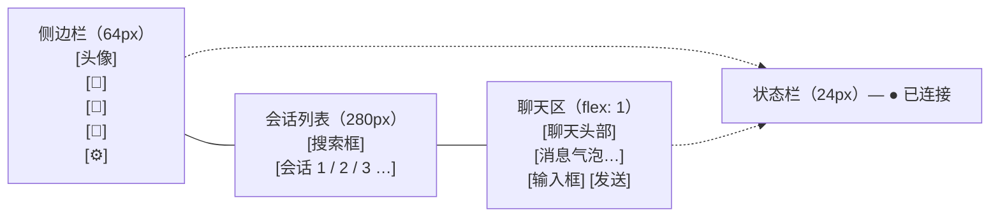

# NovaIIM Desktop Client

> Win32 + WebView2 桌面客户端

---

## 概览

NovaIIM 桌面客户端使用 **Win32 窗口 + Microsoft WebView2** 架构，C++ 后端通过 `nova_sdk` 处理 IM 逻辑，前端使用 **Vue 3 + TypeScript + Vite + Pinia** 实现 UI。

Windows 下通过 `window.__novaBridge` / `chrome.webview.postMessage` 与 C++ 通信，其他平台通信方式待定。

```
┌──────────────────────────────────────────┐
│  Win32 Window (HWND)                     │
│  ┌────────────────────────────────────┐  │
│  │  WebView2 (Chromium)               │  │
│  │  ┌──────────────────────────────┐  │  │
│  │  │  Vue 3 + TypeScript          │  │  │
│  │  │  (Vite build → dist/)        │  │  │
│  │  └──────────┬───────────────────┘  │  │
│  │             │ bridge 抽象层        │  │
│  │             │ (Win32: chrome.      │  │
│  │             │  webview.postMessage)│  │
│  └─────────────┼──────────────────────┘  │
│                │                         │
│  ┌─────────────▼──────────────────────┐  │
│  │  JsBridge (C++)                    │  │
│  │  ↔ NovaBridge (TS)                │  │
│  └─────────────┬──────────────────────┘  │
│                │                         │
│  ┌─────────────▼──────────────────────┐  │
│  │  nova_sdk (NovaClient / VMs)       │  │
│  └────────────────────────────────────┘  │
└──────────────────────────────────────────┘
```

---

## 文件结构

```
client/desktop/
├── CMakeLists.txt          # 平台路由（当前仅 Windows）
├── web/                    # Vue 3 + TypeScript 前端
│   ├── package.json        # 依赖：vue, vue-router, pinia
│   ├── vite.config.ts      # Vite 构建配置
│   ├── tsconfig.json       # TypeScript 配置
│   ├── index.html          # Vite 入口
│   ├── src/
│   │   ├── main.ts         # App 挂载 (createApp + Pinia + Router)
│   │   ├── App.vue         # 根组件 (<RouterView />)
│   │   ├── bridge/         # 平台通信抽象层
│   │   │   ├── types.ts    # NovaBridge 接口定义
│   │   │   └── index.ts    # Win32Bridge / MockBridge 实现
│   │   ├── stores/         # Pinia 状态管理
│   │   │   ├── auth.ts     # 登录/注册/登出
│   │   │   ├── chat.ts     # 会话/消息
│   │   │   └── connection.ts  # 连接状态
│   │   ├── views/          # 页面组件
│   │   │   ├── LoginView.vue  # 登录/注册（双表单切换）
│   │   │   └── MainView.vue   # 三栏聊天主界面
│   │   ├── router/
│   │   │   └── index.ts    # hash 路由 (/login, /main)
│   │   └── styles/
│   │       └── main.css    # 主题样式（CSS Variables）
│   └── dist/               # Vite 构建输出 (git ignored)
└── win/                    # Windows 平台实现
    ├── CMakeLists.txt      # 构建配置 + WebView2 SDK 下载
    ├── main.cpp            # wWinMain 入口
    ├── webview2_app.h/cpp  # Win32 窗口 + WebView2 生命周期
    ├── win32_ui_dispatcher.h/cpp  # PostMessage UI 线程投递
    ├── js_bridge.h/cpp     # C++ ↔ JS 双向通信桥
    ├── app.rc              # Windows 资源文件（图标）
    └── app.ico             # 应用图标（蓝色 N）
```

---

## C++ ↔ JS 通信协议

### JS → C++ (Actions)

通过 `NovaBridge.send(action, data)` 发送：

| Action | 参数 | 说明 |
|--------|------|------|
| `connect` | — | 连接服务器 |
| `disconnect` | — | 断开连接 |
| `login` | `{email, password}` | 登录 |
| `register` | `{email, nickname, password}` | 注册 |
| `sendMessage` | `{to, content}` | 发送消息 |

### C++ → JS (Events)

通过 `NovaBridge.on(event, callback)` 订阅：

| Event | 数据 | 说明 |
|-------|------|------|
| `loginResult` | `{success, uid, nickname, msg}` | 登录结果 |
| `registerResult` | `{success, uid, msg}` | 注册结果 |
| `connectionState` | `{state}` | 连接状态变更 |
| `newMessage` | `{conversationId, senderUid, content, serverSeq, serverTime, msgType}` | 新消息 |
| `sendMsgResult` | `{success, serverSeq, serverTime, msg}` | 发送结果 |
| `recallNotify` | `{conversationId, serverSeq, operatorUid}` | 撤回通知 |

### 通信实现

**前端 Bridge 抽象 (src/bridge/)**：

```typescript
// 接口定义 — 平台无关
export interface NovaBridge {
  send(action: string, data?: Record<string, unknown>): void
  on<T>(event: string, callback: (data: T) => void): void
  off(event: string, callback?: EventCallback): void
}

// Win32 实现 — WebView2 postMessage
class Win32Bridge implements NovaBridge {
  send(action, data) {
    window.chrome.webview.postMessage(JSON.stringify({ action, ...data }))
  }
  // C++ 通过 window.__novaBridge.onEvent() 推送事件
}

// MockBridge — 无原生环境时用于开发调试
```

**Pinia Store 封装 (src/stores/)**：
```typescript
// auth.ts — Promise-based API
const result = await auth.login(email, password)
const result = await auth.register(email, nickname, password)
auth.logout()

// chat.ts — 自动订阅 newMessage / sendMsgResult
chat.sendMessage(content, senderUid)

// connection.ts — 订阅 connectionState 事件
conn.connect() / conn.disconnect()
```

---

## UI 页面

### 登录/注册页 (LoginView.vue)

- 两个表单通过 `v-if/v-else` 切换：登录 ↔ 注册
- **登录**：邮箱 + 密码，15 秒超时（Promise）
- **注册**：邮箱 + 昵称 + 密码 + 确认密码
  - 前端校验：密码一致性、最小 6 位
  - 注册成功自动切回登录，回填邮箱
- 按钮防重复提交（computed disabled + loading 文案）

### 主界面 (MainView.vue)

三栏布局：



- 连接状态实时显示（绿/黄/红点）
- Enter 键发送消息
- XSS 防护（`escapeHtml()`）

---

## 生命周期

```
wWinMain()
  ├── CoInitializeEx(COINIT_APARTMENTTHREADED)
  ├── NovaClient(config_path)
  ├── client.Init()
  ├── WebView2App(hInstance, &client)
  ├── app.Init(nCmdShow)
  │     ├── CreateWindowExW()
  │     ├── Win32UIDispatcher::SetHwnd() + Install()
  │     └── InitWebView2()  (异步)
  │           └── OnWebViewReady()
  │                 ├── JsBridge(webview, &client)
  │                 ├── bridge.Init()  → 缓存 VM + 订阅事件
  │                 ├── SetVirtualHostNameToFolderMapping("novaim.local")
  │                 └── Navigate("https://novaim.local/index.html")
  ├── app.Run()  (Win32 消息循环)
  │     └── WM_DESTROY → bridge_.reset() → PostQuitMessage()
  ├── client.Shutdown()
  └── CoUninitialize()
```

### 线程安全

- **网络回调 → UI 线程**：所有 `PostEvent()` 通过 `UIDispatcher::Post()` 回到 UI 线程
- **生命周期守护**：`PostEvent` lambda 捕获 `weak_ptr<atomic<bool>> alive_`，执行前检查 JsBridge 是否已销毁
- **关闭顺序**：`WM_DESTROY` 先销毁 `JsBridge`，再 `PostQuitMessage`，确保 bridge 在 `client.Shutdown()` 之前释放

---

## 构建

```bash
# 1. 构建前端 (Vue + Vite)
cd client/desktop/web
npm install
npm run build          # 输出到 dist/

# 2. 构建 C++ 桌面端
cmake -B build -DNOVA_BUILD_CLIENT=ON
cmake --build build --target nova_desktop
# POST_BUILD 自动将 web/dist/ 复制到 output/bin/web/

# 输出: output/bin/nova_desktop.exe + output/bin/web/
```

### 前端开发

```bash
cd client/desktop/web
npm run dev            # Vite 开发服务器 (localhost:5173)
# MockBridge 在无 WebView2 环境下自动启用
```

### 依赖

**前端**：
- **Vue 3** + **Vue Router** (hash mode) + **Pinia** 状态管理
- **Vite** 构建工具
- **TypeScript** 类型安全

**C++ / 系统**：
- **WebView2 Runtime** — Microsoft Edge WebView2（自动下载 NuGet SDK）
- **nova_sdk.dll** — 自动复制到输出目录
- **Windows 10 1809+** — WebView2 最低系统要求
