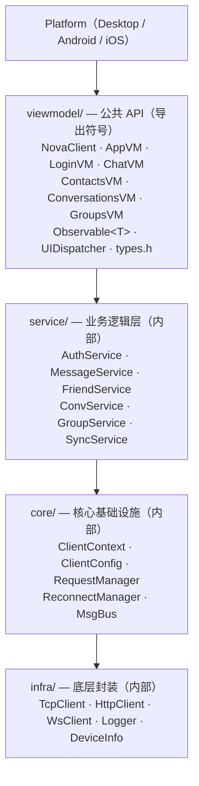

# NovaIIM Client SDK

> nova_sdk — C++20 跨平台 IM 客户端共享库 (.dll / .so / .framework)

---

## 概览

`nova_sdk` 是 NovaIIM 客户端核心库，提供完整的 IM 能力封装。上层应用（桌面端、移动端）通过公共 API 接入，无需了解底层协议和网络细节。

**架构分层：**



---

## 公共 API

### NovaClient

SDK 唯一入口，管理整个客户端生命周期。采用 PIMPL 模式隐藏实现。

```cpp
#include <viewmodel/nova_client.h>

// 构造：传入 YAML 配置文件路径
nova::client::NovaClient client("config.yaml");

// 初始化（加载配置、创建服务、缓存 ViewModel）
client.Init();

// 连接 / 断开服务器
client.Connect();
client.Disconnect();

// 获取 ViewModel（单例，生命周期与 NovaClient 一致）
auto app   = client.App();           // → shared_ptr<AppVM>
auto login = client.Login();         // → shared_ptr<LoginVM>
auto chat  = client.Chat();          // → shared_ptr<ChatVM>
auto contacts = client.Contacts();   // → shared_ptr<ContactsVM>
auto convs    = client.Conversations(); // → shared_ptr<ConversationsVM>
auto groups   = client.Groups();     // → shared_ptr<GroupsVM>

// 关闭
client.Shutdown();
```

### ViewModel

每个 ViewModel 暴露 `Observable<T>` 属性和操作方法：

#### AppVM — 连接状态
```cpp
// 观察连接状态变更
app->State().Observe([](const ClientState& s) {
    // kDisconnected / kConnecting / kConnected / kAuthenticated / kReconnecting
});
```

#### LoginVM — 登录/注册
```cpp
// 登录
login->Login("user@example.com", "password",
    [](const LoginResult& r) {
        if (r.success) { /* r.uid, r.nickname */ }
        else           { /* r.msg */ }
    });

// 注册
login->Register("user@example.com", "nickname", "password",
    [](const RegisterResult& r) {
        if (r.success) { /* r.uid */ }
        else           { /* r.msg */ }
    });

// 登出
login->Logout();

// 观察状态
login->LoggedIn().Observe([](const bool& v) { /* ... */ });
login->Uid().Observe([](const std::string& uid) { /* ... */ });
```

#### ChatVM — 消息收发
```cpp
// 发送文本消息
chat->SendTextMessage(conversation_id, "Hello",
    [](const SendMsgResult& r) {
        // r.success, r.server_seq, r.server_time, r.msg
    });

// 接收新消息
chat->OnMessageReceived([](const ReceivedMessage& msg) {
    // msg.conversation_id, msg.sender_uid, msg.content, msg.msg_type
});

// 消息撤回通知
chat->OnMessageRecalled([](const RecallNotification& n) {
    // n.conversation_id, n.server_seq, n.operator_uid
});
```

### Observable\<T\>

数据驱动 UI 的核心机制：

```cpp
Observable<int> count;

// 订阅（立即以当前值触发一次回调 + 后续变更通知）
count.Observe([](const int& v) { printf("count = %d\n", v); });

// 设置值（自动通知所有观察者）
count.Set(42);

// 获取当前值
int val = count.Get();

// 清除所有观察者
count.ClearObservers();
```

**线程安全**：`Set()` / `Get()` / `Observe()` 均在 mutex 保护下操作。`Set()` 在锁外通知观察者（使用快照），避免死锁。

### UIDispatcher

跨线程 UI 调度器。网络回调运行在 I/O 线程，UI 操作必须回到主线程：

```cpp
// 平台端注册（仅需一次）
UIDispatcher::Set([](std::function<void()> fn) {
    // 投递到主线程执行，例如 Win32 PostMessage
    PostMessage(hwnd, WM_APP, 0, reinterpret_cast<LPARAM>(new auto(std::move(fn))));
});

// SDK 或平台端调用
UIDispatcher::Post([&]() {
    // 在 UI 线程执行
    webview->ExecuteScript(...);
});
```

---

## 类型定义 (types.h)

```cpp
// 连接状态
enum class ClientState {
    kDisconnected, kConnecting, kConnected, kAuthenticated, kReconnecting
};

// 登录结果
struct LoginResult  { bool success; string uid, nickname, msg; };

// 注册结果
struct RegisterResult { bool success; string uid, msg; };

// 发送结果
struct SendMsgResult { bool success; int64_t server_seq, server_time; string msg; };

// 接收消息
struct ReceivedMessage {
    int64_t conversation_id;
    string sender_uid, content;
    int64_t server_seq, server_time;
    int32_t msg_type;
};

// 撤回通知
struct RecallNotification {
    int64_t conversation_id, server_seq;
    string operator_uid;
};

// 同步消息
struct SyncMessage {
    int64_t conversation_id, server_seq;
    string sender_uid, content, server_time;
    int32_t msg_type, status;
};
```

---

## 配置文件 (YAML)

```yaml
server_host: "127.0.0.1"
server_port: 9090
device_type: ""          # 留空自动检测 (desktop/android/ios)
device_id: ""            # 留空自动生成 (FNV-1a hash)
heartbeat_interval_ms: 30000
request_timeout_ms: 10000
reconnect_enabled: true
reconnect_min_delay_ms: 1000
reconnect_max_delay_ms: 30000
log_level: "info"
log_file: ""
```

---

## 内部架构

### 请求-响应匹配 (RequestManager)

每个发出的请求携带递增 `seq_id`，`RequestManager` 在 `pending_` 表中注册回调。收到响应时按 `seq` 匹配并触发回调。超时检查每秒运行一次。

### 自动重连 (ReconnectManager)

指数退避策略：`1s → 2s → 4s → ... → 30s`（上限可配置）。连接成功后重置延迟。

### 消息总线 (MsgBus)

基于 `hv::EventLoopThread` 的高性能发布-订阅总线，用于服务端推送消息的分发。

### 协议拆包

使用 libhv 的 `UNPACK_BY_LENGTH_FIELD` 模式：
- 包头 18 字节：`cmd(2) + seq(4) + uid(8) + body_len(4)`
- `body_offset = 18`, `length_field_offset = 14`, `length_field_bytes = 4`

---

## 平台集成

### Windows Desktop (WebView2)

```cpp
// main.cpp
NovaClient client("config.yaml");
client.Init();
WebView2App app(hInstance, &client);
app.Init(nCmdShow);
app.Run();    // Win32 消息循环
client.Shutdown();
```

### Android (JNI + Kotlin)

```kotlin
NovaClient.configure("/path/to/config.yaml")
NovaClient.connect()
NovaClient.login("email", "password")
NovaClient.sendMessage(convId, "Hello")
```

### iOS (Objective-C++)

```objc
NovaClient *client = [NovaClient sharedInstance];
[client configureWithPath:@"config.yaml"];
[client connect];
[client loginWithEmail:@"email" password:@"password"];
```

---

## 构建

```bash
# 作为 NovaIIM 子项目构建
cmake -B build -DNOVA_BUILD_CLIENT=ON
cmake --build build --target nova_sdk

# 输出
# output/bin/nova_sdk.dll  (Windows)
# output/lib/libnova_sdk.so (Linux)
```
