# NovaIIM 子功能时序图

本文档汇总各核心子功能在客户端、Server、数据库与第三方组件之间的交互时序，便于排查链路与对照实现。

参与方说明：
- **C** Client（nova_sdk + 平台 UI）
- **GW** Gateway / TCP server
- **Svc** Service 层（UserSvc / MsgSvc / FriendSvc / GroupSvc / ConvSvc / SyncSvc / FileSvc）
- **DAO** ormpp DAO + DbManager
- **DB** SQLite / MySQL
- **CM** ConnManager（多端连接）
- **Bus** 内部 MsgBus（事件解耦）
- **Admin** Admin Web 前端
- **AS** AdminServer（HTTP :9091）
- **FS** FileServer（HTTP :9092）

---

## 1. 注册

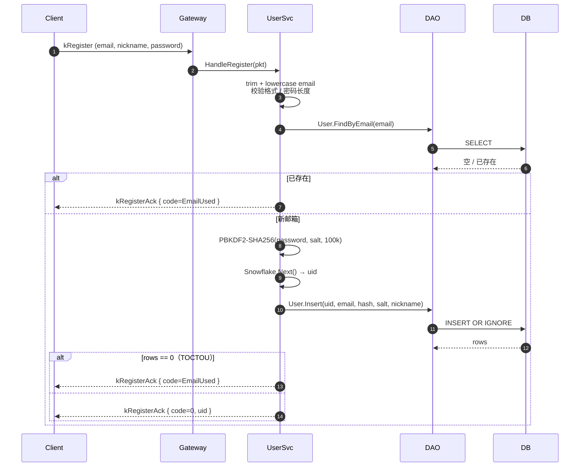

---

## 2. 登录

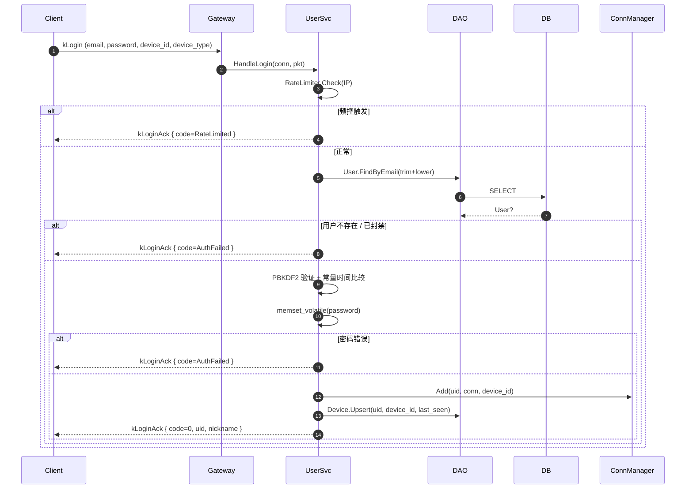

---

## 3. 心跳

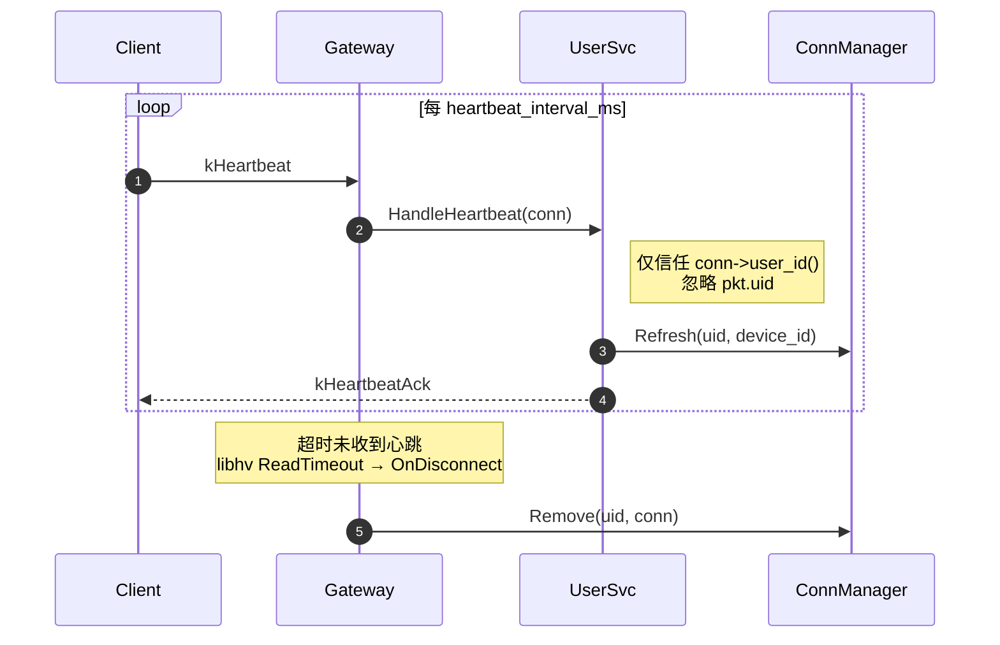

---

## 4. 自动重连（客户端）

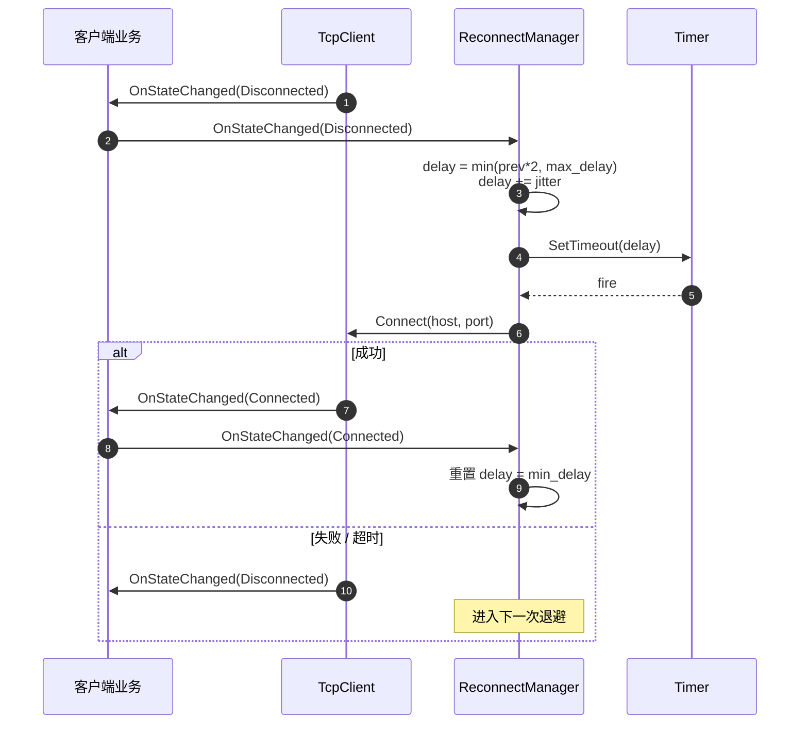

---

## 5. 发送私聊消息（在线接收）

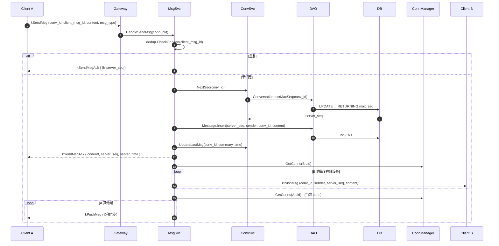

---

## 6. 离线消息同步

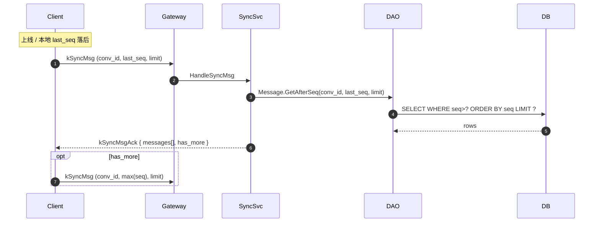

---

## 7. 消息送达 / 已读

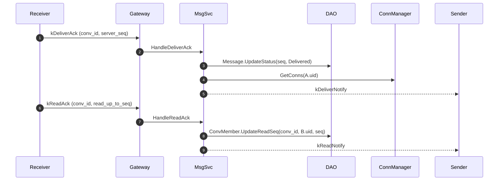

---

## 8. 消息撤回

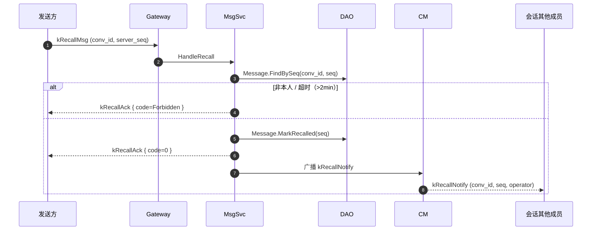

---

## 9. 添加好友

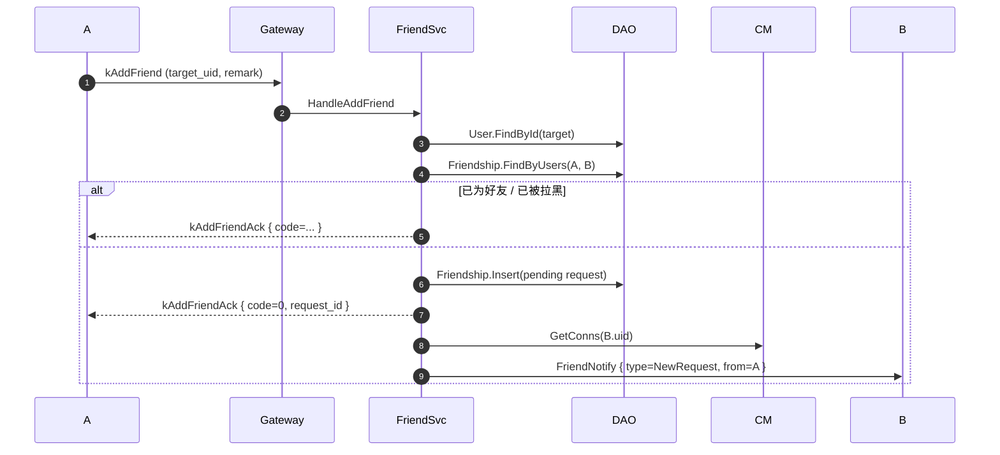

---

## 10. 处理好友申请（同意自动建私聊）

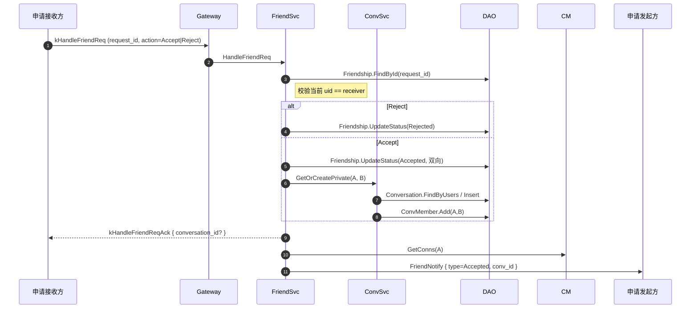

---

## 11. 创建群组

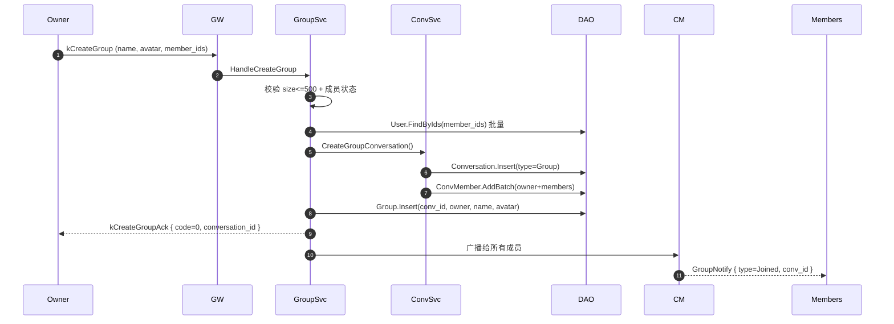

---

## 12. 文件上传（小文件，HTTP）

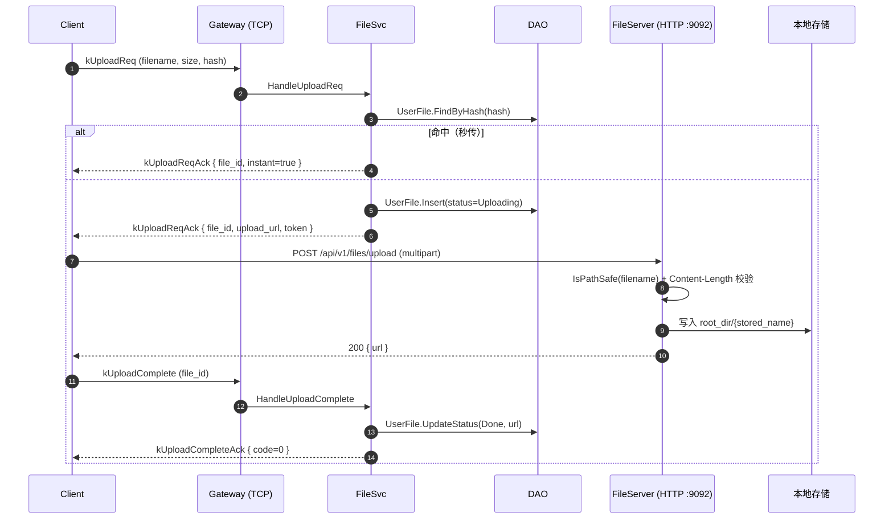

---

## 13. 文件下载

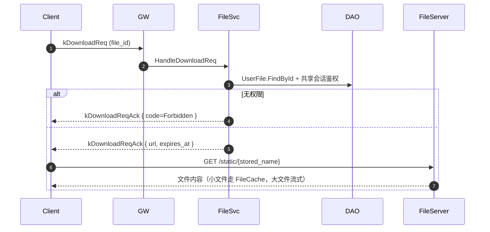

---

## 14. Admin 登录 + 受保护接口

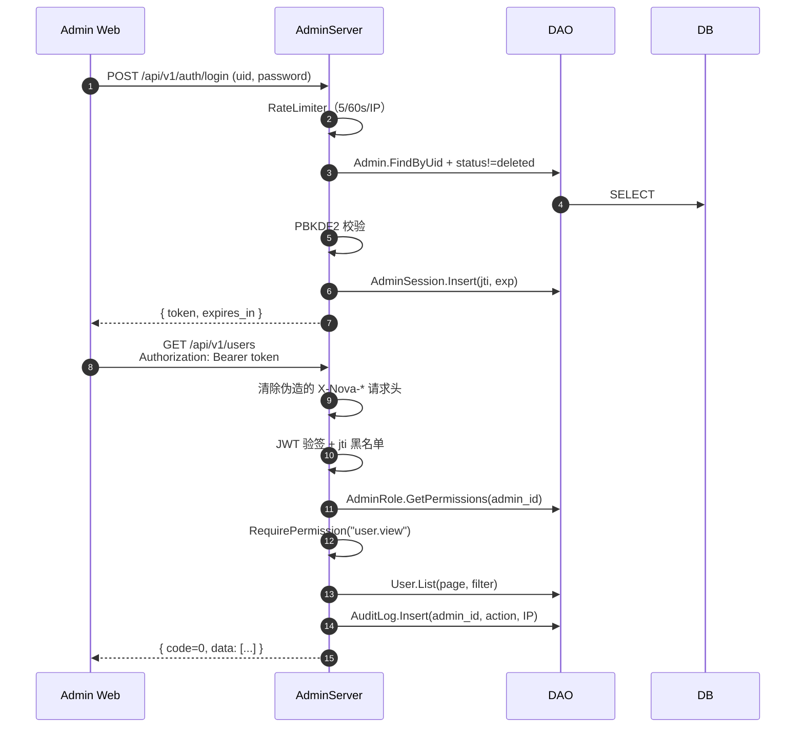

---

## 15. Admin 踢人下线

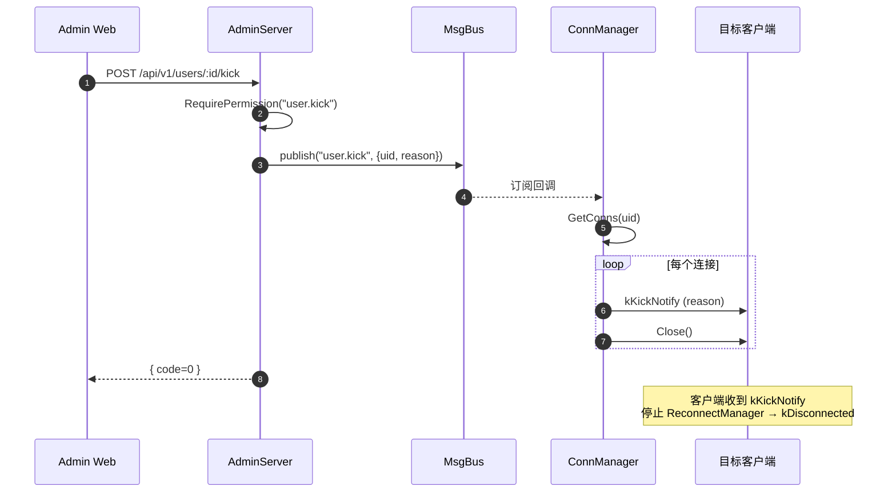

---

## 16. JS Bridge 端到端（桌面端单条消息发送）

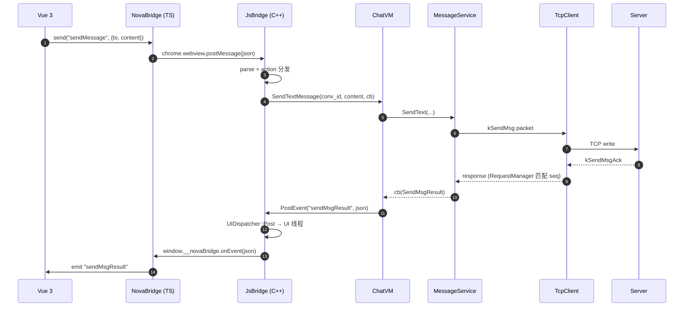

---

## 17. 客户端缓存写入与读取

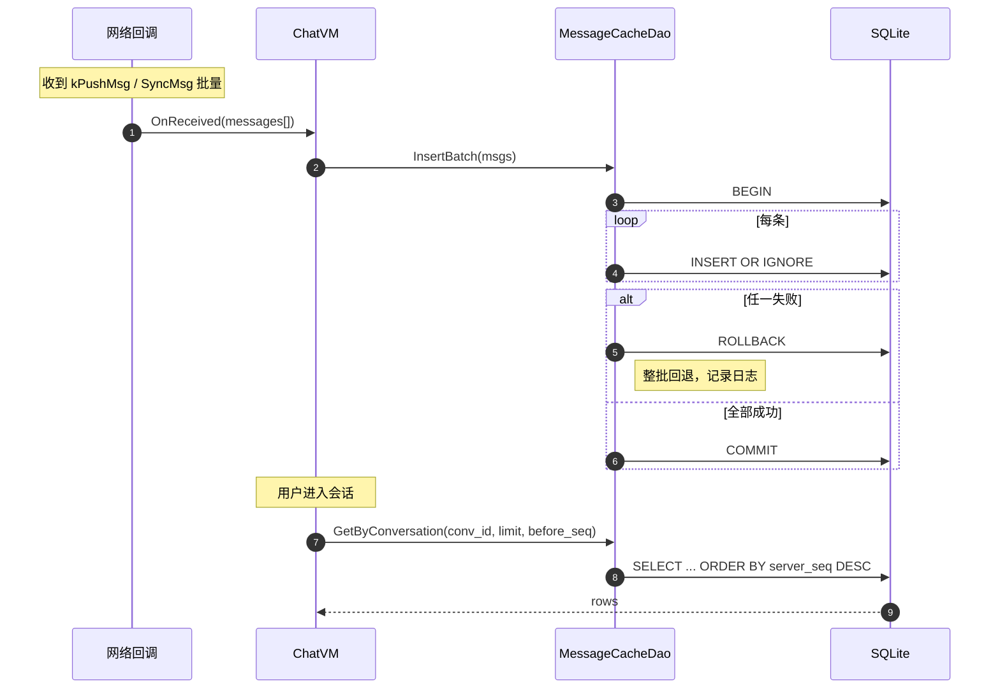

---

## 18. NovaClient 启动 / 关闭

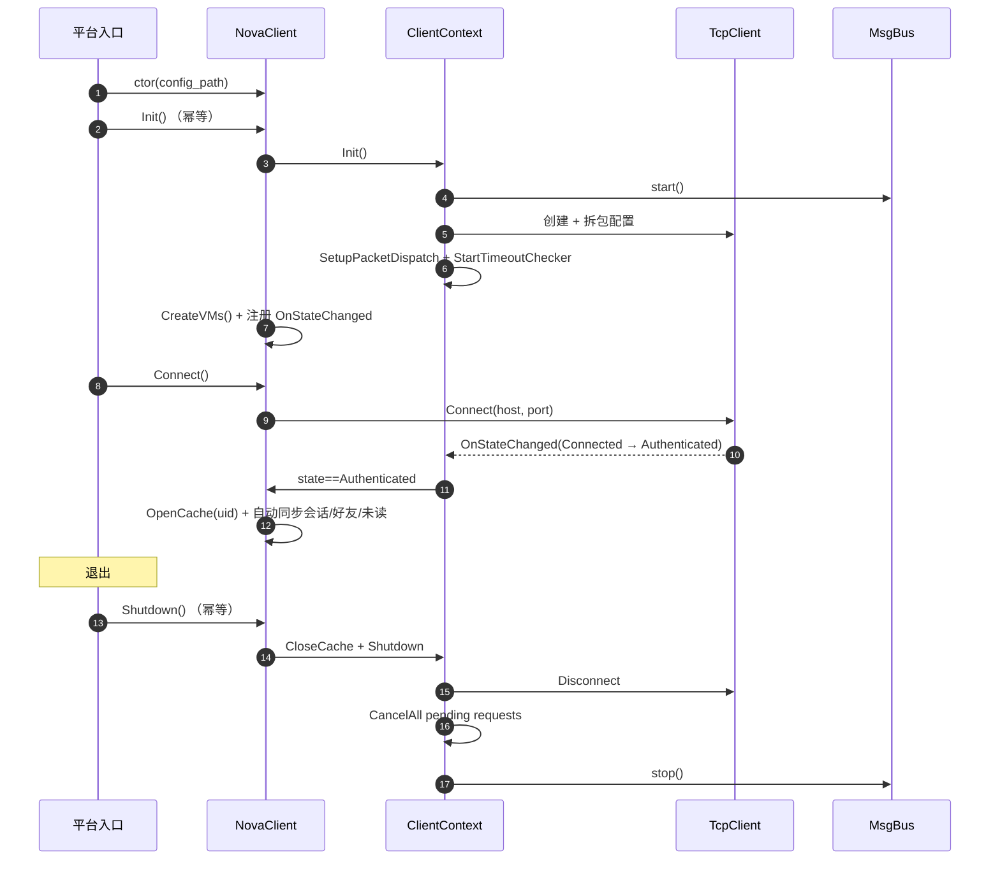
