# NovaIIM 子功能时序图

本文档汇总各核心子功能在客户端、Server、数据库与第三方组件之间的交互时序，便于排查链路与对照实现。

> **图例标记**：
> - ✅ **已实现**：协议命令 + 服务端处理器 + 客户端调用全部到位
> - ⚠ **部分实现**：仅链路一端可用、字段定义但未消费、或顺序版/简化版
> - ✗ **未实现**：仅文档/设计，代码尚无实际对应实现

---

## 实现状态矩阵（截至 2026-04-23）

| 状态 | 计数 | 编号 |
|---|---|---|
| ✅ IMPL | 40 | 1, 2, 3, 4, 5, 6, 7, 8, 9, 10, 11, 12, 13, 14, 15, 16, 17, 18, 19, 20, 21, 22, 24, 25, 26, 27, 28, 29, 30, 31, 32, 33, 34, 35, 43, 46, 47, 48, 65 |
| ⚠ PARTIAL | 4 | 39, 40, 41, 44 |
| ✗ MISSING | 24 | 23, 36, 37, 38, 42, 45, 49, 50, 51, 52, 53, 54, 55, 56, 57, 58, 59, 60, 61, 62, 63, 64, 66, 67, 68 |

详见每个分组小节首行的状态摘要，以及末尾「按状态分类的索引」。

参与方说明：
- **C** Client（nova_sdk + 平台 UI）
- **GW** Gateway / TCP server
- **Svc** Service 层（UserSvc / MsgSvc / FriendSvc / GroupSvc / ConvSvc / SyncSvc / FileSvc）
- **DAO** ormpp DAO + DbManager
- **DB** SQLite / MySQL
- **CM** ConnManager（多端连接）
- **Bus** 内部 MsgBus（事件解耦）
- **Admin** Admin Web 前端
- **AS** AdminServer（HTTP :9091）
- **FS** FileServer（HTTP :9092）

---

## 目录索引

> 提示：GitHub / VS Code 预览中点击即可跳转。

### 一、账户与连接（1–4, 22–23, 56–58, 63–64）
- [1. 注册](#1-注册)
- [2. 登录](#2-登录)
- [3. 心跳](#3-心跳)
- [4. 自动重连（客户端）](#4-自动重连客户端)
- [22. 多端互踢（同账号新设备登录）](#22-多端互踢同账号新设备登录)
- [23. 客户端修改密码](#23-客户端修改密码)
- [56. 邮箱验证码 / 注册校验](#56-邮箱验证码--注册校验)
- [57. 忘记密码（邮箱重置）](#57-忘记密码邮箱重置)
- [58. 扫码登录（已登录端授权新端）](#58-扫码登录已登录端授权新端)
- [63. 用户登录会话管理（列表 / 撤销）](#63-用户登录会话管理列表--撤销)
- [64. 注销账号（GDPR / 数据删除）](#64-注销账号gdpr--数据删除)

### 二、消息收发与同步（5–8, 36–37, 59–62）
- [5. 发送私聊消息（在线接收）](#5-发送私聊消息在线接收)
- [6. 离线消息同步](#6-离线消息同步)
- [7. 消息送达 / 已读](#7-消息送达--已读)
- [8. 消息撤回](#8-消息撤回)
- [36. 已读回执批量上报](#36-已读回执批量上报)
- [37. 输入中（Typing）通知](#37-输入中typing通知)
- [59. 消息转发](#59-消息转发)
- [60. 消息表情回应（Reaction）](#60-消息表情回应reaction)
- [61. 消息编辑（仅文本，限时）](#61-消息编辑仅文本限时)
- [62. 在线状态订阅 / 推送](#62-在线状态订阅--推送)

### 三、好友与会话（9–10, 34–35）
- [9. 添加好友](#9-添加好友)
- [10. 处理好友申请（同意自动建私聊）](#10-处理好友申请同意自动建私聊)
- [34. 会话置顶 / 静音 / 删除](#34-会话置顶--静音--删除)
- [35. 黑名单 / 屏蔽](#35-黑名单--屏蔽)

### 四、群组（11, 33）
- [11. 创建群组](#11-创建群组)
- [33. 群组成员邀请 / 退群 / 踢人](#33-群组成员邀请--退群--踢人)

### 五、文件与媒体（12–13, 38–39）
- [12. 文件上传（小文件，HTTP）](#12-文件上传小文件http)
- [13. 文件下载](#13-文件下载)
- [38. 文件上传断点续传（分片）](#38-文件上传断点续传分片)
- [39. 头像 / 群头像更新（带预签名）](#39-头像--群头像更新带预签名)

### 六、Admin 后台与 RBAC（14–15, 24–31, 68）
- [14. Admin 登录 + 受保护接口](#14-admin-登录--受保护接口)
- [15. Admin 踢人下线](#15-admin-踢人下线)
- [24. AdminServer 启动 + 中间件链装配](#24-adminserver-启动--中间件链装配)
- [25. AdminServer 受保护请求中间件链路](#25-adminserver-受保护请求中间件链路)
- [26. Admin Token 续期 / 登出（jti 黑名单）](#26-admin-token-续期--登出jti-黑名单)
- [27. Admin RBAC 角色授予](#27-admin-rbac-角色授予)
- [28. Admin 用户封禁 / 解封](#28-admin-用户封禁--解封)
- [29. Admin 审计日志查询](#29-admin-审计日志查询)
- [30. Admin 强制撤回消息](#30-admin-强制撤回消息)
- [31. Admin 群组解散 / 转让](#31-admin-群组解散--转让)
- [68. 批量数据导出（管理员）](#68-批量数据导出管理员)

### 七、客户端 SDK 与桌面端（16–18, 40–41）
- [16. JS Bridge 端到端（桌面端单条消息发送）](#16-js-bridge-端到端桌面端单条消息发送)
- [17. 客户端缓存写入与读取](#17-客户端缓存写入与读取)
- [18. NovaClient 启动 / 关闭](#18-novaclient-启动--关闭)
- [40. 通知与免打扰处理](#40-通知与免打扰处理)
- [41. 客户端首屏冷启动数据加载](#41-客户端首屏冷启动数据加载)

### 八、IM Server 与基础设施（19–21, 32, 42–45, 55, 65–67）
- [19. IM Server 启动（依赖注入 + 路由注册 + 监听）](#19-im-server-启动依赖注入--路由注册--监听)
- [20. IM Server 优雅关闭](#20-im-server-优雅关闭)
- [21. Gateway 收包流程（拆包→限流→鉴权→分发）](#21-gateway-收包流程拆包限流鉴权分发)
- [32. MsgBus 跨服务事件传播](#32-msgbus-跨服务事件传播)
- [42. 配置热加载](#42-配置热加载)
- [43. 数据库重连与连接池保活](#43-数据库重连与连接池保活)
- [44. 健康检查 / 就绪探针](#44-健康检查--就绪探针)
- [45. CI 构建 + 测试 + 覆盖率](#45-ci-构建--测试--覆盖率)
- [55. 消息存储分库 / 分表选择](#55-消息存储分库--分表选择)
- [65. WebSocket 客户端（Web 端 / 第三方接入）](#65-websocket-客户端web-端--第三方接入)
- [66. Prometheus 指标抓取](#66-prometheus-指标抓取)
- [67. 分布式锁（Redis 单实例 SETNX）](#67-分布式锁redis-单实例-setnx)

### 九、群组进阶（46–49）
- [46. 群公告 / 群信息修改](#46-群公告--群信息修改)
- [47. 群成员角色变更（设置/取消管理员）](#47-群成员角色变更设置取消管理员)
- [48. 群禁言 / 全员禁言](#48-群禁言--全员禁言)
- [49. 群消息 @ 提醒](#49-群消息--提醒)

### 十、客户端进阶（50–52）
- [50. 消息搜索（本地全文）](#50-消息搜索本地全文)
- [51. 客户端 Token 刷新（与 Server）](#51-客户端-token-刷新与-server)
- [52. 客户端日志上报](#52-客户端日志上报)

### 十一、推送（53–54）
- [53. 推送通道兜底（在线优先 / 离线 APNs/FCM）](#53-推送通道兜底在线优先--离线-apnsfcm)
- [54. 群离线推送聚合](#54-群离线推送聚合)

> 后续补充章节请同步追加到本索引对应分组。

---

## 1. 注册

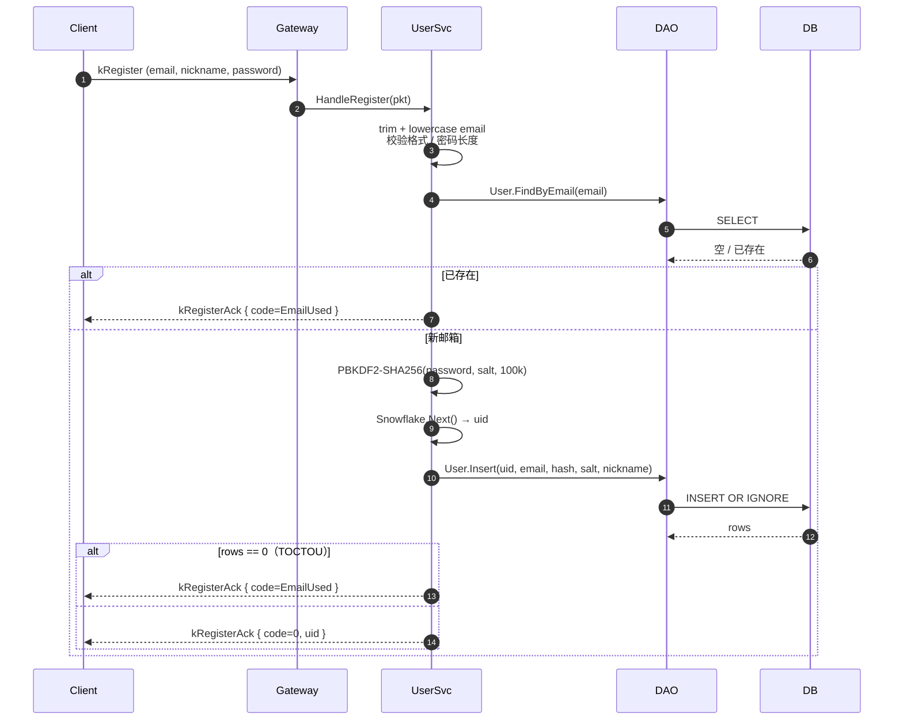
```mermaid
sequenceDiagram
    autonumber
    participant C as Client
    participant GW as Gateway
    participant Svc as UserSvc
    participant DAO
    participant DB

    C->>GW: kRegister (email, nickname, password)
    GW->>Svc: HandleRegister(pkt)
    Svc->>Svc: trim + lowercase email<br/>校验格式 / 密码长度
    Svc->>DAO: User.FindByEmail(email)
    DAO->>DB: SELECT
    DB-->>DAO: 空 / 已存在
    alt 已存在
        Svc-->>C: kRegisterAck { code=EmailUsed }
    else 新邮箱
        Svc->>Svc: PBKDF2-SHA256(password, salt, 100k)
        Svc->>Svc: Snowflake.Next() → uid
        Svc->>DAO: User.Insert(uid, email, hash, salt, nickname)
        DAO->>DB: INSERT OR IGNORE
        DB-->>DAO: rows
        alt rows == 0（TOCTOU）
            Svc-->>C: kRegisterAck { code=EmailUsed }
        else
            Svc-->>C: kRegisterAck { code=0, uid }
        end
    end
```

---

## 2. 登录

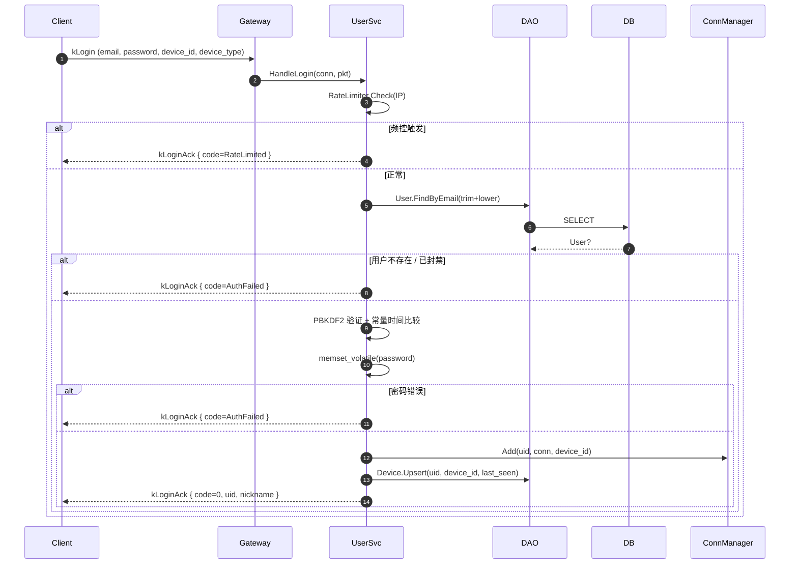
```mermaid
sequenceDiagram
    autonumber
    participant C as Client
    participant GW as Gateway
    participant Svc as UserSvc
    participant DAO
    participant DB
    participant CM as ConnManager

    C->>GW: kLogin (email, password, device_id, device_type)
    GW->>Svc: HandleLogin(conn, pkt)
    Svc->>Svc: RateLimiter.Check(IP)
    alt 频控触发
        Svc-->>C: kLoginAck { code=RateLimited }
    else 正常
        Svc->>DAO: User.FindByEmail(trim+lower)
        DAO->>DB: SELECT
        DB-->>DAO: User?
        alt 用户不存在 / 已封禁
            Svc-->>C: kLoginAck { code=AuthFailed }
        else
            Svc->>Svc: PBKDF2 验证 + 常量时间比较
            Svc->>Svc: memset_volatile(password)
            alt 密码错误
                Svc-->>C: kLoginAck { code=AuthFailed }
            else
                Svc->>CM: Add(uid, conn, device_id)
                Svc->>DAO: Device.Upsert(uid, device_id, last_seen)
                Svc-->>C: kLoginAck { code=0, uid, nickname }
            end
        end
    end
```

---

## 3. 心跳

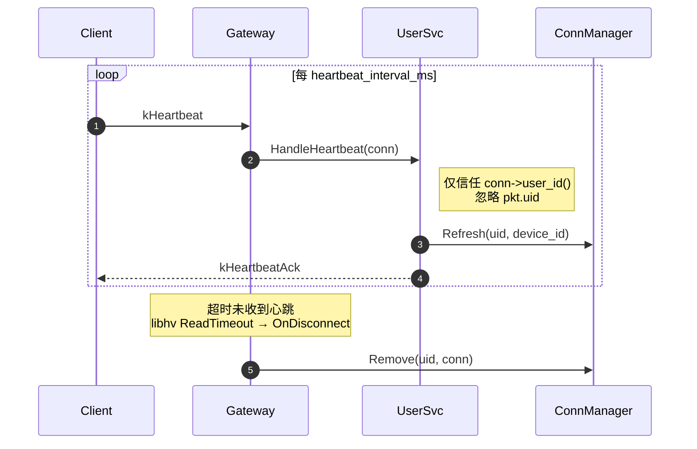
```mermaid
sequenceDiagram
    autonumber
    participant C as Client
    participant GW as Gateway
    participant Svc as UserSvc
    participant CM as ConnManager

    loop 每 heartbeat_interval_ms
        C->>GW: kHeartbeat
        GW->>Svc: HandleHeartbeat(conn)
        Note right of Svc: 仅信任 conn->user_id()<br/>忽略 pkt.uid
        Svc->>CM: Refresh(uid, device_id)
        Svc-->>C: kHeartbeatAck
    end

    Note over GW: 超时未收到心跳<br/>libhv ReadTimeout → OnDisconnect
    GW->>CM: Remove(uid, conn)
```

---

## 4. 自动重连（客户端）

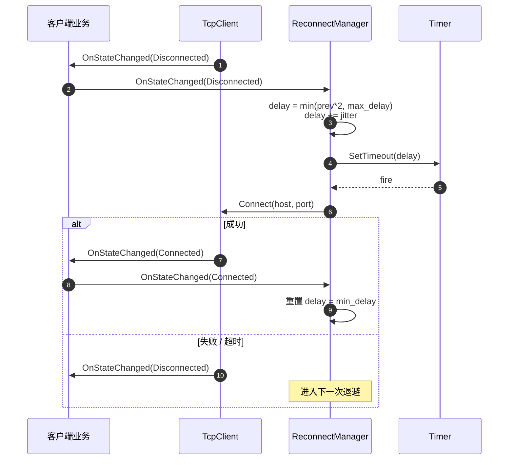
```mermaid
sequenceDiagram
    autonumber
    participant App as 客户端业务
    participant Tcp as TcpClient
    participant RM as ReconnectManager
    participant Timer

    Tcp->>App: OnStateChanged(Disconnected)
    App->>RM: OnStateChanged(Disconnected)
    RM->>RM: delay = min(prev*2, max_delay)<br/>delay += jitter
    RM->>Timer: SetTimeout(delay)
    Timer-->>RM: fire
    RM->>Tcp: Connect(host, port)
    alt 成功
        Tcp->>App: OnStateChanged(Connected)
        App->>RM: OnStateChanged(Connected)
        RM->>RM: 重置 delay = min_delay
    else 失败 / 超时
        Tcp->>App: OnStateChanged(Disconnected)
        Note over RM: 进入下一次退避
    end
```

---

## 5. 发送私聊消息（在线接收）

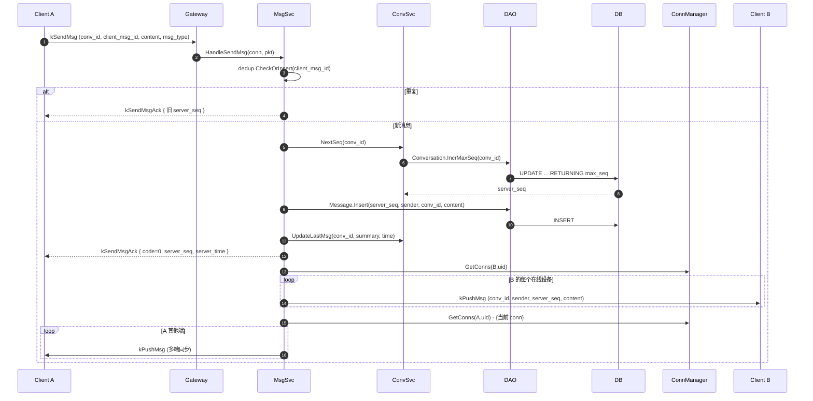
```mermaid
sequenceDiagram
    autonumber
    participant A as Client A
    participant GW as Gateway
    participant Msg as MsgSvc
    participant Conv as ConvSvc
    participant DAO
    participant DB
    participant CM as ConnManager
    participant B as Client B

    A->>GW: kSendMsg (conv_id, client_msg_id, content, msg_type)
    GW->>Msg: HandleSendMsg(conn, pkt)
    Msg->>Msg: dedup.CheckOrInsert(client_msg_id)
    alt 重复
        Msg-->>A: kSendMsgAck { 旧 server_seq }
    else 新消息
        Msg->>Conv: NextSeq(conv_id)
        Conv->>DAO: Conversation.IncrMaxSeq(conv_id)
        DAO->>DB: UPDATE ... RETURNING max_seq
        DB-->>Conv: server_seq
        Msg->>DAO: Message.Insert(server_seq, sender, conv_id, content)
        DAO->>DB: INSERT
        Msg->>Conv: UpdateLastMsg(conv_id, summary, time)
        Msg-->>A: kSendMsgAck { code=0, server_seq, server_time }
        Msg->>CM: GetConns(B.uid)
        loop B 的每个在线设备
            Msg->>B: kPushMsg (conv_id, sender, server_seq, content)
        end
        Msg->>CM: GetConns(A.uid) - {当前 conn}
        loop A 其他端
            Msg->>A: kPushMsg (多端同步)
        end
    end
```

---

## 6. 离线消息同步

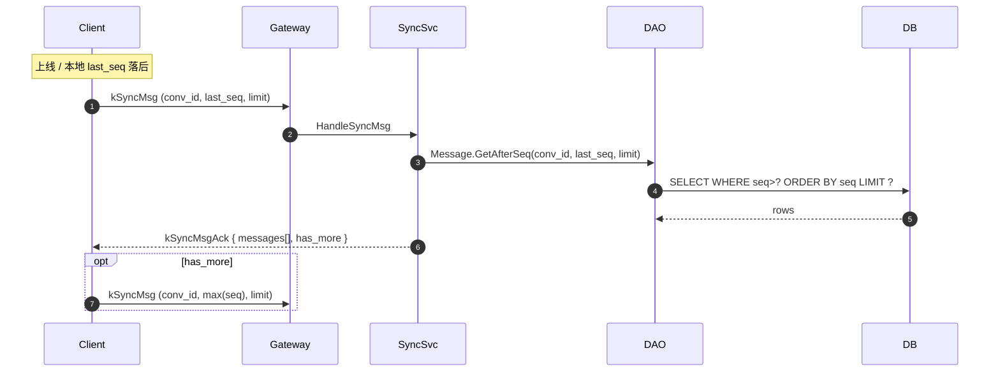
```mermaid
sequenceDiagram
    autonumber
    participant C as Client
    participant GW as Gateway
    participant Sync as SyncSvc
    participant DAO
    participant DB

    Note over C: 上线 / 本地 last_seq 落后
    C->>GW: kSyncMsg (conv_id, last_seq, limit)
    GW->>Sync: HandleSyncMsg
    Sync->>DAO: Message.GetAfterSeq(conv_id, last_seq, limit)
    DAO->>DB: SELECT WHERE seq>? ORDER BY seq LIMIT ?
    DB-->>DAO: rows
    Sync-->>C: kSyncMsgAck { messages[], has_more }
    opt has_more
        C->>GW: kSyncMsg (conv_id, max(seq), limit)
    end
```

---

## 7. 消息送达 / 已读

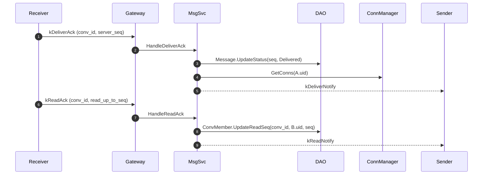
```mermaid
sequenceDiagram
    autonumber
    participant B as Receiver
    participant GW as Gateway
    participant Msg as MsgSvc
    participant DAO
    participant CM as ConnManager
    participant A as Sender

    B->>GW: kDeliverAck (conv_id, server_seq)
    GW->>Msg: HandleDeliverAck
    Msg->>DAO: Message.UpdateStatus(seq, Delivered)
    Msg->>CM: GetConns(A.uid)
    Msg-->>A: kDeliverNotify

    B->>GW: kReadAck (conv_id, read_up_to_seq)
    GW->>Msg: HandleReadAck
    Msg->>DAO: ConvMember.UpdateReadSeq(conv_id, B.uid, seq)
    Msg-->>A: kReadNotify
```

---

## 8. 消息撤回

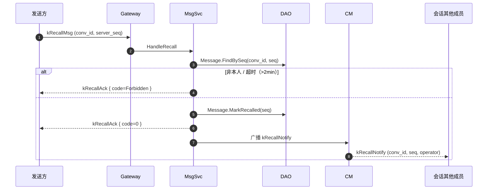
```mermaid
sequenceDiagram
    autonumber
    participant A as 发送方
    participant GW as Gateway
    participant Msg as MsgSvc
    participant DAO
    participant CM
    participant Peers as 会话其他成员

    A->>GW: kRecallMsg (conv_id, server_seq)
    GW->>Msg: HandleRecall
    Msg->>DAO: Message.FindBySeq(conv_id, seq)
    alt 非本人 / 超时（>2min）
        Msg-->>A: kRecallAck { code=Forbidden }
    else
        Msg->>DAO: Message.MarkRecalled(seq)
        Msg-->>A: kRecallAck { code=0 }
        Msg->>CM: 广播 kRecallNotify
        CM-->>Peers: kRecallNotify (conv_id, seq, operator)
    end
```

---

## 9. 添加好友

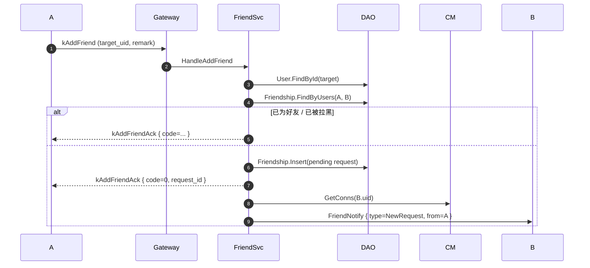
```mermaid
sequenceDiagram
    autonumber
    participant A
    participant GW as Gateway
    participant Friend as FriendSvc
    participant DAO
    participant CM
    participant B

    A->>GW: kAddFriend (target_uid, remark)
    GW->>Friend: HandleAddFriend
    Friend->>DAO: User.FindById(target)
    Friend->>DAO: Friendship.FindByUsers(A, B)
    alt 已为好友 / 已被拉黑
        Friend-->>A: kAddFriendAck { code=... }
    else
        Friend->>DAO: Friendship.Insert(pending request)
        Friend-->>A: kAddFriendAck { code=0, request_id }
        Friend->>CM: GetConns(B.uid)
        Friend->>B: FriendNotify { type=NewRequest, from=A }
    end
```

---

## 10. 处理好友申请（同意自动建私聊）

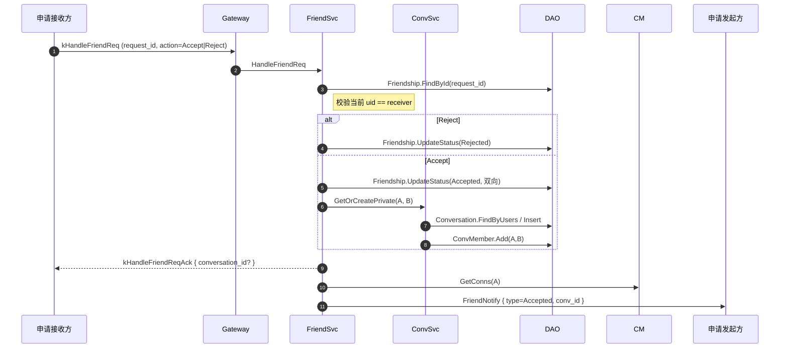
```mermaid
sequenceDiagram
    autonumber
    participant B as 申请接收方
    participant GW as Gateway
    participant Friend as FriendSvc
    participant Conv as ConvSvc
    participant DAO
    participant CM
    participant A as 申请发起方

    B->>GW: kHandleFriendReq (request_id, action=Accept|Reject)
    GW->>Friend: HandleFriendReq
    Friend->>DAO: Friendship.FindById(request_id)
    Note right of Friend: 校验当前 uid == receiver
    alt Reject
        Friend->>DAO: Friendship.UpdateStatus(Rejected)
    else Accept
        Friend->>DAO: Friendship.UpdateStatus(Accepted, 双向)
        Friend->>Conv: GetOrCreatePrivate(A, B)
        Conv->>DAO: Conversation.FindByUsers / Insert
        Conv->>DAO: ConvMember.Add(A,B)
    end
    Friend-->>B: kHandleFriendReqAck { conversation_id? }
    Friend->>CM: GetConns(A)
    Friend->>A: FriendNotify { type=Accepted, conv_id }
```

---

## 11. 创建群组

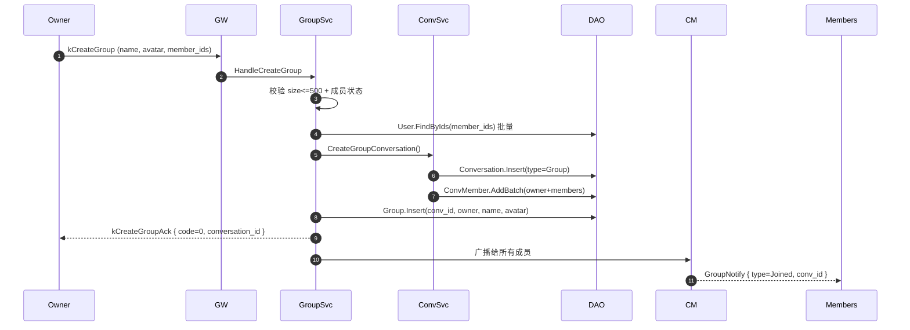
```mermaid
sequenceDiagram
    autonumber
    participant Owner
    participant GW
    participant Group as GroupSvc
    participant Conv as ConvSvc
    participant DAO
    participant CM
    participant Members

    Owner->>GW: kCreateGroup (name, avatar, member_ids)
    GW->>Group: HandleCreateGroup
    Group->>Group: 校验 size<=500 + 成员状态
    Group->>DAO: User.FindByIds(member_ids) 批量
    Group->>Conv: CreateGroupConversation()
    Conv->>DAO: Conversation.Insert(type=Group)
    Conv->>DAO: ConvMember.AddBatch(owner+members)
    Group->>DAO: Group.Insert(conv_id, owner, name, avatar)
    Group-->>Owner: kCreateGroupAck { code=0, conversation_id }
    Group->>CM: 广播给所有成员
    CM-->>Members: GroupNotify { type=Joined, conv_id }
```

---

## 12. 文件上传（小文件，HTTP）

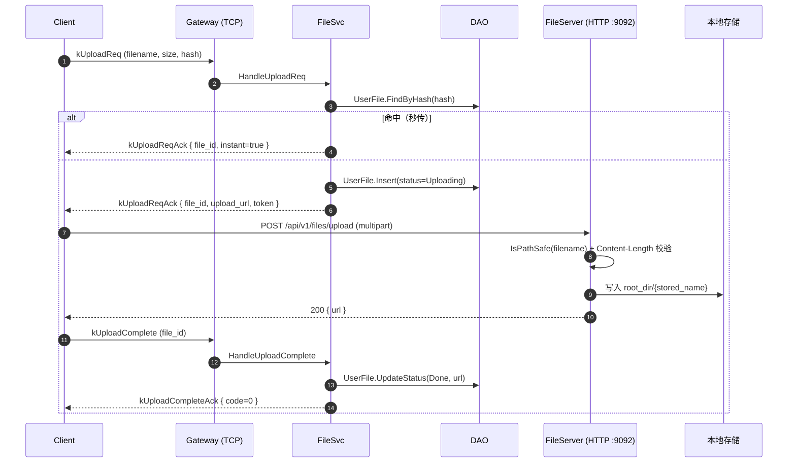
```mermaid
sequenceDiagram
    autonumber
    participant C as Client
    participant GW as Gateway (TCP)
    participant FileSvc
    participant DAO
    participant FS as FileServer (HTTP :9092)
    participant Disk as 本地存储

    C->>GW: kUploadReq (filename, size, hash)
    GW->>FileSvc: HandleUploadReq
    FileSvc->>DAO: UserFile.FindByHash(hash)
    alt 命中（秒传）
        FileSvc-->>C: kUploadReqAck { file_id, instant=true }
    else
        FileSvc->>DAO: UserFile.Insert(status=Uploading)
        FileSvc-->>C: kUploadReqAck { file_id, upload_url, token }
        C->>FS: POST /api/v1/files/upload (multipart)
        FS->>FS: IsPathSafe(filename) + Content-Length 校验
        FS->>Disk: 写入 root_dir/{stored_name}
        FS-->>C: 200 { url }
        C->>GW: kUploadComplete (file_id)
        GW->>FileSvc: HandleUploadComplete
        FileSvc->>DAO: UserFile.UpdateStatus(Done, url)
        FileSvc-->>C: kUploadCompleteAck { code=0 }
    end
```

---

## 13. 文件下载

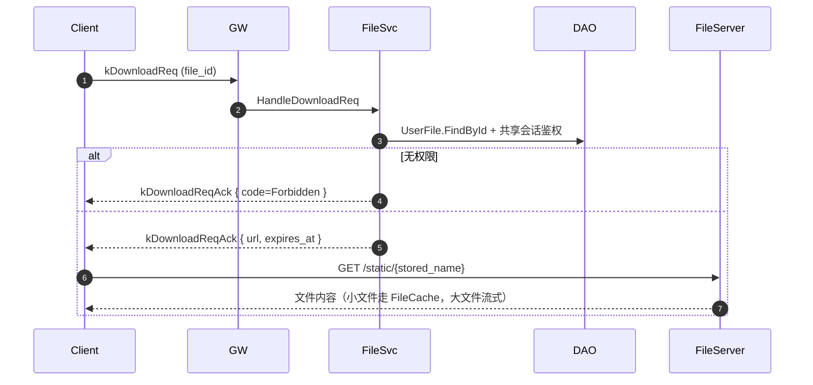
```mermaid
sequenceDiagram
    autonumber
    participant C as Client
    participant GW
    participant FileSvc
    participant DAO
    participant FS as FileServer

    C->>GW: kDownloadReq (file_id)
    GW->>FileSvc: HandleDownloadReq
    FileSvc->>DAO: UserFile.FindById + 共享会话鉴权
    alt 无权限
        FileSvc-->>C: kDownloadReqAck { code=Forbidden }
    else
        FileSvc-->>C: kDownloadReqAck { url, expires_at }
        C->>FS: GET /static/{stored_name}
        FS-->>C: 文件内容（小文件走 FileCache，大文件流式）
    end
```

---

## 14. Admin 登录 + 受保护接口

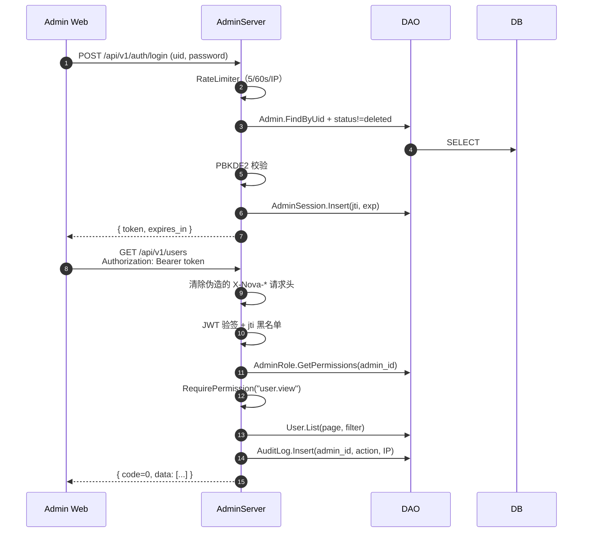
```mermaid
sequenceDiagram
    autonumber
    participant Admin as Admin Web
    participant AS as AdminServer
    participant DAO
    participant DB

    Admin->>AS: POST /api/v1/auth/login (uid, password)
    AS->>AS: RateLimiter（5/60s/IP）
    AS->>DAO: Admin.FindByUid + status!=deleted
    DAO->>DB: SELECT
    AS->>AS: PBKDF2 校验
    AS->>DAO: AdminSession.Insert(jti, exp)
    AS-->>Admin: { token, expires_in }

    Admin->>AS: GET /api/v1/users<br/>Authorization: Bearer token
    AS->>AS: 清除伪造的 X-Nova-* 请求头
    AS->>AS: JWT 验签 + jti 黑名单
    AS->>DAO: AdminRole.GetPermissions(admin_id)
    AS->>AS: RequirePermission("user.view")
    AS->>DAO: User.List(page, filter)
    AS->>DAO: AuditLog.Insert(admin_id, action, IP)
    AS-->>Admin: { code=0, data: [...] }
```

---

## 15. Admin 踢人下线

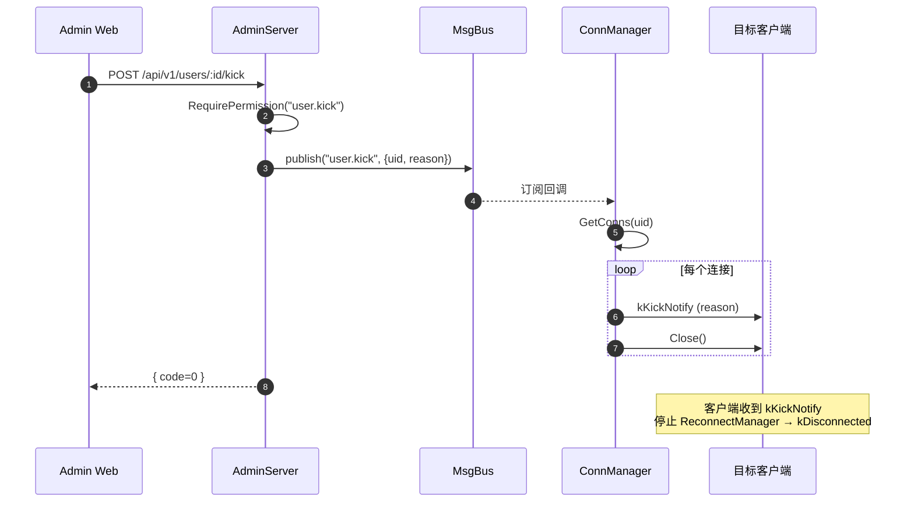
```mermaid
sequenceDiagram
    autonumber
    participant Admin as Admin Web
    participant AS as AdminServer
    participant Bus as MsgBus
    participant CM as ConnManager
    participant Target as 目标客户端

    Admin->>AS: POST /api/v1/users/:id/kick
    AS->>AS: RequirePermission("user.kick")
    AS->>Bus: publish("user.kick", {uid, reason})
    Bus-->>CM: 订阅回调
    CM->>CM: GetConns(uid)
    loop 每个连接
        CM->>Target: kKickNotify (reason)
        CM->>Target: Close()
    end
    AS-->>Admin: { code=0 }
    Note over Target: 客户端收到 kKickNotify<br/>停止 ReconnectManager → kDisconnected
```

---

## 16. JS Bridge 端到端（桌面端单条消息发送）

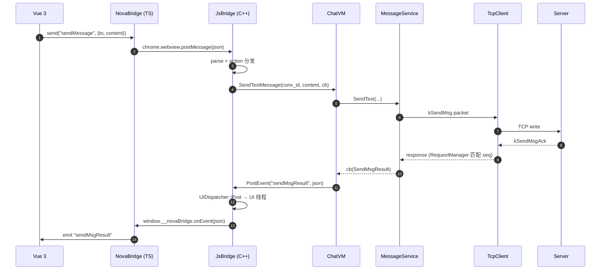
```mermaid
sequenceDiagram
    autonumber
    participant UI as Vue 3
    participant TS as NovaBridge (TS)
    participant JB as JsBridge (C++)
    participant VM as ChatVM
    participant Svc as MessageService
    participant Net as TcpClient
    participant Server

    UI->>TS: send("sendMessage", {to, content})
    TS->>JB: chrome.webview.postMessage(json)
    JB->>JB: parse + action 分发
    JB->>VM: SendTextMessage(conv_id, content, cb)
    VM->>Svc: SendText(...)
    Svc->>Net: kSendMsg packet
    Net->>Server: TCP write
    Server-->>Net: kSendMsgAck
    Net-->>Svc: response (RequestManager 匹配 seq)
    Svc-->>VM: cb(SendMsgResult)
    VM->>JB: PostEvent("sendMsgResult", json)
    JB->>JB: UIDispatcher::Post → UI 线程
    JB->>TS: window.__novaBridge.onEvent(json)
    TS->>UI: emit "sendMsgResult"
```

---

## 17. 客户端缓存写入与读取

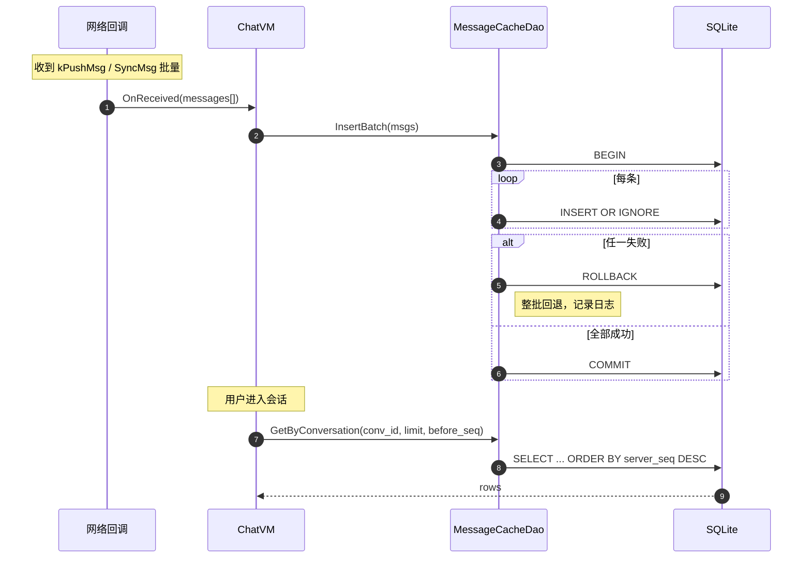
```mermaid
sequenceDiagram
    autonumber
    participant Net as 网络回调
    participant VM as ChatVM
    participant Cache as MessageCacheDao
    participant SQLite

    Note over Net: 收到 kPushMsg / SyncMsg 批量
    Net->>VM: OnReceived(messages[])
    VM->>Cache: InsertBatch(msgs)
    Cache->>SQLite: BEGIN
    loop 每条
        Cache->>SQLite: INSERT OR IGNORE
    end
    alt 任一失败
        Cache->>SQLite: ROLLBACK
        Note right of Cache: 整批回退，记录日志
    else 全部成功
        Cache->>SQLite: COMMIT
    end

    Note over VM: 用户进入会话
    VM->>Cache: GetByConversation(conv_id, limit, before_seq)
    Cache->>SQLite: SELECT ... ORDER BY server_seq DESC
    SQLite-->>VM: rows
```

---

## 18. NovaClient 启动 / 关闭

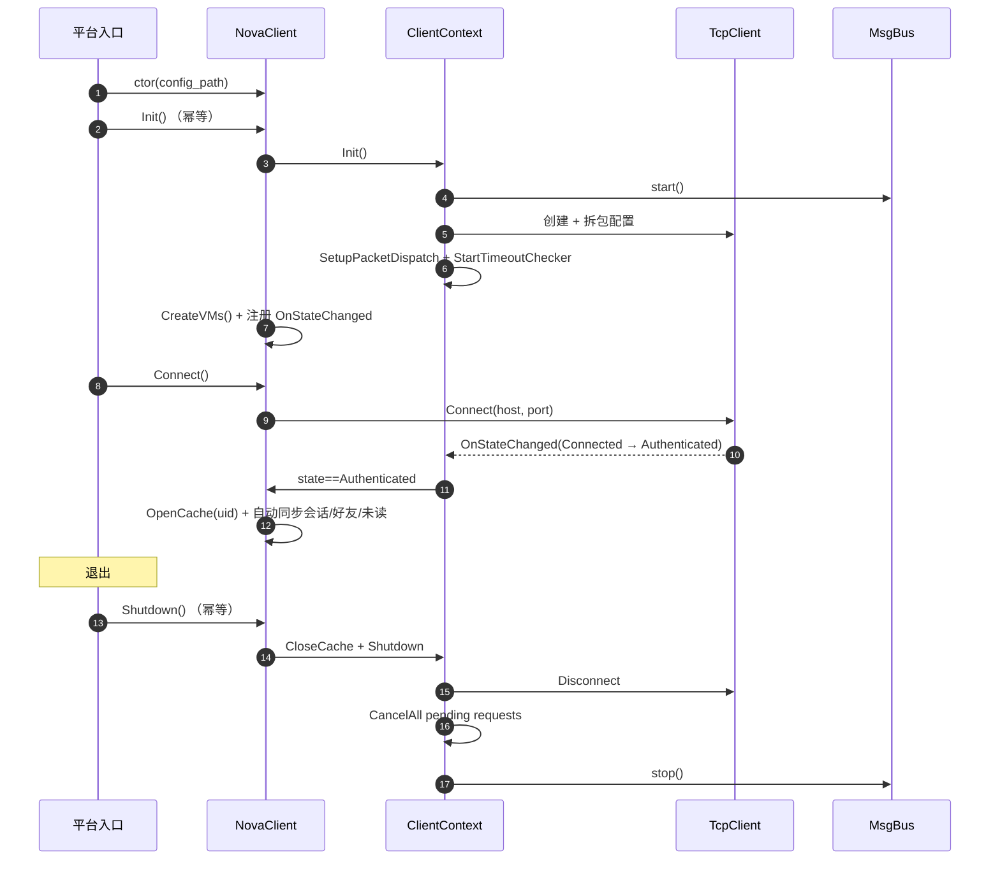
```mermaid
sequenceDiagram
    autonumber
    participant App as 平台入口
    participant NC as NovaClient
    participant Ctx as ClientContext
    participant Net as TcpClient
    participant Bus as MsgBus

    App->>NC: ctor(config_path)
    App->>NC: Init()  （幂等）
    NC->>Ctx: Init()
    Ctx->>Bus: start()
    Ctx->>Net: 创建 + 拆包配置
    Ctx->>Ctx: SetupPacketDispatch + StartTimeoutChecker
    NC->>NC: CreateVMs() + 注册 OnStateChanged

    App->>NC: Connect()
    NC->>Net: Connect(host, port)
    Net-->>Ctx: OnStateChanged(Connected → Authenticated)
    Ctx->>NC: state==Authenticated
    NC->>NC: OpenCache(uid) + 自动同步会话/好友/未读

    Note over App: 退出
    App->>NC: Shutdown() （幂等）
    NC->>Ctx: CloseCache + Shutdown
    Ctx->>Net: Disconnect
    Ctx->>Ctx: CancelAll pending requests
    Ctx->>Bus: stop()
```

---

## 19. IM Server 启动（依赖注入 + 路由注册 + 监听）

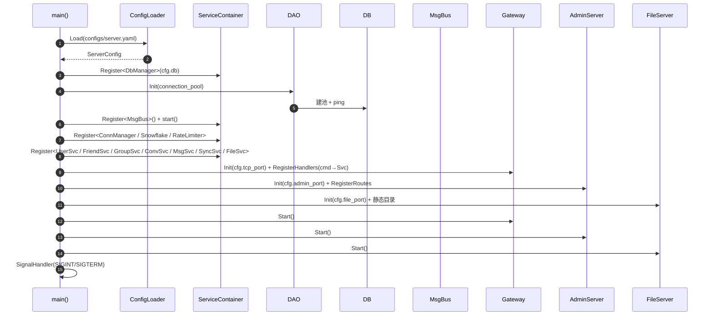
```mermaid
sequenceDiagram
    autonumber
    participant Main as main()
    participant Cfg as ConfigLoader
    participant DI as ServiceContainer
    participant DAO
    participant DB
    participant Bus as MsgBus
    participant GW as Gateway
    participant AS as AdminServer
    participant FS as FileServer

    Main->>Cfg: Load(configs/server.yaml)
    Cfg-->>Main: ServerConfig
    Main->>DI: Register<DbManager>(cfg.db)
    Main->>DAO: Init(connection_pool)
    DAO->>DB: 建池 + ping
    Main->>DI: Register<MsgBus>() + start()
    Main->>DI: Register<ConnManager / Snowflake / RateLimiter>
    Main->>DI: Register<UserSvc / FriendSvc / GroupSvc / ConvSvc / MsgSvc / SyncSvc / FileSvc>
    Main->>GW: Init(cfg.tcp_port) + RegisterHandlers(cmd→Svc)
    Main->>AS: Init(cfg.admin_port) + RegisterRoutes
    Main->>FS: Init(cfg.file_port) + 静态目录
    Main->>GW: Start()
    Main->>AS: Start()
    Main->>FS: Start()
    Main->>Main: SignalHandler(SIGINT/SIGTERM)
```

---

## 20. IM Server 优雅关闭

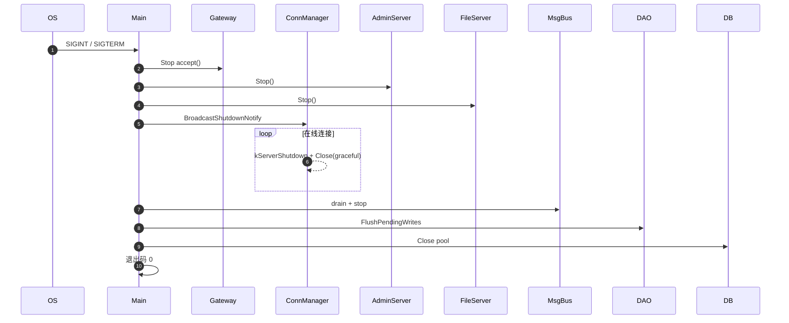
```mermaid
sequenceDiagram
    autonumber
    participant OS
    participant Main
    participant GW as Gateway
    participant CM as ConnManager
    participant AS as AdminServer
    participant FS as FileServer
    participant Bus as MsgBus
    participant DAO
    participant DB

    OS->>Main: SIGINT / SIGTERM
    Main->>GW: Stop accept()
    Main->>AS: Stop()
    Main->>FS: Stop()
    Main->>CM: BroadcastShutdownNotify
    loop 在线连接
        CM-->>CM: kServerShutdown + Close(graceful)
    end
    Main->>Bus: drain + stop
    Main->>DAO: FlushPendingWrites
    Main->>DB: Close pool
    Main->>Main: 退出码 0
```

---

## 21. Gateway 收包流程（拆包→限流→鉴权→分发）

```mermaid
sequenceDiagram
    autonumber
    participant Sock as TCP Socket
    participant Codec as PacketCodec
    participant GW as Gateway
    participant RL as RateLimiter
    participant Disp as Handler 路由表
    participant Svc as 目标 Service

    Sock->>Codec: bytes
    Codec->>Codec: 校验 magic + 长度<br/>解析 Header(cmd, seq, uid?)
    alt 包错误
        Codec->>GW: ProtocolError → Close
    else
        Codec->>GW: Packet
        GW->>RL: Check(uid 或 IP, cmd)
        alt 触发限流
            GW-->>Sock: ErrorAck { code=RateLimited }
        else
            GW->>GW: 是否需要鉴权？
            alt 需要 && conn.user_id() == 0
                GW-->>Sock: ErrorAck { code=Unauthorized }
            else
                GW->>Disp: Lookup(cmd)
                Disp->>Svc: Handle(conn, pkt)
                Svc-->>Sock: Ack / Push
            end
        end
    end
```

---

## 22. 多端互踢（同账号新设备登录）

```mermaid
sequenceDiagram
    autonumber
    participant New as 新设备
    participant GW as Gateway
    participant Usr as UserSvc
    participant CM as ConnManager
    participant Old as 旧设备

    New->>GW: kLogin (device_id=new)
    GW->>Usr: HandleLogin
    Usr->>Usr: 校验通过
    Usr->>CM: GetConnByDevice(uid, device_type, device_id)
    alt 同 device_type 已有连接 (single-instance per type)
        CM-->>Usr: oldConn
        Usr->>Old: kKickNotify { reason=AnotherDeviceLogin }
        Usr->>CM: Remove(oldConn) + Close
    end
    Usr->>CM: Add(uid, newConn, new device)
    Usr-->>New: kLoginAck { code=0 }
```

---

## 23. 客户端修改密码

```mermaid
sequenceDiagram
    autonumber
    participant C as Client
    participant GW
    participant Usr as UserSvc
    participant DAO
    participant CM as ConnManager
    participant Other as 同账号其他设备

    C->>GW: kChangePassword (old_pwd, new_pwd)
    GW->>Usr: HandleChangePassword
    Usr->>DAO: User.FindById(uid)
    Usr->>Usr: PBKDF2 校验 old_pwd
    alt 旧密码错误
        Usr-->>C: kChangePasswordAck { code=AuthFailed }
    else
        Usr->>Usr: 校验 new_pwd 强度<br/>派生新 hash + 新 salt
        Usr->>DAO: User.UpdatePassword(uid, hash, salt)
        Usr-->>C: kChangePasswordAck { code=0 }
        Note over Usr: 安全策略：踢出其他端
        Usr->>CM: GetConns(uid) - {当前 conn}
        loop 其他端
            Usr->>Other: kKickNotify { reason=PasswordChanged }
        end
    end
```

---

## 24. AdminServer 启动 + 中间件链装配

```mermaid
sequenceDiagram
    autonumber
    participant Main
    participant AS as AdminServer
    participant Hv as libhv HttpServer
    participant Mw as MiddlewareChain

    Main->>AS: Init(port, jwt_secret, cors_cfg)
    AS->>Mw: Use(CORS)
    AS->>Mw: Use(SecurityHeaders)
    AS->>Mw: Use(RequestId + AccessLog)
    AS->>Mw: Use(RateLimit)
    AS->>Mw: Use(StripUntrustedHeaders) — 移除伪造的 X-Nova-*
    AS->>Mw: Use(JwtAuth)（白名单：login / health）
    AS->>Mw: Use(Permission)
    AS->>AS: Routes.Register(/api/v1/*)
    AS->>Hv: Listen(port)
    AS-->>Main: Started
```

---

## 25. AdminServer 受保护请求中间件链路

```mermaid
sequenceDiagram
    autonumber
    participant Admin as Admin Web
    participant Hv as libhv
    participant CORS
    participant RL as RateLimit
    participant Strip as StripHeaders
    participant Jwt as JwtAuth
    participant Perm as Permission
    participant H as Handler
    participant Audit as AuditLog

    Admin->>Hv: HTTP 请求 (Authorization: Bearer ...)
    Hv->>CORS: 处理 OPTIONS / 写 CORS 头
    CORS->>RL: next
    RL->>RL: Check(IP + path)
    alt 触发
        RL-->>Admin: 429 Too Many Requests
    else
        RL->>Strip: next
        Strip->>Strip: 删除 X-Nova-Admin-Id 等伪造头
        Strip->>Jwt: next
        Jwt->>Jwt: 解析 token + 验签 + exp + jti 黑名单
        alt 无效
            Jwt-->>Admin: 401 Unauthorized
        else
            Jwt->>Jwt: ctx.admin_id = claims.sub
            Jwt->>Perm: next
            Perm->>Perm: 反射路由所需权限码
            Perm->>Perm: 查询 admin_id 的角色权限集
            alt 无权限
                Perm-->>Admin: 403 Forbidden
            else
                Perm->>H: next
                H->>H: 业务处理
                H->>Audit: Insert(admin_id, action, target, IP, UA)
                H-->>Admin: { code=0, data }
            end
        end
    end
```

---

## 26. Admin Token 续期 / 登出（jti 黑名单）

```mermaid
sequenceDiagram
    autonumber
    participant Admin
    participant AS as AdminServer
    participant DAO

    Admin->>AS: POST /api/v1/auth/refresh<br/>Authorization: Bearer old_token
    AS->>AS: JwtAuth 校验 old_token
    AS->>DAO: AdminSession.IsRevoked(old_jti)?
    alt 已撤销
        AS-->>Admin: 401
    else
        AS->>DAO: AdminSession.Insert(new_jti, exp)
        AS->>DAO: AdminSession.Revoke(old_jti)
        AS-->>Admin: { token: new, expires_in }
    end

    Note over Admin: 用户登出
    Admin->>AS: POST /api/v1/auth/logout
    AS->>DAO: AdminSession.Revoke(jti)
    AS-->>Admin: { code=0 }
    Note right of AS: 后续携带该 jti 的请求<br/>会被 JwtAuth 拒绝
```

---

## 27. Admin RBAC 角色授予

```mermaid
sequenceDiagram
    autonumber
    participant Super as 超级管理员
    participant AS as AdminServer
    participant DAO
    participant DB
    participant Audit

    Super->>AS: POST /api/v1/admins/:id/roles<br/>{ role_ids: [...] }
    AS->>AS: RequirePermission("admin.role.assign")
    AS->>DAO: Role.FindByIds(role_ids)
    alt 含未知角色 / 含 superadmin 但当前非 super
        AS-->>Super: 400 / 403
    else
        AS->>DB: BEGIN
        AS->>DAO: AdminRole.DeleteByAdmin(id)
        AS->>DAO: AdminRole.InsertBatch(id, role_ids)
        AS->>DB: COMMIT
        AS->>Audit: log("role.assign", target=id, diff)
        AS-->>Super: { code=0 }
    end
```

---

## 28. Admin 用户封禁 / 解封

```mermaid
sequenceDiagram
    autonumber
    participant Admin
    participant AS as AdminServer
    participant DAO
    participant Bus as MsgBus
    participant CM as ConnManager
    participant Target as 目标用户连接

    Admin->>AS: POST /api/v1/users/:uid/ban<br/>{ reason, until }
    AS->>AS: RequirePermission("user.ban")
    AS->>DAO: User.UpdateStatus(uid, Banned, until)
    AS->>Bus: publish("user.kick", {uid, reason="banned"})
    Bus-->>CM: 订阅回调
    CM->>Target: kKickNotify + Close
    AS->>DAO: AuditLog.Insert(...)
    AS-->>Admin: { code=0 }

    Note over AS: 解封路径
    Admin->>AS: POST /api/v1/users/:uid/unban
    AS->>DAO: User.UpdateStatus(uid, Active, NULL)
    AS->>DAO: AuditLog.Insert(...)
    AS-->>Admin: { code=0 }
```

---

## 29. Admin 审计日志查询

```mermaid
sequenceDiagram
    autonumber
    participant Admin
    participant AS as AdminServer
    participant DAO
    participant DB

    Admin->>AS: GET /api/v1/audit-logs?admin_id&action&from&to&page
    AS->>AS: RequirePermission("audit.view")
    AS->>AS: 校验时间范围 ≤ 90d，page ≤ MaxPage
    AS->>DAO: AuditLog.Query(filter, page, size)
    DAO->>DB: SELECT ... WHERE ...
    DB-->>DAO: rows + total
    AS-->>Admin: { code=0, data: [...], total }
```

---

## 30. Admin 强制撤回消息

```mermaid
sequenceDiagram
    autonumber
    participant Admin
    participant AS as AdminServer
    participant Bus as MsgBus
    participant Msg as MsgSvc
    participant DAO
    participant CM
    participant Conv as 会话成员

    Admin->>AS: POST /api/v1/messages/recall<br/>{ conv_id, server_seq, reason }
    AS->>AS: RequirePermission("message.recall")
    AS->>Bus: publish("message.admin_recall", payload)
    Bus-->>Msg: 订阅回调
    Msg->>DAO: Message.MarkRecalled(seq, by=admin)
    Msg->>CM: 广播 kRecallNotify(operator=Admin)
    CM-->>Conv: kRecallNotify
    AS->>DAO: AuditLog.Insert(...)
    AS-->>Admin: { code=0 }
```

---

## 31. Admin 群组解散 / 转让

```mermaid
sequenceDiagram
    autonumber
    participant Admin
    participant AS as AdminServer
    participant Group as GroupSvc (via Bus or in-proc)
    participant DAO
    participant CM
    participant Members

    alt 解散
        Admin->>AS: DELETE /api/v1/groups/:conv_id
        AS->>AS: RequirePermission("group.delete")
        AS->>Group: Dissolve(conv_id)
        Group->>DAO: Group.UpdateStatus(Dissolved)
        Group->>DAO: ConvMember.RemoveAll
        Group->>CM: 广播 GroupNotify(type=Dissolved)
        CM-->>Members: GroupNotify
    else 转让群主
        Admin->>AS: PATCH /api/v1/groups/:conv_id/owner<br/>{ new_owner_uid }
        AS->>AS: RequirePermission("group.transfer")
        AS->>DAO: ConvMember.Exists(conv_id, new_owner)
        AS->>DAO: Group.UpdateOwner(conv_id, new_owner)
        AS->>CM: 广播 GroupNotify(type=OwnerChanged)
    end
    AS->>DAO: AuditLog.Insert(...)
    AS-->>Admin: { code=0 }
```

---

## 32. MsgBus 跨服务事件传播

```mermaid
sequenceDiagram
    autonumber
    participant Pub as Publisher (UserSvc / AS / ...)
    participant Bus as MsgBus
    participant S1 as 订阅者 1 (CM)
    participant S2 as 订阅者 2 (StatsSvc)
    participant S3 as 订阅者 3 (AuditSvc)

    Pub->>Bus: publish<EventT>(payload)
    Bus->>Bus: 锁内拷贝订阅者列表
    Bus->>S1: callback(payload)（异步线程池）
    Bus->>S2: callback(payload)
    Bus->>S3: callback(payload)
    Note over Bus: 任一回调异常被捕获并记录<br/>不影响其他订阅者

    Note over S1: 取消订阅
    S1->>Bus: unsubscribe(sub_id)
    Bus->>Bus: 删除条目（受保护写）
```

---

## 33. 群组成员邀请 / 退群 / 踢人

```mermaid
sequenceDiagram
    autonumber
    participant Op as 操作者
    participant GW as Gateway
    participant Group as GroupSvc
    participant Conv as ConvSvc
    participant DAO
    participant CM
    participant Members as 群成员

    alt 邀请
        Op->>GW: kInviteGroup (conv_id, invitee_ids)
        GW->>Group: HandleInvite
        Group->>DAO: ConvMember.Exists(conv_id, op) + 角色>=Member
        Group->>DAO: User.FindByIds(invitees)
        Group->>DAO: ConvMember.AddBatch
        Group-->>Op: kInviteGroupAck { code=0 }
        Group->>CM: 广播 GroupNotify(type=MembersJoined, list)
        CM-->>Members: GroupNotify
    else 退群
        Op->>GW: kQuitGroup (conv_id)
        GW->>Group: HandleQuit
        Group->>DAO: ConvMember.FindRole(conv_id, op)
        alt op == Owner
            Group-->>Op: kQuitGroupAck { code=NeedTransferFirst }
        else
            Group->>DAO: ConvMember.Delete(conv_id, op)
            Group-->>Op: kQuitGroupAck { code=0 }
            Group->>CM: 广播 GroupNotify(type=MemberLeft, op)
        end
    else 踢人
        Op->>GW: kKickMember (conv_id, target_uid)
        GW->>Group: HandleKick
        Group->>DAO: 校验 op.role > target.role
        Group->>DAO: ConvMember.Delete(conv_id, target)
        Group->>CM: 推送 target → kKickedFromGroup
        Group->>CM: 广播 GroupNotify(type=MemberKicked)
    end
```

---

## 34. 会话置顶 / 静音 / 删除

```mermaid
sequenceDiagram
    autonumber
    participant C as Client
    participant GW
    participant Conv as ConvSvc
    participant DAO
    participant CM as ConnManager
    participant Other as 同账号其他端

    C->>GW: kUpdateConvSetting (conv_id, pin?, mute?, hide?)
    GW->>Conv: HandleUpdateSetting
    Conv->>DAO: ConvMember.UpdateSetting(uid, conv_id, fields)
    Conv-->>C: kUpdateConvSettingAck { code=0 }
    Conv->>CM: GetConns(uid) - {当前 conn}
    Conv->>Other: ConvNotify(type=SettingChanged, fields) — 多端同步
```

---

## 35. 黑名单 / 屏蔽

```mermaid
sequenceDiagram
    autonumber
    participant A as Client A
    participant GW
    participant Friend as FriendSvc
    participant DAO
    participant Msg as MsgSvc

    A->>GW: kBlockUser (target_uid)
    GW->>Friend: HandleBlock
    Friend->>DAO: Block.Insert(A, target)
    Friend->>DAO: Friendship.UpdateStatus(A, target, Blocked)
    Friend-->>A: kBlockUserAck { code=0 }
    Note right of Friend: 不通知被拉黑方

    Note over Msg: 后续 target → A 的私聊消息
    Msg->>DAO: Block.Exists(A, sender=target)?
    alt 已拉黑
        Msg-->>A: 不投递
        Msg-->>Msg: 写信箱? 否（直接静默）
    end
```

---

## 36. 已读回执批量上报

```mermaid
sequenceDiagram
    autonumber
    participant C as Client
    participant Timer
    participant Buf as ReadAckBuffer
    participant GW
    participant Msg as MsgSvc
    participant DAO

    Note over C: 用户在会话页停留
    C->>Buf: AddRead(conv_id, seq)
    loop 每 500ms 或满 N 条
        Timer-->>Buf: flush
        Buf->>GW: kReadAckBatch [(conv_id, max_seq)...]
        GW->>Msg: HandleReadAckBatch
        Msg->>DAO: ConvMember.UpdateReadSeq 批量
        Msg-->>C: kReadAckBatchAck
    end
```

---

## 37. 输入中（Typing）通知

```mermaid
sequenceDiagram
    autonumber
    participant A as 输入方
    participant GW
    participant Msg as MsgSvc
    participant CM
    participant Peers

    A->>GW: kTyping (conv_id, state=Start|Stop)
    GW->>Msg: HandleTyping (低优先级 / 不落库)
    Msg->>CM: GetConns(会话其他成员)
    Msg-->>Peers: kTypingNotify (from, conv_id, state)
    Note over Msg: 触发节流（同一发送者 2s 内丢弃重复 Start）
```

---

## 38. 文件上传断点续传（分片）

```mermaid
sequenceDiagram
    autonumber
    participant C as Client
    participant GW
    participant FileSvc
    participant DAO
    participant FS as FileServer
    participant Disk

    C->>GW: kUploadInit (filename, total_size, hash, chunk_size)
    GW->>FileSvc: HandleInit
    FileSvc->>DAO: UserFile.FindByHash(hash)
    alt 命中（秒传）
        FileSvc-->>C: { instant=true, file_id }
    else
        FileSvc->>DAO: UserFile.Insert(status=Uploading, total_chunks)
        FileSvc-->>C: { upload_id, uploaded_chunks=[...] }
        loop 缺失的分片
            C->>FS: PUT /api/v1/files/chunks/{upload_id}/{idx}
            FS->>Disk: 写临时块文件
            FS->>DAO: UserFileChunk.Insert(upload_id, idx, sha256)
            FS-->>C: 200 { received: idx }
        end
        C->>FS: POST /api/v1/files/chunks/{upload_id}/complete
        FS->>Disk: 合并所有块 → 最终文件
        FS->>FS: 校验整体 hash
        alt hash 不匹配
            FS->>Disk: 删合并文件
            FS-->>C: 422 HashMismatch
        else
            FS->>DAO: UserFile.UpdateStatus(Done, url)
            FS->>Disk: 清理分片
            FS-->>C: 200 { url, file_id }
        end
    end
```

---

## 39. 头像 / 群头像更新（带预签名）

```mermaid
sequenceDiagram
    autonumber
    participant C as Client
    participant GW
    participant Usr as UserSvc
    participant FS as FileServer
    participant DAO
    participant CM

    C->>GW: kRequestAvatarUpload (size, mime)
    GW->>Usr: HandleAvatarUploadReq
    Usr->>Usr: 校验 mime ∈ {image/*}, size ≤ 5MB
    Usr-->>C: { upload_url, token, expires_at }
    C->>FS: PUT upload_url (binary)
    FS-->>C: 200 { url }
    C->>GW: kSetAvatar (url)
    GW->>Usr: HandleSetAvatar
    Usr->>DAO: User.UpdateAvatar(uid, url)
    Usr->>CM: 广播好友：UserProfileNotify(avatar)
    Usr-->>C: kSetAvatarAck { code=0 }
```

---

## 40. 通知与免打扰处理

```mermaid
sequenceDiagram
    autonumber
    participant Push as 推送来源 (Msg/Friend/Group)
    participant CM
    participant C as Client
    participant Local as 本地通知中心

    Push->>CM: GetConns(target uid)
    CM->>C: kPushXxx
    C->>C: 查 ConvSetting.mute / 全局勿扰时段
    alt 静音
        C->>C: 仅角标 +1，不弹通知
    else
        C->>Local: ShowNotification(title, body)
    end
    C->>C: 更新本地未读
```

---

## 41. 客户端首屏冷启动数据加载

```mermaid
sequenceDiagram
    autonumber
    participant App as 平台 UI
    participant NC as NovaClient
    participant Cache as 本地 SQLite
    participant Net as TcpClient
    participant Sync as SyncSvc
    participant Server

    App->>NC: Init + Connect (token / saved creds)
    NC->>Cache: OpenCache(uid)
    NC-->>App: 立即返回缓存中的会话/好友/最近消息（离线可用）
    App->>App: 渲染首屏

    par 同步会话
        NC->>Net: kSyncConvList (last_update_ts)
        Net->>Server: 请求
        Server-->>Net: ConvList delta
        Net->>Cache: Upsert
        Net-->>App: ConvListChanged
    and 同步好友
        NC->>Net: kSyncFriendList (rev)
        Server-->>Net: Friend delta
        Net->>Cache: Upsert
    and 拉未读
        loop 每个会话
            NC->>Net: kSyncMsg (conv_id, last_seq)
            Server-->>Net: messages
            Net->>Cache: InsertBatch
            Net-->>App: ConvUnreadChanged
        end
    end
```

---

## 42. 配置热加载

```mermaid
sequenceDiagram
    autonumber
    participant OS
    participant Main
    participant Cfg as ConfigLoader
    participant Bus as MsgBus
    participant Subs as 监听者 (RateLimit / Log / DbPool)

    OS->>Main: SIGHUP
    Main->>Cfg: Reload(configs/server.yaml)
    Cfg->>Cfg: 解析 + 校验
    alt 校验失败
        Cfg-->>Main: error
        Main->>Main: 保留旧配置 + 记录 ERROR
    else
        Cfg->>Bus: publish<ConfigChanged>(diff)
        Bus-->>Subs: 回调
        Subs->>Subs: 应用新阈值（不重启）
        Note over Subs: 不可热改项（端口、数据库 DSN）<br/>仅记录 WARN，需重启生效
    end
```

---

## 43. 数据库重连与连接池保活

```mermaid
sequenceDiagram
    autonumber
    participant Worker as 业务线程
    participant Pool as DbConnectionPool
    participant Conn
    participant Health as HealthChecker (后台)
    participant DB

    Worker->>Pool: Acquire()
    Pool->>Conn: 取空闲
    Pool->>Conn: ping?（超过 idle_check_interval）
    alt ping 失败
        Pool->>Conn: dispose
        Pool->>DB: 新建连接
        DB-->>Pool: ok / fail
        alt fail
            Pool-->>Worker: throw / nullopt
        end
    end
    Pool-->>Worker: Conn
    Worker->>Conn: 执行 SQL
    Worker->>Pool: Release(Conn)

    loop 后台 health_check_interval
        Health->>Pool: 遍历空闲连接
        Health->>Conn: SELECT 1
        alt 连不上
            Health->>Pool: 标记并重建
        end
    end
```

---

## 44. 健康检查 / 就绪探针

```mermaid
sequenceDiagram
    autonumber
    participant K8s as 探针 (k8s/LB)
    participant AS as AdminServer
    participant DB
    participant CM as ConnManager
    participant Bus

    K8s->>AS: GET /healthz (liveness)
    AS-->>K8s: 200 OK（进程存活即可）

    K8s->>AS: GET /readyz (readiness)
    AS->>DB: SELECT 1
    AS->>Bus: is_running()?
    AS->>CM: counters()
    alt 全部健康
        AS-->>K8s: 200 { db: ok, bus: ok, online: N }
    else 任一异常
        AS-->>K8s: 503 { failures: [...] }
        Note over K8s: 暂停流量
    end
```

---

## 45. CI 构建 + 测试 + 覆盖率

```mermaid
sequenceDiagram
    autonumber
    participant Dev as 开发者
    participant Git as GitHub
    participant CI as CI Runner
    participant Build as cmake/ninja
    participant Test as ctest
    participant Cov as gcov/llvm-cov

    Dev->>Git: push
    Git->>CI: 触发 workflow
    CI->>Build: configure (Release / Debug)
    Build-->>CI: ok
    CI->>Test: ctest --output-on-failure
    Test->>Test: 执行 321 GoogleTest
    alt 任一失败
        Test-->>CI: non-zero
        CI->>Git: status=failure + 上传日志
    else
        Test-->>CI: 全部通过
        CI->>Cov: 收集覆盖率
        Cov-->>CI: 报告
        CI->>Git: status=success + artifacts
    end
```

---

## 46. 群公告 / 群信息修改

```mermaid
sequenceDiagram
    autonumber
    participant Op as 管理员/群主
    participant GW as Gateway
    participant Group as GroupSvc
    participant DAO
    participant CM
    participant Members

    Op->>GW: kUpdateGroupInfo (conv_id, name?, announcement?, avatar?)
    GW->>Group: HandleUpdateGroupInfo
    Group->>DAO: ConvMember.FindRole(conv_id, op)
    alt 角色 < Admin
        Group-->>Op: kUpdateGroupInfoAck { code=Forbidden }
    else
        Group->>Group: 长度/敏感词校验
        Group->>DAO: Group.UpdatePartial(conv_id, fields)
        Group-->>Op: kUpdateGroupInfoAck { code=0 }
        Group->>CM: 广播 GroupNotify(type=InfoChanged, fields)
        CM-->>Members: GroupNotify
    end
```

---

## 47. 群成员角色变更（设置/取消管理员）

```mermaid
sequenceDiagram
    autonumber
    participant Owner as 群主
    participant GW
    participant Group as GroupSvc
    participant DAO
    participant CM
    participant Target as 目标成员
    participant Others as 其他成员

    Owner->>GW: kSetMemberRole (conv_id, target_uid, role)
    GW->>Group: HandleSetRole
    Group->>DAO: Group.GetOwner(conv_id) == Owner
    alt 非群主
        Group-->>Owner: kSetMemberRoleAck { code=Forbidden }
    else
        Group->>DAO: ConvMember.UpdateRole(conv_id, target_uid, role)
        Group-->>Owner: kSetMemberRoleAck { code=0 }
        Group->>CM: 推送 Target → GroupNotify(type=RoleChanged, role)
        Group->>CM: 广播 Others → GroupNotify(type=RoleChanged)
    end
```

---

## 48. 群禁言 / 全员禁言

```mermaid
sequenceDiagram
    autonumber
    participant Op as 管理员
    participant GW
    participant Group as GroupSvc
    participant Msg as MsgSvc
    participant DAO
    participant CM
    participant Target

    alt 单人禁言
        Op->>GW: kMuteMember (conv_id, uid, until)
        GW->>Group: HandleMuteMember
        Group->>DAO: ConvMember.UpdateMuteUntil(conv_id, uid, until)
        Group->>CM: 推送 Target → GroupNotify(type=Muted, until)
    else 全员禁言
        Op->>GW: kMuteAll (conv_id, enabled)
        GW->>Group: HandleMuteAll
        Group->>DAO: Group.UpdateMuteAll(conv_id, enabled)
        Group->>CM: 广播 GroupNotify(type=MuteAllChanged, enabled)
    end
    Group-->>Op: kAck { code=0 }

    Note over Msg: 后续 kSendMsg 流程
    Msg->>DAO: 校验 mute_until / mute_all（管理员豁免）
    alt 被禁言
        Msg-->>Op: kSendMsgAck { code=Muted }
    end
```

---

## 49. 群消息 @ 提醒

```mermaid
sequenceDiagram
    autonumber
    participant A as 发送方
    participant GW
    participant Msg as MsgSvc
    participant DAO
    participant CM
    participant Mentioned as 被 @ 成员
    participant Others as 普通成员

    A->>GW: kSendMsg (conv_id, content, mention_uids[])
    GW->>Msg: HandleSendMsg
    Msg->>DAO: 校验所有 mention_uids ∈ ConvMember
    Msg->>DAO: Message.Insert(...) + extra.mentions
    Msg-->>A: kSendMsgAck { server_seq }
    par 推送被@
        Msg->>CM: GetConns(mentioned)
        Msg->>Mentioned: kPushMsg + flag.has_mention=true
        Note right of Mentioned: 红点强提醒，免打扰失效
    and 普通推送
        Msg->>CM: GetConns(others)
        Msg->>Others: kPushMsg
    end
```

---

## 50. 消息搜索（本地全文）

```mermaid
sequenceDiagram
    autonumber
    participant UI
    participant VM as SearchVM
    participant Cache as MessageCacheDao
    participant FTS as SQLite FTS5

    UI->>VM: Search(keyword, scope)
    VM->>FTS: SELECT rowid FROM msg_fts WHERE content MATCH ?
    FTS-->>VM: rowids
    VM->>Cache: Message.FindByIds(rowids)
    Cache-->>VM: messages[]
    VM->>VM: 按 conv_id 分组 + 高亮 snippet
    VM-->>UI: SearchResult { groups: [...] }
```

---

## 51. 客户端 Token 刷新（与 Server）

```mermaid
sequenceDiagram
    autonumber
    participant C as Client
    participant Net as TcpClient
    participant GW
    participant Usr as UserSvc
    participant DAO

    Note over C: access_token 即将过期
    C->>GW: kRefreshToken (refresh_token)
    GW->>Usr: HandleRefreshToken
    Usr->>DAO: Token.FindByRefresh(refresh_token)
    alt 无效 / 已撤销 / 过期
        Usr-->>C: kRefreshTokenAck { code=AuthFailed }
        C->>C: 跳转登录
    else
        Usr->>DAO: Token.Revoke(old)
        Usr->>DAO: Token.Insert(new access + new refresh)
        Usr-->>C: { access_token, refresh_token, expires_in }
        C->>C: 更新本地凭证
    end
```

---

## 52. 客户端日志上报

```mermaid
sequenceDiagram
    autonumber
    participant App
    participant Logger as NovaLogger
    participant Buf as 滚动缓冲
    participant FS as FileServer
    participant AS as AdminServer

    App->>Logger: NOVA_LOG_*
    Logger->>Buf: 写本地文件 + 内存环
    Note over App: 用户点 "反馈问题" 或崩溃自动触发
    App->>Logger: PackageLogs(reason)
    Logger->>Logger: 收集日志 + 设备信息 + 屏蔽敏感字段
    App->>FS: POST /api/v1/feedback/upload (zip)
    FS-->>App: { feedback_id }
    App->>AS: POST /api/v1/feedback (uid, feedback_id, reason)
    AS-->>App: { code=0 }
```

---

## 53. 推送通道兜底（在线优先 / 离线 APNs/FCM）

```mermaid
sequenceDiagram
    autonumber
    participant Msg as MsgSvc
    participant CM as ConnManager
    participant DAO
    participant Push as PushGateway
    participant Vendor as APNs / FCM

    Msg->>CM: GetConns(target_uid)
    alt 至少一个端在线
        CM-->>Msg: conns
        Msg->>CM: 投递 kPushMsg
    else 全部离线
        Msg->>DAO: Device.ListByUser(uid, with_push_token)
        loop 每个带 push_token 的设备
            Msg->>Push: Send(token, payload, badge)
            Push->>Vendor: HTTP/2 推送
            Vendor-->>Push: ack / 无效 token
            alt 无效
                Push->>DAO: Device.UnsetPushToken
            end
        end
    end
```

---

## 54. 群离线推送聚合

```mermaid
sequenceDiagram
    autonumber
    participant Msg as MsgSvc
    participant Agg as PushAggregator
    participant Timer
    participant Push as PushGateway

    loop 群消息持续到达
        Msg->>Agg: Enqueue(uid, conv_id, msg_summary)
    end
    Timer-->>Agg: flush(每 N 秒 or 队列满)
    Agg->>Agg: 按 uid 合并：相同会话合并条数<br/>不同会话合并为 “3 个会话有 12 条新消息”
    Agg->>Push: SendBatched(uid, payload)
    Note right of Agg: 防止"消息轰炸"
```

---

## 55. 消息存储分库 / 分表选择

```mermaid
sequenceDiagram
    autonumber
    participant Msg as MsgSvc
    participant Router as ShardRouter
    participant DAO_A as MessageDao(shard_A)
    participant DAO_B as MessageDao(shard_B)

    Msg->>Router: Pick(conv_id)
    Router->>Router: shard = hash(conv_id) % N
    alt shard 0
        Router-->>Msg: DAO_A
        Msg->>DAO_A: Insert/Query
    else shard 1
        Router-->>Msg: DAO_B
        Msg->>DAO_B: Insert/Query
    end
    Note right of Router: 跨分片查询（全局搜索）<br/>需并行 fan-out + 合并排序
```

---

## 56. 邮箱验证码 / 注册校验

```mermaid
sequenceDiagram
    autonumber
    participant C as Client
    participant GW
    participant Usr as UserSvc
    participant Cache as VerifyCodeCache
    participant Mail as MailGateway

    C->>GW: kSendVerifyCode (email, scene=Register|ResetPwd)
    GW->>Usr: HandleSendVerifyCode
    Usr->>Usr: RateLimiter.Check(email + IP, 1/min)
    Usr->>Usr: 生成 6 位随机码
    Usr->>Cache: Put(scene+email, code, ttl=10min)
    Usr->>Mail: SendAsync(email, template, code)
    Mail-->>Usr: queued
    Usr-->>C: kSendVerifyCodeAck { code=0, cooldown=60s }

    Note over C: 用户输入验证码
    C->>GW: kRegister/kResetPwd (email, code, ...)
    GW->>Usr: Handle...
    Usr->>Cache: Get(scene+email)
    alt 不存在 / 错误 / 过期
        Usr-->>C: { code=BadVerifyCode }
    else
        Usr->>Cache: Delete(scene+email)
        Usr->>Usr: 后续业务流程
    end
```

---

## 57. 忘记密码（邮箱重置）

```mermaid
sequenceDiagram
    autonumber
    participant C as Client
    participant GW
    participant Usr as UserSvc
    participant Cache as VerifyCodeCache
    participant DAO
    participant CM

    C->>Usr: 56-步获取邮箱验证码 (scene=ResetPwd)
    C->>GW: kResetPassword (email, code, new_pwd)
    GW->>Usr: HandleResetPassword
    Usr->>Cache: 校验 code
    Usr->>DAO: User.FindByEmail(email)
    Usr->>Usr: 校验新密码强度
    Usr->>DAO: User.UpdatePassword(uid, new_hash, new_salt)
    Usr->>DAO: Token.RevokeAllByUser(uid)
    Usr->>CM: 广播踢出 uid 所有连接（reason=PasswordReset）
    Usr-->>C: kResetPasswordAck { code=0 }
    Note right of C: 客户端跳转登录页
```

---

## 58. 扫码登录（已登录端授权新端）

```mermaid
sequenceDiagram
    autonumber
    participant New as 新端 (PC)
    participant GW
    participant Usr as UserSvc
    participant Old as 已登录端 (Phone)

    New->>GW: kRequestQrLogin (device_info)
    GW->>Usr: HandleRequestQrLogin
    Usr->>Usr: 生成 qr_token (uuid)，状态=Pending
    Usr-->>New: { qr_token, expires_at }
    New->>New: 渲染二维码（含 qr_token）

    Note over Old: 用户用手机扫码
    Old->>GW: kScanQrLogin (qr_token)
    GW->>Usr: HandleScan
    Usr->>Usr: qr_token.scanned_by = Old.uid，状态=Scanned
    Usr-->>Old: { 用户名摘要，待确认 }
    Old-->>GW: kConfirmQrLogin (qr_token, allow=true)
    Usr->>Usr: 状态=Confirmed
    Note over New: 长轮询 / 心跳 query
    New->>GW: kQueryQrLogin (qr_token)
    Usr->>Usr: 颁发 access/refresh token (uid=Old.uid)
    Usr-->>New: { token, uid }
    New->>New: 进入主界面（视为已登录）
```

---

## 59. 消息转发

```mermaid
sequenceDiagram
    autonumber
    participant A as 发送方
    participant GW
    participant Msg as MsgSvc
    participant DAO
    participant CM
    participant Targets as 目标会话成员

    A->>GW: kForwardMsg (src_conv_id, src_seq, target_conv_ids[])
    GW->>Msg: HandleForward
    Msg->>DAO: Message.FindBySeq(src_conv_id, src_seq)
    Msg->>DAO: ConvMember.Exists(src_conv_id, A) — 鉴权
    alt 源消息已撤回 / A 不在源会话
        Msg-->>A: { code=Forbidden }
    else
        loop 每个 target_conv_id
            Msg->>DAO: ConvMember.Exists(target, A)
            Msg->>Msg: NextSeq + Insert (extra.forward_from = src)
            Msg->>CM: 推送目标会话成员 → kPushMsg
        end
        Msg-->>A: kForwardMsgAck { results: [...] }
    end
```

---

## 60. 消息表情回应（Reaction）

```mermaid
sequenceDiagram
    autonumber
    participant U as 用户
    participant GW
    participant Msg as MsgSvc
    participant DAO
    participant CM
    participant Members

    U->>GW: kReactMsg (conv_id, seq, emoji, action=Add|Remove)
    GW->>Msg: HandleReact
    Msg->>DAO: Message.Exists + 未撤回
    Msg->>DAO: Reaction.UpsertOrDelete(seq, uid, emoji)
    Msg-->>U: kReactMsgAck { code=0 }
    Msg->>CM: 广播会话成员
    Msg-->>Members: ReactionNotify { conv_id, seq, emoji, by=uid, action }
```

---

## 61. 消息编辑（仅文本，限时）

```mermaid
sequenceDiagram
    autonumber
    participant A
    participant GW
    participant Msg
    participant DAO
    participant CM
    participant Members

    A->>GW: kEditMsg (conv_id, seq, new_content)
    GW->>Msg: HandleEdit
    Msg->>DAO: Message.FindBySeq
    alt 非本人 / 已撤回 / 超过 5 分钟 / 非文本类型
        Msg-->>A: { code=Forbidden }
    else
        Msg->>DAO: Message.UpdateContent(seq, new, edited_at)
        Msg-->>A: { code=0 }
        Msg->>CM: 广播 EditNotify
        CM-->>Members: EditNotify (seq, new_content, edited_at)
    end
```

---

## 62. 在线状态订阅 / 推送

```mermaid
sequenceDiagram
    autonumber
    participant C as Client
    participant GW
    participant Pres as PresenceSvc
    participant CM
    participant DAO

    C->>GW: kSubscribePresence (uids[])
    GW->>Pres: HandleSubscribe
    Pres->>Pres: subscriptions[C] += uids
    loop 每个 uid
        Pres->>CM: IsOnline(uid)
        Pres->>DAO: User.LastSeen(uid) — 离线兜底
    end
    Pres-->>C: kSubscribePresenceAck { snapshots }

    Note over CM: 后续 uid 上线/离线
    CM->>Pres: publish(PresenceChanged uid, state)
    Pres->>Pres: 反查订阅者
    Pres->>C: PresenceNotify (uid, state, last_seen)
```

---

## 63. 用户登录会话管理（列表 / 撤销）

```mermaid
sequenceDiagram
    autonumber
    participant C as Client
    participant GW
    participant Usr as UserSvc
    participant DAO
    participant CM as ConnManager
    participant Target as 被撤销端

    C->>GW: kListSessions
    GW->>Usr: HandleListSessions
    Usr->>DAO: Token.ListByUser(uid)
    Usr-->>C: { sessions: [{device, ip, last_active, current?}] }

    C->>GW: kRevokeSession (session_id)
    GW->>Usr: HandleRevoke
    Usr->>DAO: Token.Revoke(session_id) — 校验属于 uid
    Usr->>CM: GetConnByDevice(uid, session.device_id)
    CM->>Target: kKickNotify(reason=SessionRevoked) + Close
    Usr-->>C: { code=0 }
```

---

## 64. 注销账号（GDPR / 数据删除）

```mermaid
sequenceDiagram
    autonumber
    participant C as Client
    participant GW
    participant Usr as UserSvc
    participant DAO
    participant CM
    participant Job as 后台清理任务

    C->>GW: kDeleteAccount (password)
    GW->>Usr: HandleDelete
    Usr->>Usr: PBKDF2 校验密码
    Usr->>DAO: User.UpdateStatus(uid, PendingDelete, delete_at=now+7d)
    Usr->>DAO: Token.RevokeAllByUser(uid)
    Usr->>CM: 踢出所有连接
    Usr-->>C: { code=0, restorable_until=delete_at }

    Note over Job: 7 天后定时
    Job->>DAO: User.ListPendingDelete(now)
    loop 每个 uid
        Job->>DAO: 删除/匿名化 messages/files/friend/group_member
        Job->>DAO: User.HardDelete(uid)
    end
```

---

## 65. WebSocket 客户端（Web 端 / 第三方接入）

```mermaid
sequenceDiagram
    autonumber
    participant Web as 浏览器
    participant WS as libhv WebSocketServer
    participant Auth
    participant GW as Gateway 内部
    participant Svc

    Web->>WS: WS Upgrade (?token=...)
    WS->>Auth: 验签 token
    alt 无效
        Auth-->>Web: 401 Close
    else
        Auth->>GW: 创建虚拟 conn (user_id=uid)
        loop 心跳/消息
            Web->>WS: text/binary frame (json packet)
            WS->>GW: dispatch(cmd, payload)
            GW->>Svc: Handle
            Svc-->>WS: 响应 frame
            WS-->>Web: send
        end
        Note over Web,WS: 断开 → GW.OnDisconnect
    end
```

---

## 66. Prometheus 指标抓取

```mermaid
sequenceDiagram
    autonumber
    participant Prom as Prometheus
    participant AS as AdminServer
    participant Reg as MetricsRegistry
    participant Svc as 各 Service

    loop 业务持续运行
        Svc->>Reg: counter/gauge/histogram.observe(...)
    end

    loop 抓取间隔
        Prom->>AS: GET /metrics
        AS->>Reg: Collect()
        Reg-->>AS: text/plain（OpenMetrics 格式）
        AS-->>Prom: 200 metrics body
    end
```

---

## 67. 分布式锁（Redis 单实例 SETNX）

```mermaid
sequenceDiagram
    autonumber
    participant Worker
    participant Redis
    participant Critical as 临界区资源

    Worker->>Redis: SET lock:{key} {token} NX PX 5000
    alt 抢到
        Redis-->>Worker: OK
        Worker->>Critical: 业务处理
        Worker->>Redis: EVAL "if get==token then del" (原子释放)
    else 已被占用
        Redis-->>Worker: nil
        Worker->>Worker: 退避重试 / 放弃
    end
    Note right of Worker: TTL 兜底防死锁<br/>token 防止误删别人锁
```

---

## 68. 批量数据导出（管理员）

```mermaid
sequenceDiagram
    autonumber
    participant Admin
    participant AS as AdminServer
    participant Job as ExportJob
    participant DAO
    participant FS as FileServer

    Admin->>AS: POST /api/v1/exports { type=users, filter, format=csv }
    AS->>AS: RequirePermission("data.export")
    AS->>Job: Submit(task)
    AS-->>Admin: 202 { job_id, status=Pending }

    Note over Job: 异步执行
    Job->>DAO: 流式 SELECT (cursor / keyset 分页)
    loop 每页
        Job->>FS: 追加写 export_{job_id}.csv
    end
    Job->>DAO: ExportJob.Update(Done, file_url, rows)

    Admin->>AS: GET /api/v1/exports/:id
    AS-->>Admin: { status=Done, download_url, expires_at }
    Admin->>FS: GET download_url
    FS-->>Admin: csv 内容
```

---

## 附录 A：按实现状态分类的快速索引

### ✅ 已实现（40）

- 账户与连接：[1 注册](#1-注册)、[2 登录](#2-登录)、[3 心跳](#3-心跳)、[4 自动重连](#4-自动重连客户端)、[22 多端互踢](#22-多端互踢同账号新设备登录)
- 消息：[5 SendMsg](#5-发送私聊消息在线接收)、[6 SyncMsg](#6-离线消息同步)、[7 Deliver/Read](#7-消息送达--已读)、[8 Recall](#8-消息撤回)
- 好友/会话/群：[9 AddFriend](#9-添加好友)、[10 HandleFriendReq](#10-处理好友申请同意自动建私聊)、[11 CreateGroup](#11-创建群组)、[33 邀请/退/踢](#33-群组成员邀请--退群--踢人)、[34 置顶/静音/隐藏](#34-会话置顶--静音--删除)、[35 黑名单](#35-黑名单--屏蔽)、[46 群信息](#46-群公告--群信息修改)、[47 群角色](#47-群成员角色变更设置取消管理员)、[48 群禁言](#48-群禁言--全员禁言)
- 文件：[12 上传](#12-文件上传小文件http)、[13 下载](#13-文件下载)
- Admin：[14 登录](#14-admin-登录--受保护接口)、[15 踢人](#15-admin-踢人下线)、[24 中间件装配](#24-adminserver-启动--中间件链装配)、[25 受保护链路](#25-adminserver-受保护请求中间件链路)、[26 Token 续期](#26-admin-token-续期--登出jti-黑名单)、[27 RBAC](#27-admin-rbac-角色授予)、[28 封禁](#28-admin-用户封禁--解封)、[29 审计](#29-admin-审计日志查询)、[30 强制撤回](#30-admin-强制撤回消息)、[31 群解散/转让](#31-admin-群组解散--转让)
- SDK / 桌面端：[16 JsBridge](#16-js-bridge-端到端桌面端单条消息发送)、[17 缓存](#17-客户端缓存写入与读取)、[18 NovaClient 生命周期](#18-novaclient-启动--关闭)
- 基础设施：[19 Server 启动](#19-im-server-启动依赖注入--路由注册--监听)、[20 优雅关闭](#20-im-server-优雅关闭)、[21 Gateway 收包](#21-gateway-收包流程拆包限流鉴权分发)、[32 MsgBus](#32-msgbus-跨服务事件传播)、[43 DB 连接管理](#43-数据库重连与连接池保活)、[65 WebSocket 接入](#65-websocket-客户端web-端--第三方接入)

### ⚠ 部分实现（4）

| # | 现状 |
|---|---|
| [39 头像上传（预签名）](#39-头像--群头像更新带预签名) | 通用文件上传链路在，但无预签名 URL / 头像广播专用流程 |
| [40 客户端免打扰](#40-通知与免打扰处理) | 协议有 `ConvSetting.mute` 字段，但客户端通知中心未消费 |
| [41 冷启动并行同步](#41-客户端首屏冷启动数据加载) | 实际为顺序 sync，未做 `par` 并行 |
| [44 健康检查](#44-健康检查--就绪探针) | 无 `/healthz`,`/readyz` 端点；进程存活仅可视为隐式 liveness |

### ✗ 仅文档未实现（24）

> 视为路线图（roadmap）。命令枚举、handler、依赖（Redis / Prometheus / APNs / FCM / Mail）均缺失。

- 账户：[23 改密](#23-客户端修改密码)、[51 用户 Token 刷新](#51-客户端-token-刷新与-server)、[56 邮箱验证码](#56-邮箱验证码--注册校验)、[57 忘记密码](#57-忘记密码邮箱重置)、[58 扫码登录](#58-扫码登录已登录端授权新端)、[63 会话列表/撤销](#63-用户登录会话管理列表--撤销)、[64 注销账号](#64-注销账号gdpr--数据删除)
- 消息：[36 已读批量](#36-已读回执批量上报)、[37 Typing](#37-输入中typing通知)、[49 @ 提醒](#49-群消息--提醒)、[59 转发](#59-消息转发)、[60 Reaction](#60-消息表情回应reaction)、[61 编辑](#61-消息编辑仅文本限时)、[62 在线状态订阅](#62-在线状态订阅--推送)
- 文件：[38 分片续传](#38-文件上传断点续传分片)
- 客户端：[50 本地 FTS 搜索](#50-消息搜索本地全文)、[52 日志/反馈上报](#52-客户端日志上报)
- Admin：[68 批量导出](#68-批量数据导出管理员)
- 基础设施 / 运维：[42 SIGHUP 热加载](#42-配置热加载)、[45 CI 流水线](#45-ci-构建--测试--覆盖率)（无 `.github/workflows`）、[53 APNs/FCM 推送](#53-推送通道兜底在线优先--离线-apnsfcm)、[54 群推聚合](#54-群离线推送聚合)、[55 消息分片路由](#55-消息存储分库--分表选择)、[66 Prometheus](#66-prometheus-指标抓取)、[67 Redis 分布式锁](#67-分布式锁redis-单实例-setnx)

