# NovaIIM 软件设计文档

> **版本**: 2.1 | **最后更新**: 2026-04-21 | **状态**: 服务端完成 (294 测试), 客户端架构设计中

---

## 目录

1. [系统总体架构](#1-系统总体架构)
2. [启动流程](#2-启动流程)
3. [网络层与线程模型](#3-网络层与线程模型)
4. [UserService — 用户服务](#4-userservice--用户服务)
5. [FriendService — 好友服务](#5-friendservice--好友服务)
6. [MsgService — 消息服务](#6-msgservice--消息服务)
7. [ConvService — 会话服务](#7-convservice--会话服务)
8. [GroupService — 群组服务](#8-groupservice--群组服务)
9. [FileService — 文件服务](#9-fileservice--文件服务)
10. [SyncService — 同步服务](#10-syncservice--同步服务)
11. [AdminServer — 管理面板](#11-adminserver--管理面板)
12. [FileServer — HTTP 文件服务器](#12-fileserver--http-文件服务器)
13. [数据访问层](#13-数据访问层)
14. [安全架构](#14-安全架构)
15. [Admin 前端设计](#15-admin-前端设计)
16. [IM 客户端设计 (跨平台 MVVM)](#16-im-客户端设计-跨平台-mvvm)

---

## 1. 系统总体架构

### 1.1 系统组件架构图

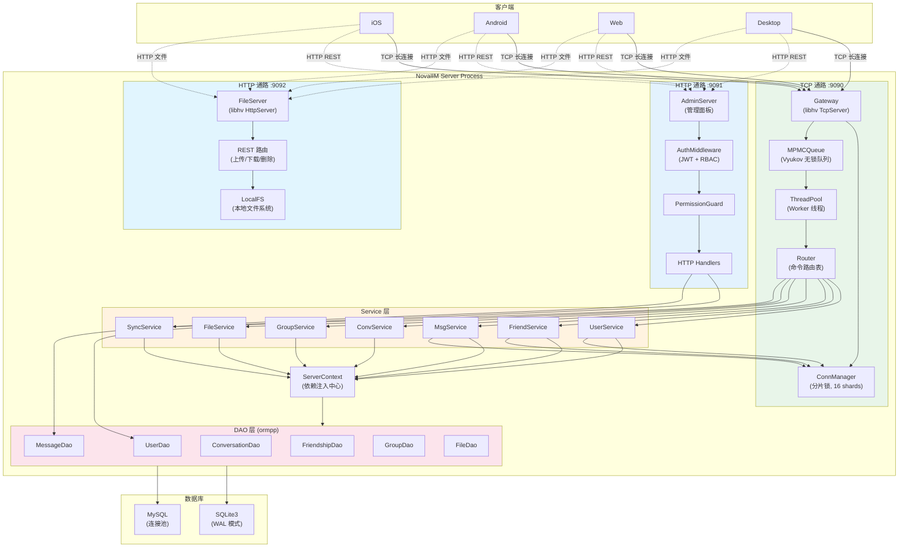
```mermaid
graph TB
    subgraph Clients["客户端"]
        iOS["iOS"]
        Android["Android"]
        Web["Web"]
        Desktop["Desktop"]
    end

    subgraph Server["NovaIIM Server Process"]
        subgraph TCP_Path["TCP 通路 :9090"]
            GW["Gateway<br/>(libhv TcpServer)"]
            CM["ConnManager<br/>(分片锁, 16 shards)"]
            MPMC["MPMCQueue<br/>(Vyukov 无锁队列)"]
            TP["ThreadPool<br/>(Worker 线程)"]
            RT["Router<br/>(命令路由表)"]
        end

        subgraph HTTP_Path["HTTP 通路 :9091"]
            AS["AdminServer<br/>(管理面板)"]
            AM["AuthMiddleware<br/>(JWT + RBAC)"]
            PG["PermissionGuard"]
            HH["HTTP Handlers"]
        end

        subgraph FILE_Path["HTTP 通路 :9092"]
            FSV["FileServer<br/>(libhv HttpServer)"]
            FRT["REST 路由<br/>(上传/下载/删除)"]
            LFS["LocalFS<br/>(本地文件系统)"]
        end

        subgraph Services["Service 层"]
            US["UserService"]
            FS["FriendService"]
            MS["MsgService"]
            CS["ConvService"]
            GS["GroupService"]
            FIS["FileService"]
            SS["SyncService"]
        end

        SC["ServerContext<br/>(依赖注入中心)"]

        subgraph DAO["DAO 层 (ormpp)"]
            UD["UserDao"]
            MD["MessageDao"]
            CD["ConversationDao"]
            FD["FriendshipDao"]
            GD["GroupDao"]
            FID["FileDao"]
        end
    end

    subgraph DB["数据库"]
        SQLite["SQLite3<br/>(WAL 模式)"]
        MySQL["MySQL<br/>(连接池)"]
    end

    iOS & Android & Web & Desktop -->|TCP 长连接| GW
    GW --> CM
    GW --> MPMC
    MPMC --> TP
    TP --> RT
    RT --> US & FS & MS & CS & GS & FIS & SS

    iOS & Android & Web & Desktop -.->|HTTP REST| AS
    AS --> AM --> PG --> HH
    HH --> UD & MD

    iOS & Android & Web & Desktop -.->|HTTP 文件| FSV
    FSV --> FRT --> LFS

    US & FS & MS & CS & GS & FIS & SS --> SC
    SC --> DAO
    DAO --> SQLite
    DAO --> MySQL

    US & FS & MS --> CM

    style TCP_Path fill:#e8f5e9
    style HTTP_Path fill:#e3f2fd
    style FILE_Path fill:#e1f5fe
    style Services fill:#fff3e0
    style DAO fill:#fce4ec
```

### 1.2 分层架构图


```mermaid
graph LR
    subgraph Presentation["接入层"]
        direction TB
        G1["Gateway (TCP)"]
        G2["AdminServer (HTTP)"]
        G3["FileServer (HTTP)"]
    end

    subgraph Distribution["分发层"]
        direction TB
        D1["MPMCQueue"]
        D2["ThreadPool"]
        D3["Router"]
    end

    subgraph Business["业务层"]
        direction TB
        B1["UserService"]
        B2["FriendService"]
        B3["MsgService"]
        B4["ConvService"]
        B5["GroupService"]
        B6["FileService"]
        B7["SyncService"]
    end

    subgraph Data["数据层"]
        direction TB
        DA1["DaoFactory"]
        DA2["DbManager"]
    end

    subgraph Storage["存储层"]
        direction TB
        S1["SQLite3 / MySQL"]
    end

    Presentation --> Distribution --> Business --> Data --> Storage
```

### 1.3 双通路数据流

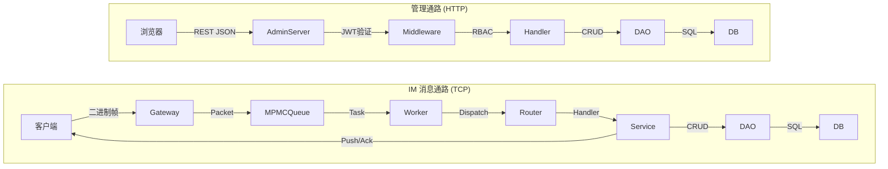
```mermaid
flowchart LR
    subgraph IM["IM 消息通路 (TCP)"]
        direction LR
        C1["客户端"] -->|二进制帧| G["Gateway"]
        G -->|Packet| Q["MPMCQueue"]
        Q -->|Task| W["Worker"]
        W -->|Dispatch| R["Router"]
        R -->|Handler| S["Service"]
        S -->|CRUD| D["DAO"]
        D -->|SQL| DB1["DB"]
        S -->|Push/Ack| C1
    end

    subgraph Admin["管理通路 (HTTP)"]
        direction LR
        B["浏览器"] -->|REST JSON| A["AdminServer"]
        A -->|JWT验证| M["Middleware"]
        M -->|RBAC| H["Handler"]
        H -->|CRUD| D2["DAO"]
        D2 -->|SQL| DB2["DB"]
    end
```

---

## 2. 启动流程

### 2.1 Application 启动时序图

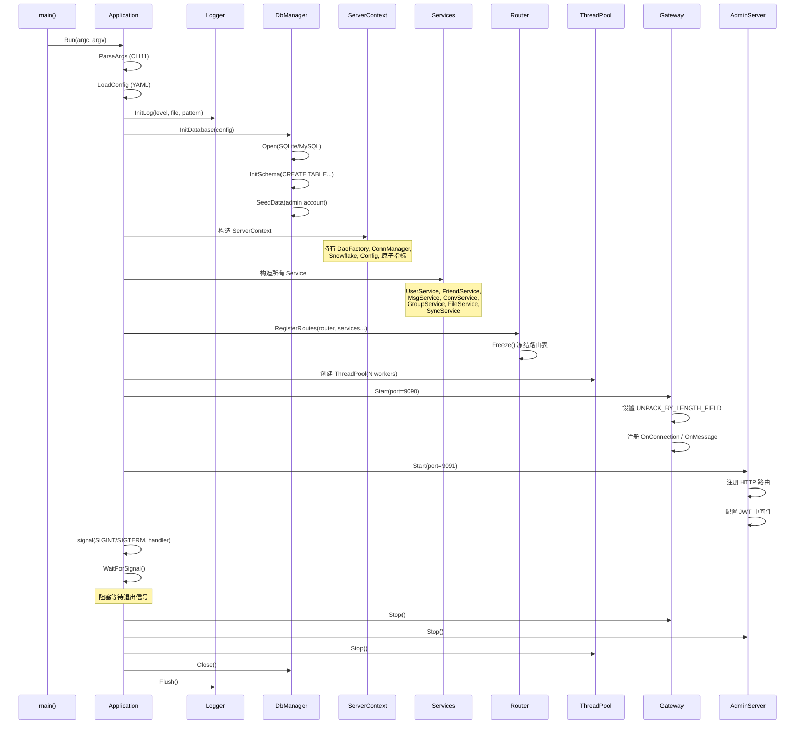
```mermaid
sequenceDiagram
    participant Main as main()
    participant App as Application
    participant Log as Logger
    participant DB as DbManager
    participant SC as ServerContext
    participant Svc as Services
    participant RT as Router
    participant TP as ThreadPool
    participant GW as Gateway
    participant AS as AdminServer

    Main->>App: Run(argc, argv)
    App->>App: ParseArgs (CLI11)
    App->>App: LoadConfig (YAML)
    App->>Log: InitLog(level, file, pattern)
    App->>DB: InitDatabase(config)
    DB->>DB: Open(SQLite/MySQL)
    DB->>DB: InitSchema(CREATE TABLE...)
    DB->>DB: SeedData(admin account)
    App->>SC: 构造 ServerContext
    Note over SC: 持有 DaoFactory, ConnManager,<br/>Snowflake, Config, 原子指标

    App->>Svc: 构造所有 Service
    Note over Svc: UserService, FriendService,<br/>MsgService, ConvService,<br/>GroupService, FileService,<br/>SyncService

    App->>RT: RegisterRoutes(router, services...)
    RT->>RT: Freeze() 冻结路由表

    App->>TP: 创建 ThreadPool(N workers)
    App->>GW: Start(port=9090)
    GW->>GW: 设置 UNPACK_BY_LENGTH_FIELD
    GW->>GW: 注册 OnConnection / OnMessage

    App->>AS: Start(port=9091)
    AS->>AS: 注册 HTTP 路由
    AS->>AS: 配置 JWT 中间件

    App->>App: signal(SIGINT/SIGTERM, handler)
    App->>App: WaitForSignal()
    Note over App: 阻塞等待退出信号

    App->>GW: Stop()
    App->>AS: Stop()
    App->>TP: Stop()
    App->>DB: Close()
    App->>Log: Flush()
```

---

## 3. 网络层与线程模型

### 3.1 Gateway 包处理流程

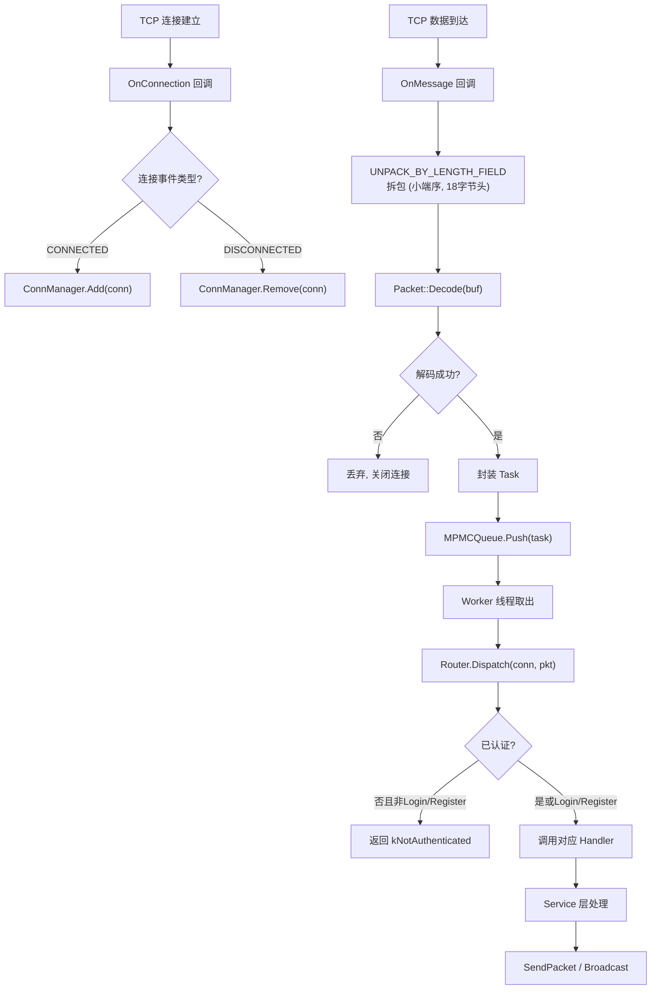
```mermaid
flowchart TD
    A["TCP 连接建立"] --> B["OnConnection 回调"]
    B --> C{"连接事件类型?"}
    C -->|CONNECTED| D["ConnManager.Add(conn)"]
    C -->|DISCONNECTED| E["ConnManager.Remove(conn)"]

    F["TCP 数据到达"] --> G["OnMessage 回调"]
    G --> H["UNPACK_BY_LENGTH_FIELD<br/>拆包 (小端序, 18字节头)"]
    H --> I["Packet::Decode(buf)"]
    I --> J{"解码成功?"}
    J -->|否| K["丢弃, 关闭连接"]
    J -->|是| L["封装 Task"]
    L --> M["MPMCQueue.Push(task)"]
    M --> N["Worker 线程取出"]
    N --> O["Router.Dispatch(conn, pkt)"]
    O --> P{"已认证?"}
    P -->|否且非Login/Register| Q["返回 kNotAuthenticated"]
    P -->|是或Login/Register| R["调用对应 Handler"]
    R --> S["Service 层处理"]
    S --> T["SendPacket / Broadcast"]
```

### 3.2 线程模型架构图

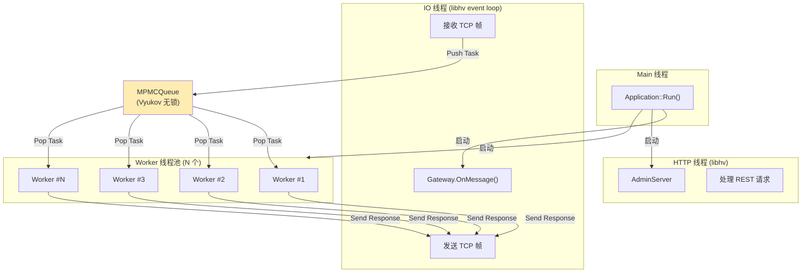
```mermaid
graph TB
    subgraph MainThread["Main 线程"]
        MT["Application::Run()"]
    end

    subgraph IOThread["IO 线程 (libhv event loop)"]
        IO["Gateway.OnMessage()"]
        IO2["接收 TCP 帧"]
        IO3["发送 TCP 帧"]
    end

    subgraph WorkerPool["Worker 线程池 (N 个)"]
        W1["Worker #1"]
        W2["Worker #2"]
        W3["Worker #3"]
        WN["Worker #N"]
    end

    subgraph HTTPThread["HTTP 线程 (libhv)"]
        HT["AdminServer"]
        HT2["处理 REST 请求"]
    end

    IO2 -->|Push Task| Q["MPMCQueue<br/>(Vyukov 无锁)"]
    Q -->|Pop Task| W1 & W2 & W3 & WN
    W1 & W2 & W3 & WN -->|Send Response| IO3

    MT -->|启动| IO
    MT -->|启动| HT
    MT -->|启动| WorkerPool

    style Q fill:#ffecb3
```

### 3.3 ConnManager 分片锁架构

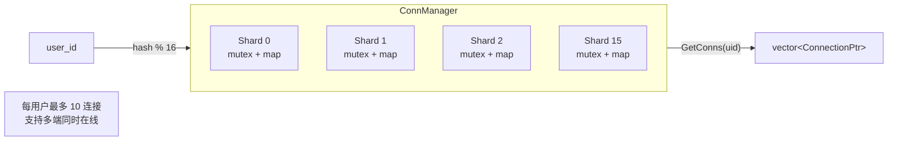
```mermaid
graph LR
    subgraph ConnManager
        direction TB
        S0["Shard 0<br/>mutex + map"]
        S1["Shard 1<br/>mutex + map"]
        S2["Shard 2<br/>mutex + map"]
        SN["Shard 15<br/>mutex + map"]
    end

    U["user_id"] -->|hash % 16| ConnManager
    ConnManager -->|"GetConns(uid)"| CL["vector&lt;ConnectionPtr&gt;"]

    Note1["每用户最多 10 连接<br/>支持多端同时在线"]
```

---

## 4. UserService — 用户服务

### 4.1 注册流程图

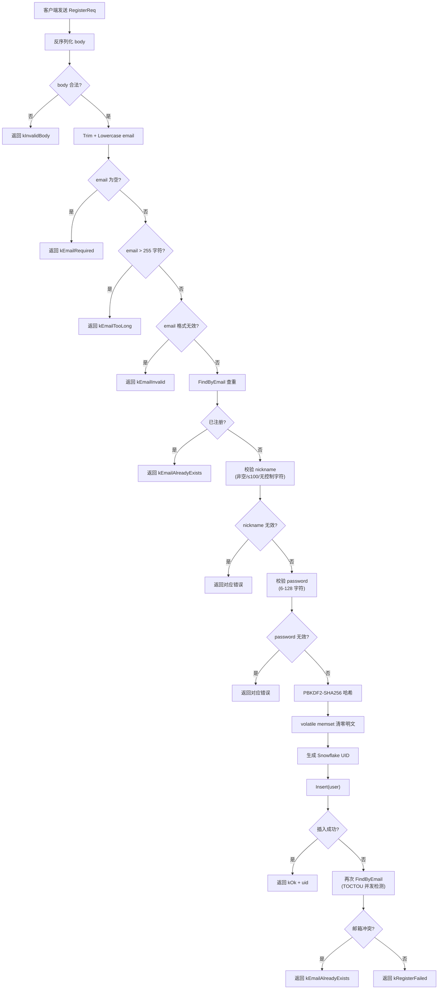
```mermaid
flowchart TD
    A["客户端发送 RegisterReq"] --> B["反序列化 body"]
    B --> C{"body 合法?"}
    C -->|否| D["返回 kInvalidBody"]
    C -->|是| E["Trim + Lowercase email"]
    E --> F{"email 为空?"}
    F -->|是| G["返回 kEmailRequired"]
    F -->|否| H{"email > 255 字符?"}
    H -->|是| I["返回 kEmailTooLong"]
    H -->|否| J{"email 格式无效?"}
    J -->|是| K["返回 kEmailInvalid"]
    J -->|否| L["FindByEmail 查重"]
    L --> M{"已注册?"}
    M -->|是| N["返回 kEmailAlreadyExists"]
    M -->|否| O["校验 nickname<br/>(非空/≤100/无控制字符)"]
    O --> P{"nickname 无效?"}
    P -->|是| Q["返回对应错误"]
    P -->|否| R["校验 password<br/>(6-128 字符)"]
    R --> S{"password 无效?"}
    S -->|是| T["返回对应错误"]
    S -->|否| U["PBKDF2-SHA256 哈希"]
    U --> V["volatile memset 清零明文"]
    V --> W["生成 Snowflake UID"]
    W --> X["Insert(user)"]
    X --> Y{"插入成功?"}
    Y -->|是| Z["返回 kOk + uid"]
    Y -->|否| AA["再次 FindByEmail<br/>(TOCTOU 并发检测)"]
    AA --> AB{"邮箱冲突?"}
    AB -->|是| AC["返回 kEmailAlreadyExists"]
    AB -->|否| AD["返回 kRegisterFailed"]
```

### 4.2 登录时序图

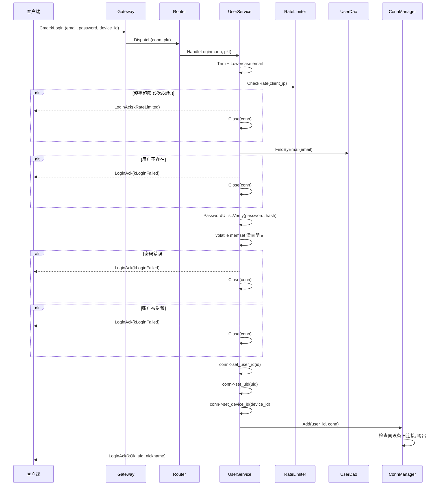
```mermaid
sequenceDiagram
    participant C as 客户端
    participant GW as Gateway
    participant RT as Router
    participant US as UserService
    participant RL as RateLimiter
    participant DAO as UserDao
    participant CM as ConnManager

    C->>GW: Cmd::kLogin (email, password, device_id)
    GW->>RT: Dispatch(conn, pkt)
    RT->>US: HandleLogin(conn, pkt)

    US->>US: Trim + Lowercase email
    US->>RL: CheckRate(client_ip)
    alt 频率超限 (5次/60秒)
        US-->>C: LoginAck(kRateLimited)
        US->>US: Close(conn)
    end

    US->>DAO: FindByEmail(email)
    alt 用户不存在
        US-->>C: LoginAck(kLoginFailed)
        US->>US: Close(conn)
    end

    US->>US: PasswordUtils::Verify(password, hash)
    US->>US: volatile memset 清零明文

    alt 密码错误
        US-->>C: LoginAck(kLoginFailed)
        US->>US: Close(conn)
    end

    alt 账户被封禁
        US-->>C: LoginAck(kLoginFailed)
        US->>US: Close(conn)
    end

    US->>US: conn->set_user_id(id)
    US->>US: conn->set_uid(uid)
    US->>US: conn->set_device_id(device_id)
    US->>CM: Add(user_id, conn)
    CM->>CM: 检查同设备旧连接, 踢出
    US-->>C: LoginAck(kOk, uid, nickname)
```

### 4.3 用户服务状态机

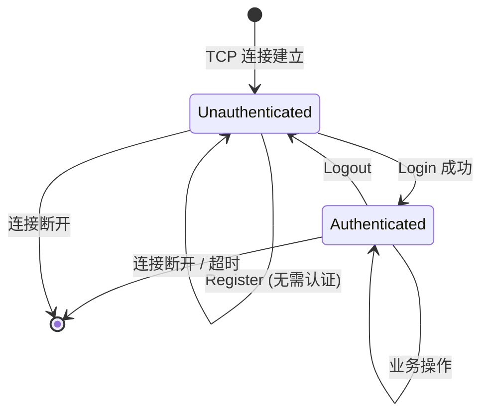
```mermaid
stateDiagram-v2
    [*] --> Unauthenticated: TCP 连接建立
    Unauthenticated --> Authenticated: Login 成功
    Unauthenticated --> Unauthenticated: Register (无需认证)
    Authenticated --> Authenticated: Heartbeat 续期
    Authenticated --> Authenticated: 业务操作
    Authenticated --> Unauthenticated: Logout
    Authenticated --> [*]: 连接断开 / 超时
    Unauthenticated --> [*]: 连接断开
```

---

## 5. FriendService — 好友服务

### 5.1 好友申请完整流程图

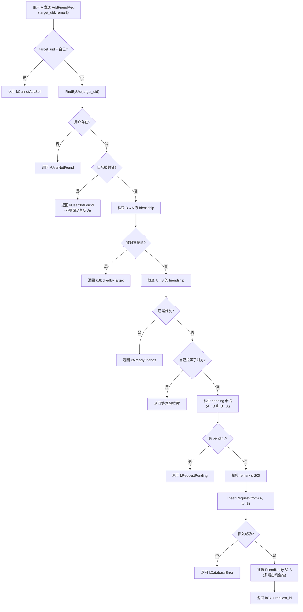
```mermaid
flowchart TD
    A["用户 A 发送 AddFriendReq<br/>(target_uid, remark)"] --> B{"target_uid = 自己?"}
    B -->|是| C["返回 kCannotAddSelf"]
    B -->|否| D["FindByUid(target_uid)"]
    D --> E{"用户存在?"}
    E -->|否| F["返回 kUserNotFound"]
    E -->|是| G{"目标被封禁?"}
    G -->|是| H["返回 kUserNotFound<br/>(不暴露封禁状态)"]
    G -->|否| I["检查 B→A 的 friendship"]
    I --> J{"被对方拉黑?"}
    J -->|是| K["返回 kBlockedByTarget"]
    J -->|否| L["检查 A→B 的 friendship"]
    L --> M{"已是好友?"}
    M -->|是| N["返回 kAlreadyFriends"]
    M -->|否| O{"自己拉黑了对方?"}
    O -->|是| P["返回'先解除拉黑'"]
    O -->|否| Q["检查 pending 申请<br/>(A→B 和 B→A)"]
    Q --> R{"有 pending?"}
    R -->|是| S["返回 kRequestPending"]
    R -->|否| T["校验 remark ≤ 200"]
    T --> U["InsertRequest(from=A, to=B)"]
    U --> V{"插入成功?"}
    V -->|否| W["返回 kDatabaseError"]
    V -->|是| X["推送 FriendNotify 给 B<br/>(多端在线全推)"]
    X --> Y["返回 kOk + request_id"]
```

### 5.2 好友申请处理时序图

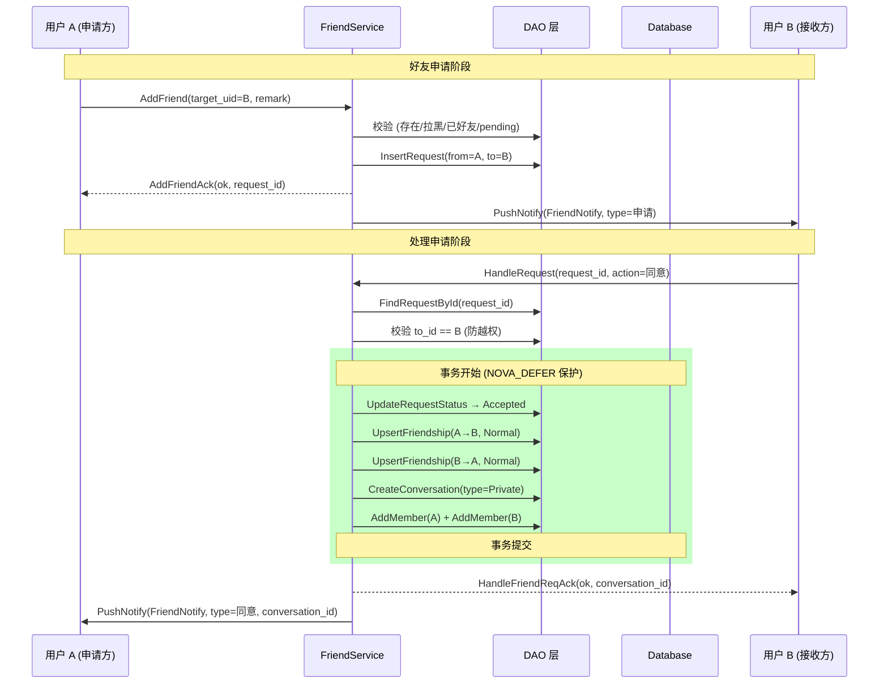
```mermaid
sequenceDiagram
    participant A as 用户 A (申请方)
    participant S as FriendService
    participant DAO as DAO 层
    participant DB as Database
    participant B as 用户 B (接收方)

    Note over A,B: 好友申请阶段
    A->>S: AddFriend(target_uid=B, remark)
    S->>DAO: 校验 (存在/拉黑/已好友/pending)
    S->>DAO: InsertRequest(from=A, to=B)
    S-->>A: AddFriendAck(ok, request_id)
    S->>B: PushNotify(FriendNotify, type=申请)

    Note over A,B: 处理申请阶段
    B->>S: HandleRequest(request_id, action=同意)
    S->>DAO: FindRequestById(request_id)
    S->>DAO: 校验 to_id == B (防越权)

    rect rgb(200, 255, 200)
        Note over S,DB: 事务开始 (NOVA_DEFER 保护)
        S->>DAO: UpdateRequestStatus → Accepted
        S->>DAO: UpsertFriendship(A→B, Normal)
        S->>DAO: UpsertFriendship(B→A, Normal)
        S->>DAO: CreateConversation(type=Private)
        S->>DAO: AddMember(A) + AddMember(B)
        Note over S,DB: 事务提交
    end

    S-->>B: HandleFriendReqAck(ok, conversation_id)
    S->>A: PushNotify(FriendNotify, type=同意, conversation_id)
```

### 5.3 好友关系状态机

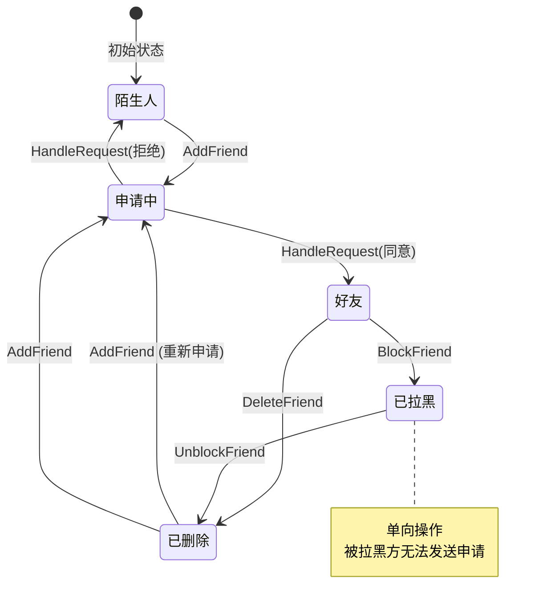
```mermaid
stateDiagram-v2
    [*] --> 陌生人: 初始状态

    陌生人 --> 申请中: AddFriend
    申请中 --> 好友: HandleRequest(同意)
    申请中 --> 陌生人: HandleRequest(拒绝)

    好友 --> 已删除: DeleteFriend
    好友 --> 已拉黑: BlockFriend

    已删除 --> 申请中: AddFriend (重新申请)

    已拉黑 --> 已删除: UnblockFriend
    已删除 --> 申请中: AddFriend

    Note right of 已拉黑: 单向操作<br/>被拉黑方无法发送申请
```

---

## 6. MsgService — 消息服务

### 6.1 消息发送流程图

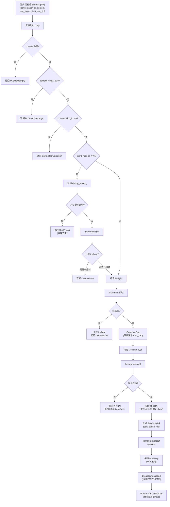
```mermaid
flowchart TD
    A["客户端发送 SendMsgReq<br/>(conversation_id, content,<br/>msg_type, client_msg_id)"] --> B["反序列化 body"]
    B --> C{"content 为空?"}
    C -->|是| D["返回 kContentEmpty"]
    C -->|否| E{"content > max_size?"}
    E -->|是| F["返回 kContentTooLarge"]
    E -->|否| G{"conversation_id ≤ 0?"}
    G -->|是| H["返回 kInvalidConversation"]
    G -->|否| I{"client_msg_id 非空?"}

    I -->|是| J["加锁 dedup_mutex_"]
    J --> K{"LRU 缓存命中?"}
    K -->|是| L["返回缓存的 Ack<br/>(幂等去重)"]
    K -->|否| M["TryMarkInflight"]
    M --> N{"已有 in-flight?"}
    N -->|是且未超时| O["返回 kServerBusy"]
    N -->|否或已超时| P["标记 in-flight"]

    I -->|否| P
    P --> Q["IsMember 校验"]
    Q --> R{"非成员?"}
    R -->|是| S["清除 in-flight<br/>返回 kNotMember"]
    R -->|否| T["GenerateSeq<br/>(原子递增 max_seq)"]
    T --> U["构建 Message 对象"]
    U --> V["Insert(message)"]
    V --> W{"写入成功?"}
    W -->|否| X["清除 in-flight<br/>返回 kDatabaseError"]
    W -->|是| Y["DedupInsert<br/>(缓存 Ack, 移除 in-flight)"]
    Y --> Z["返回 SendMsgAck<br/>(seq, epoch_ms)"]
    Z --> AA["自动恢复隐藏会话<br/>(unhide)"]
    AA --> BB["编码 PushMsg<br/>(一次编码)"]
    BB --> CC["BroadcastEncoded<br/>(推送所有在线成员)"]
    CC --> DD["BroadcastConvUpdate<br/>(新消息摘要推送)"]
```

### 6.2 消息投递全链路时序图

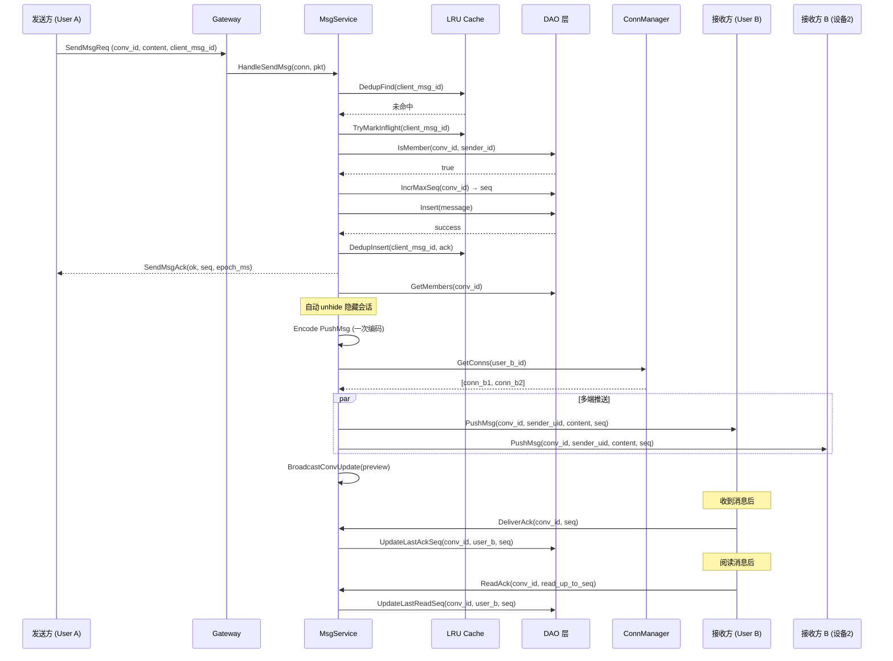
```mermaid
sequenceDiagram
    participant A as 发送方 (User A)
    participant GW as Gateway
    participant MS as MsgService
    participant Cache as LRU Cache
    participant DAO as DAO 层
    participant CM as ConnManager
    participant B as 接收方 (User B)
    participant B2 as 接收方 B (设备2)

    A->>GW: SendMsgReq (conv_id, content, client_msg_id)
    GW->>MS: HandleSendMsg(conn, pkt)

    MS->>Cache: DedupFind(client_msg_id)
    Cache-->>MS: 未命中

    MS->>Cache: TryMarkInflight(client_msg_id)
    MS->>DAO: IsMember(conv_id, sender_id)
    DAO-->>MS: true

    MS->>DAO: IncrMaxSeq(conv_id) → seq
    MS->>DAO: Insert(message)
    DAO-->>MS: success

    MS->>Cache: DedupInsert(client_msg_id, ack)
    MS-->>A: SendMsgAck(ok, seq, epoch_ms)

    MS->>DAO: GetMembers(conv_id)
    Note over MS: 自动 unhide 隐藏会话

    MS->>MS: Encode PushMsg (一次编码)

    MS->>CM: GetConns(user_b_id)
    CM-->>MS: [conn_b1, conn_b2]

    par 多端推送
        MS->>B: PushMsg(conv_id, sender_uid, content, seq)
        MS->>B2: PushMsg(conv_id, sender_uid, content, seq)
    end

    MS->>MS: BroadcastConvUpdate(preview)

    Note over B: 收到消息后
    B->>MS: DeliverAck(conv_id, seq)
    MS->>DAO: UpdateLastAckSeq(conv_id, user_b, seq)

    Note over B: 阅读消息后
    B->>MS: ReadAck(conv_id, read_up_to_seq)
    MS->>DAO: UpdateLastReadSeq(conv_id, user_b, seq)
```

### 6.3 消息撤回流程图

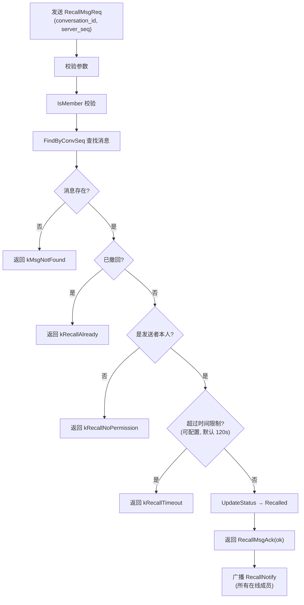
```mermaid
flowchart TD
    A["发送 RecallMsgReq<br/>(conversation_id, server_seq)"] --> B["校验参数"]
    B --> C["IsMember 校验"]
    C --> D["FindByConvSeq 查找消息"]
    D --> E{"消息存在?"}
    E -->|否| F["返回 kMsgNotFound"]
    E -->|是| G{"已撤回?"}
    G -->|是| H["返回 kRecallAlready"]
    G -->|否| I{"是发送者本人?"}
    I -->|否| J["返回 kRecallNoPermission"]
    I -->|是| K{"超过时间限制?<br/>(可配置, 默认 120s)"}
    K -->|是| L["返回 kRecallTimeout"]
    K -->|否| M["UpdateStatus → Recalled"]
    M --> N["返回 RecallMsgAck(ok)"]
    N --> O["广播 RecallNotify<br/>(所有在线成员)"]
```

### 6.4 消息去重机制架构图

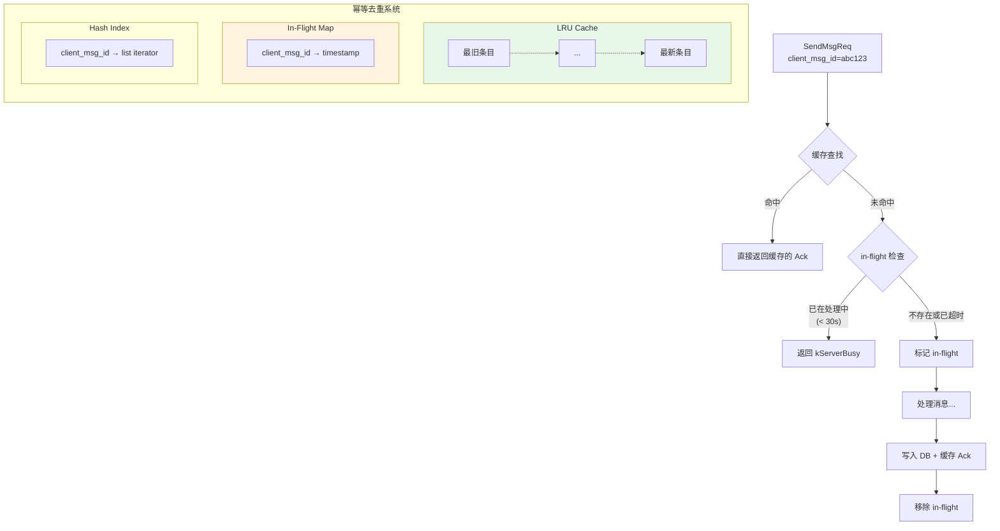
```mermaid
graph TB
    subgraph DedupSystem["幂等去重系统"]
        direction TB

        subgraph LRU["LRU Cache"]
            direction LR
            OLD["最旧条目"] -.-> MID["..."] -.-> NEW["最新条目"]
        end

        subgraph InFlight["In-Flight Map"]
            IF1["client_msg_id → timestamp"]
        end

        subgraph Index["Hash Index"]
            HI["client_msg_id → list iterator"]
        end
    end

    REQ["SendMsgReq<br/>client_msg_id=abc123"] --> CHECK{"缓存查找"}
    CHECK -->|命中| RET["直接返回缓存的 Ack"]
    CHECK -->|未命中| FLIGHT{"in-flight 检查"}
    FLIGHT -->|"已在处理中<br/>(< 30s)"| BUSY["返回 kServerBusy"]
    FLIGHT -->|"不存在或已超时"| MARK["标记 in-flight"]
    MARK --> PROCESS["处理消息..."]
    PROCESS --> INSERT["写入 DB + 缓存 Ack"]
    INSERT --> REMOVE["移除 in-flight"]

    style LRU fill:#e8f5e9
    style InFlight fill:#fff3e0
```

---

## 7. ConvService — 会话服务

### 7.1 会话列表获取流程图

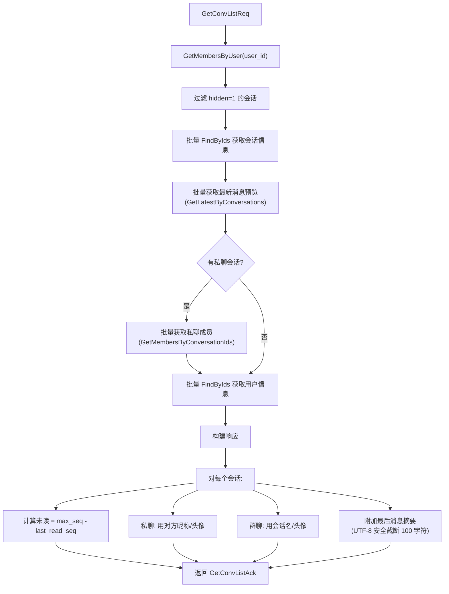
```mermaid
flowchart TD
    A["GetConvListReq"] --> B["GetMembersByUser(user_id)"]
    B --> C["过滤 hidden=1 的会话"]
    C --> D["批量 FindByIds 获取会话信息"]
    D --> E["批量获取最新消息预览<br/>(GetLatestByConversations)"]
    E --> F{"有私聊会话?"}
    F -->|是| G["批量获取私聊成员<br/>(GetMembersByConversationIds)"]
    G --> H["批量 FindByIds 获取用户信息"]
    F -->|否| H
    H --> I["构建响应"]
    I --> J["对每个会话:"]
    J --> K["计算未读 = max_seq - last_read_seq"]
    J --> L["私聊: 用对方昵称/头像"]
    J --> M["群聊: 用会话名/头像"]
    J --> N["附加最后消息摘要<br/>(UTF-8 安全截断 100 字符)"]
    K & L & M & N --> O["返回 GetConvListAck"]
```

### 7.2 会话生命周期状态机

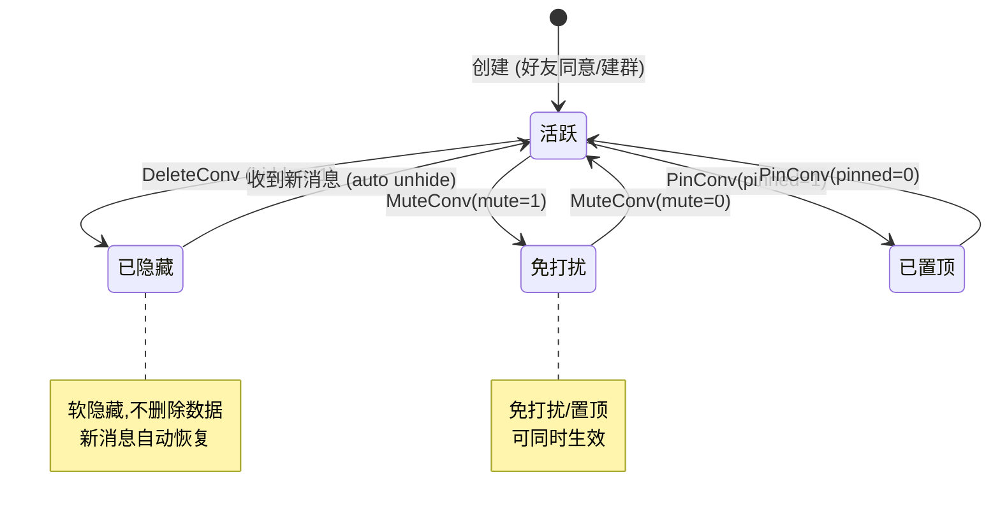
```mermaid
stateDiagram-v2
    [*] --> 活跃: 创建 (好友同意/建群)
    活跃 --> 已隐藏: DeleteConv (hidden=1)
    已隐藏 --> 活跃: 收到新消息 (auto unhide)
    活跃 --> 免打扰: MuteConv(mute=1)
    免打扰 --> 活跃: MuteConv(mute=0)
    活跃 --> 已置顶: PinConv(pinned=1)
    已置顶 --> 活跃: PinConv(pinned=0)

    Note right of 已隐藏: 软隐藏,不删除数据<br/>新消息自动恢复
    Note right of 免打扰: 免打扰/置顶<br/>可同时生效
```

### 7.3 会话操作时序图

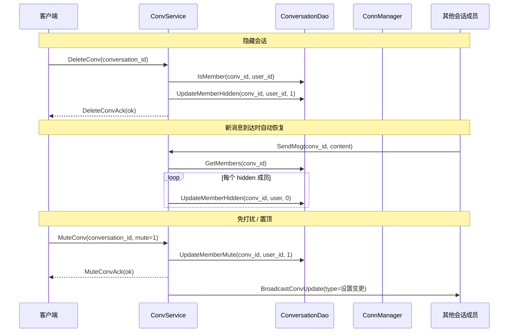
```mermaid
sequenceDiagram
    participant C as 客户端
    participant CS as ConvService
    participant DAO as ConversationDao
    participant CM as ConnManager
    participant Others as 其他会话成员

    Note over C,Others: 隐藏会话
    C->>CS: DeleteConv(conversation_id)
    CS->>DAO: IsMember(conv_id, user_id)
    CS->>DAO: UpdateMemberHidden(conv_id, user_id, 1)
    CS-->>C: DeleteConvAck(ok)

    Note over C,Others: 新消息到达时自动恢复
    Others->>CS: SendMsg(conv_id, content)
    CS->>DAO: GetMembers(conv_id)
    loop 每个 hidden 成员
        CS->>DAO: UpdateMemberHidden(conv_id, user, 0)
    end

    Note over C,Others: 免打扰 / 置顶
    C->>CS: MuteConv(conversation_id, mute=1)
    CS->>DAO: UpdateMemberMute(conv_id, user_id, 1)
    CS-->>C: MuteConvAck(ok)
    CS->>Others: BroadcastConvUpdate(type=设置变更)
```

---

## 8. GroupService — 群组服务

### 8.1 建群流程图

```mermaid
flowchart TD
    A["CreateGroupReq<br/>(name, avatar, member_ids)"] --> B{"name 为空?"}
    B -->|是| C["返回 kNameRequired"]
    B -->|否| D{"name > 100 字符?"}
    D -->|是| E["返回 kNameTooLong"]
    D -->|否| F{"含控制字符?"}
    F -->|是| G["返回 name invalid"]
    F -->|否| H{"avatar > 512 字符?"}
    H -->|是| I["返回 avatar too long"]
    H -->|否| J["去重 + 移除自己"]
    J --> K{"成员 < 2?"}
    K -->|是| L["返回 kNotEnoughMembers"]
    K -->|否| M{"成员 + 1 > 500?"}
    M -->|是| N["返回 exceeds limit"]
    M -->|否| O["FindByIds 校验所有成员"]
    O --> P{"有不存在/封禁用户?"}
    P -->|是| Q["返回 kUserNotFound"]
    P -->|否| R["开始事务"]

    R --> S["CreateConversation<br/>(type=Group)"]
    S --> T["InsertGroup<br/>(conversation_id, name, owner)"]
    T --> U["AddMember(群主, role=Owner)"]
    U --> V["循环 AddMember<br/>(成员, role=Member)"]
    V --> W["提交事务"]
    W --> X["返回 CreateGroupAck<br/>(conversation_id, group_id)"]
    X --> Y["SendGroupNotify<br/>(type=Created, 所有成员)"]

    R -.->|失败| Z["NOVA_DEFER 回滚事务"]
```

### 8.2 入群审批时序图

```mermaid
sequenceDiagram
    participant A as 申请者
    participant GS as GroupService
    participant DAO as DAO 层
    participant Owner as 群主/管理员
    participant Members as 群成员

    Note over A,Members: 阶段一: 申请入群
    A->>GS: JoinGroup(conversation_id)
    GS->>DAO: 校验 (存在/已入群/封禁/上限)
    GS->>DAO: InsertJoinRequest(user_id, conv_id)
    GS-->>A: JoinGroupAck(ok, request_id)
    GS->>Owner: GroupNotify(type=JoinRequest)

    Note over A,Members: 阶段二: 审批
    Owner->>GS: HandleJoinReq(request_id, action=同意)
    GS->>DAO: FindJoinRequestById(request_id)
    GS->>DAO: 校验审批者权限 (Owner/Admin)
    GS->>DAO: 再次校验申请者状态 (封禁/删除?)
    GS->>DAO: 再次校验群成员上限

    rect rgb(200, 255, 200)
        Note over GS,DAO: 事务
        GS->>DAO: UpdateJoinRequest → Accepted
        GS->>DAO: AddMember(申请者, role=Member)
    end

    GS-->>Owner: HandleJoinReqAck(ok)
    GS->>A: GroupNotify(type=Approved)
    GS->>Members: GroupNotify(type=MemberJoined)
```

### 8.3 群组角色权限架构图

```mermaid
graph TB
    subgraph Roles["群组角色层级"]
        direction TB
        OWNER["群主 (Owner)"]
        ADMIN["管理员 (Admin)"]
        MEMBER["普通成员 (Member)"]

        OWNER -->|管理| ADMIN
        ADMIN -->|管理| MEMBER
    end

    subgraph Permissions["操作权限矩阵"]
        direction TB
        P1["解散群: 仅群主"]
        P2["踢人: 群主踢所有人, 管理员踢成员"]
        P3["设管理员: 仅群主"]
        P4["修改群信息: 群主+管理员"]
        P5["审批入群: 群主+管理员"]
        P6["退群: 群主须先转让"]
    end

    OWNER --- P1 & P3 & P6
    OWNER & ADMIN --- P2 & P4 & P5
```

### 8.4 群组操作状态流转

```mermaid
stateDiagram-v2
    [*] --> 活跃群: CreateGroup

    state 活跃群 {
        [*] --> 正常
        正常 --> 正常: UpdateGroup (改名/头像/公告)
        正常 --> 正常: SetMemberRole (设管理员)
    }

    state 成员管理 {
        [*] --> 申请中: JoinGroup
        申请中 --> 已入群: HandleJoinReq(同意)
        申请中 --> 已拒绝: HandleJoinReq(拒绝)
        已入群 --> 已退出: LeaveGroup
        已入群 --> 已踢出: KickMember
    }

    活跃群 --> [*]: DismissGroup (仅群主)
```

---

## 9. FileService — 文件服务

### 9.1 文件上传流程图

```mermaid
flowchart TD
    A["客户端发送 UploadReq<br/>(file_name, file_size,<br/>mime_type, file_hash, file_type)"] --> B["校验参数"]
    B --> C{"file_name 为空?"}
    C -->|是| D["返回 kFileNameRequired"]
    C -->|否| E{"file_size ≤ 0?"}
    E -->|是| F["返回 kFileSizeInvalid"]
    E -->|否| G{"file_size > 100MB?"}
    G -->|是| H["返回 kFileSizeTooLarge"]
    G -->|否| I{"mime_type 为空?"}
    I -->|是| J["返回 kMimeTypeRequired"]
    I -->|否| K{"file_type 不在白名单?<br/>(avatar/image/voice/video/file)"}
    K -->|是| L["返回 kInvalidFileType"]
    K -->|否| M{"file_hash 非空?"}

    M -->|是| N["秒传检测:<br/>FindLatestByUserAndType"]
    N --> O{"hash 匹配?"}
    O -->|是| P["返回 already_exists=1<br/>(秒传成功)"]
    O -->|否| Q["继续上传流程"]

    M -->|否| Q
    Q --> R["路径安全: 提取文件名<br/>(防路径穿越)"]
    R --> S["Insert(file, path='pending')"]
    S --> T["生成唯一路径:<br/>uploads/YYYYMMDD/id_uid_name"]
    T --> U["UpdatePath(file_id, path)"]
    U --> V["返回 UploadAck<br/>(file_id, upload_url)"]
```

### 9.2 文件上传下载时序图

```mermaid
sequenceDiagram
    participant C as 客户端
    participant FS as FileService
    participant DAO as FileDao
    participant Store as 文件存储

    Note over C,Store: 上传流程
    C->>FS: UploadReq(name, size, mime, hash)
    FS->>DAO: 秒传检测 FindLatestByUserAndType
    alt hash 命中 (秒传)
        FS-->>C: UploadAck(already_exists=1, file_id)
    else 需要上传
        FS->>DAO: Insert(file, path=pending)
        FS->>FS: 生成唯一路径 uploads/date/id_uid_name
        FS->>DAO: UpdatePath(file_id, rel_path)
        FS-->>C: UploadAck(file_id, upload_url)

        C->>Store: 实际文件上传 (upload_url)
        C->>FS: UploadComplete(file_id)
        FS->>DAO: FindById(file_id) + 校验 owner
        FS-->>C: UploadCompleteAck(ok, file_path)
    end

    Note over C,Store: 下载流程
    C->>FS: DownloadReq(file_id)
    FS->>DAO: FindById(file_id)
    alt 自己的文件
        FS-->>C: DownloadAck(download_url, name, size)
    else 他人的文件
        FS->>DAO: GetMembersByUser(me) + GetMembersByUser(owner)
        FS->>FS: 检查是否共享会话
        alt 共享会话 (有权限)
            FS-->>C: DownloadAck(download_url, name, size)
        else 无共享会话
            FS-->>C: DownloadAck(kFileNotFound)
        end
    end
```

### 9.3 文件下载鉴权决策图

```mermaid
flowchart TD
    A["DownloadReq(file_id)"] --> B["FindById(file_id)"]
    B --> C{"文件存在?"}
    C -->|否| D["返回 kFileNotFound"]
    C -->|是| E{"file.user_id == 请求者?"}
    E -->|是| F["返回下载链接 ✅"]
    E -->|否| G["获取双方会话列表"]
    G --> H["构建文件主人会话集合"]
    H --> I["遍历请求者会话"]
    I --> J{"存在交集<br/>(共享会话)?"}
    J -->|是| K["返回下载链接 ✅"]
    J -->|否| L["返回 kFileNotFound ❌<br/>(不暴露文件存在)"]
```

---

## 10. SyncService — 同步服务

### 10.1 离线消息同步流程图

```mermaid
flowchart TD
    A["SyncMsgReq<br/>(conversation_id, last_seq, limit)"] --> B{"conversation_id ≤ 0?"}
    B -->|是| C["返回 kInvalidBody"]
    B -->|否| D["IsMember 校验"]
    D --> E{"非成员?"}
    E -->|是| F["返回 kNotMember"]
    E -->|否| G["规范化 limit"]
    G --> H["limit ≤ 0 → sync_default<br/>limit > sync_max → sync_max"]
    H --> I["GetAfterSeq(conv_id, last_seq, limit)"]
    I --> J["批量 FindByIds 获取发送者信息<br/>(避免 N+1)"]
    J --> K["构建 SyncMsgResp"]
    K --> L["has_more = messages.size() ≥ limit"]
    L --> M["返回消息列表 + has_more"]
```

### 10.2 客户端上线同步时序图

```mermaid
sequenceDiagram
    participant C as 客户端
    participant US as UserService
    participant SS as SyncService
    participant DAO as DAO 层
    participant CM as ConnManager

    C->>US: Login(email, password)
    US-->>C: LoginAck(ok, uid)

    Note over C: 上线后立即拉取未读
    C->>SS: SyncUnread()
    SS->>DAO: GetMembersByUser(user_id)
    SS->>DAO: FindByIds(conv_ids) 批量获取会话
    SS->>SS: 计算各会话未读数<br/>(max_seq - last_read_seq)

    SS->>DAO: GetLatestByConversations(preview_convs, 3)
    Note over SS: 批量获取预览消息 (UNION ALL)
    SS->>DAO: FindByIds(sender_ids) 批量获取发送者
    SS-->>C: SyncUnreadResp(total_unread, items[])

    Note over C: 对每个有未读的会话拉取完整消息
    loop 每个未读会话
        C->>SS: SyncMsg(conv_id, last_seq, limit=50)
        SS->>DAO: GetAfterSeq(conv_id, last_seq, 50)
        SS-->>C: SyncMsgResp(messages[], has_more)

        alt has_more == true
            C->>SS: SyncMsg(conv_id, new_last_seq, 50)
            SS-->>C: SyncMsgResp(更多消息...)
        end
    end
```

### 10.3 未读数计算示意图

```mermaid
graph LR
    subgraph Conversation["会话 (conv_id=42)"]
        direction TB
        MS["max_seq = 150"]
    end

    subgraph MemberA["成员 A"]
        direction TB
        ARS["last_read_seq = 145"]
        AAS["last_ack_seq = 148"]
    end

    subgraph MemberB["成员 B"]
        direction TB
        BRS["last_read_seq = 100"]
        BAS["last_ack_seq = 120"]
    end

    Conversation --- MemberA
    Conversation --- MemberB

    UA["A 未读 = 150 - 145 = 5"]
    UB["B 未读 = 150 - 100 = 50"]

    MemberA --> UA
    MemberB --> UB
```

---

## 11. AdminServer — 管理面板

### 11.1 HTTP 请求处理管线

```mermaid
flowchart LR
    A["HTTP 请求"] --> B["AdminServer<br/>(libhv HttpServer)"]
    B --> C{"路径匹配?"}
    C -->|"/auth/*"| D["直接处理<br/>(无需认证)"]
    C -->|其他| E["AuthMiddleware"]
    E --> F["提取 Bearer Token"]
    F --> G["JWT Verify<br/>(l8w8jwt, HS256)"]
    G --> H{"验签成功?"}
    H -->|否| I["401 Unauthorized"]
    H -->|是| J["IsRevoked 查黑名单<br/>(fail-closed)"]
    J --> K{"已吊销?"}
    K -->|是| L["401 Token Revoked"]
    K -->|否| M["查询 admin 状态"]
    M --> N{"admin 已删除?"}
    N -->|是| O["401 Account Disabled"]
    N -->|否| P["注入 X-Nova-Admin-Id"]
    P --> Q["加载 RBAC 权限"]
    Q --> R["PermissionGuard<br/>RequirePermission(...)"]
    R --> S{"有权限?"}
    S -->|否| T["403 Forbidden"]
    S -->|是| U["Handler 处理业务"]
    U --> V["写审计日志"]
    V --> W["200 JSON Response"]
```

### 11.2 管理员认证时序图

```mermaid
sequenceDiagram
    participant B as 浏览器
    participant AS as AdminServer
    participant MW as AuthMiddleware
    participant DAO as AdminAccountDao
    participant SD as AdminSessionDao
    participant JWT as l8w8jwt

    Note over B,JWT: 登录
    B->>AS: POST /auth/login {uid, password}
    AS->>DAO: FindByUid(uid)
    AS->>AS: PasswordUtils::Verify(password, hash)
    AS->>JWT: Sign(admin_id, expires=24h)
    AS->>SD: Insert(token_hash, admin_id)
    AS-->>B: {token, admin_id, nickname}

    Note over B,JWT: 后续请求
    B->>AS: GET /users (Authorization: Bearer xxx)
    AS->>MW: 拦截请求
    MW->>JWT: Verify(token)
    MW->>SD: IsRevoked(token_hash)
    Note over MW: fail-closed: 查询失败视为已吊销
    MW->>DAO: FindById(admin_id) 检查状态
    MW->>MW: 加载权限列表
    MW->>AS: 注入 X-Nova-Admin-Id
    AS->>AS: RequirePermission("user:list")
    AS-->>B: {users: [...]}

    Note over B,JWT: 登出
    B->>AS: POST /auth/logout
    AS->>SD: RevokeByTokenHash(hash)
    AS->>SD: 审计日志
    AS-->>B: {message: "ok"}
```

### 11.3 Admin 路由架构图

```mermaid
graph TB
    subgraph AdminServer["AdminServer HTTP 路由"]
        direction TB

        subgraph Auth["认证 (无需 JWT)"]
            A1["POST /auth/login"]
            A2["POST /auth/logout"]
            A3["GET /auth/me"]
        end

        subgraph Dashboard["仪表盘"]
            D1["GET /dashboard/stats"]
        end

        subgraph Users["用户管理"]
            U1["GET /users"]
            U2["POST /users"]
            U3["GET /users/:id"]
            U4["DELETE /users/:id"]
            U5["POST /users/:id/reset-password"]
            U6["POST /users/:id/ban"]
            U7["POST /users/:id/unban"]
            U8["POST /users/:id/kick"]
        end

        subgraph Messages["消息管理"]
            M1["GET /messages"]
            M2["POST /messages/:id/recall"]
        end

        subgraph Audit["审计日志"]
            AL1["GET /audit-logs"]
        end
    end

    MW["AuthMiddleware<br/>(JWT + RBAC)"] --> Dashboard & Users & Messages & Audit
```

---

## 12. FileServer — HTTP 文件服务器

独立 HTTP 端口 (默认 9092)，提供文件上传/下载/删除 REST 接口，与 TCP 层 FileService (元数据管理) 配合工作。

### 12.1 路由结构

| 方法 | 路径 | 功能 |
|------|------|------|
| GET | `/healthz` | 健康检查 |
| GET | `/static/**` | 静态文件预览/下载 (小文件 FileCache + 大文件 >4MB 流式) |
| POST | `/api/v1/files/upload` | 小文件上传 (multipart/form-data 或 raw body) |
| POST | `/api/v1/files/upload/{filename}` | 大文件流式上传 (http_state_handler 逐块写入) |
| DELETE | `/api/v1/files/{filename}` | 删除文件 |

### 12.2 安全措施

- **路径校验 (IsPathSafe):** 拒绝 `..`、绝对路径、空字节、Windows 盘符、空文件名
- **Multipart 安全:** 对原始文件名执行 IsPathSafe 校验后再做 basename 提取
- **流式上传安全:** URL 路径中 `..` / `/` / `\` 检查 + Content-Length 上限
- **删除安全:** `fs::canonical` + separator prefix 前缀校验防符号链接穿越
- **下载限速:** 可配置 `limit_rate` (KB/s)
- **上传大小限制:** 可配置 `max_upload_size` (MB)

### 12.3 配置项

```yaml
file_server:
  enabled: true
  port: 9092
  root_dir: files              # 文件存储根目录
  max_upload_size: 500         # 上传上限 MB, 0=不限制
  limit_rate: -1               # 下载限速 KB/s, -1=不限速
```

---

## 13. 数据访问层

### 13.1 DAO 工厂架构图

```mermaid
graph TB
    subgraph Factory["DaoFactory 抽象工厂"]
        direction TB
        IF["接口"]
        IF --> UDI["UserDao*"]
        IF --> MDI["MessageDao*"]
        IF --> CDI["ConversationDao*"]
        IF --> FDI["FriendshipDao*"]
        IF --> GDI["GroupDao*"]
        IF --> FIDI["FileDao*"]
        IF --> SDI["AdminSessionDao*"]
        IF --> RDI["RbacDao*"]
    end

    subgraph SQLiteFactory["SqliteDaoFactory"]
        direction TB
        SUF["UserDaoImplT&lt;SqliteDbMgr&gt;"]
        SMF["MessageDaoImplT&lt;SqliteDbMgr&gt;"]
        SCF["ConversationDaoImplT&lt;SqliteDbMgr&gt;"]
        SFF["FriendshipDaoImplT&lt;SqliteDbMgr&gt;"]
    end

    subgraph MysqlFactory["MysqlDaoFactory"]
        direction TB
        MUF["UserDaoImplT&lt;MysqlDbMgr&gt;"]
        MMF["MessageDaoImplT&lt;MysqlDbMgr&gt;"]
        MCF["ConversationDaoImplT&lt;MysqlDbMgr&gt;"]
        MFF["FriendshipDaoImplT&lt;MysqlDbMgr&gt;"]
    end

    Factory -->|SQLite| SQLiteFactory
    Factory -->|MySQL| MysqlFactory

    CFG["database.type<br/>配置文件"] -->|"CreateDaoFactory()"| Factory

    style Factory fill:#e8eaf6
    style SQLiteFactory fill:#e8f5e9
    style MysqlFactory fill:#fff3e0
```

### 13.2 事务管理流程

```mermaid
sequenceDiagram
    participant Svc as Service
    participant DF as DaoFactory
    participant DB as Database

    Svc->>DF: BeginTransaction()
    DF->>DB: BEGIN

    Note over Svc: NOVA_DEFER { if (!committed) Rollback(); }

    Svc->>DF: dao.SomeOp1()
    DF->>DB: INSERT ...

    alt 操作成功
        Svc->>DF: dao.SomeOp2()
        DF->>DB: INSERT ...
        Svc->>DF: Commit()
        DF->>DB: COMMIT
        Note over Svc: committed = true
    else 操作失败
        Note over Svc: 函数返回, NOVA_DEFER 触发
        Svc->>DF: Rollback()
        DF->>DB: ROLLBACK
    end
```

---

## 14. 安全架构

### 14.1 安全防护层次图

```mermaid
graph TB
    subgraph L1["第一层: 接入安全"]
        S1["TCP 连接心跳超时"]
        S2["认证状态守卫 (Router)"]
        S3["登录频率限制 (RateLimiter)"]
        S4["连接数限制 (每用户 ≤ 10)"]
    end

    subgraph L2["第二层: 数据安全"]
        S5["PBKDF2-SHA256 密码哈希<br/>(100k iterations)"]
        S6["密码明文 volatile memset 清零"]
        S7["SQL 参数化 (ormpp prepared stmt)"]
        S8["LIKE 通配符转义 + ESCAPE"]
    end

    subgraph L3["第三层: 业务安全"]
        S9["TOCTOU 防护 (in-flight 标记)"]
        S10["幂等去重 (LRU cache)"]
        S11["权限校验 (群角色/消息所有权)"]
        S12["文件路径穿越防护"]
    end

    subgraph L4["第四层: 管理安全"]
        S13["JWT HS256 签名验证"]
        S14["Token 黑名单 (fail-closed)"]
        S15["RBAC 权限控制"]
        S16["Admin/User 表分离"]
        S17["审计日志"]
    end

    subgraph L5["第五层: 配置安全"]
        S18["JWT 密钥启动校验"]
        S19["trust_proxy 控制 XFF 信任"]
        S20["XFF 取最后一跳 (rightmost)"]
        S21["Packet body ≤ kMaxBodySize"]
    end

    L1 --> L2 --> L3 --> L4 --> L5
```

### 14.2 认证授权流程图

```mermaid
flowchart TD
    subgraph IM_Auth["IM 客户端认证"]
        IA1["TCP 连接"] --> IA2["发送 Login/Register"]
        IA2 --> IA3["UserService 验证"]
        IA3 --> IA4["conn->set_user_id()"]
        IA4 --> IA5["ConnManager.Add()"]
        IA5 --> IA6["后续请求:<br/>Router 检查 is_authenticated()"]
    end

    subgraph Admin_Auth["Admin 管理员认证"]
        AA1["HTTP 请求"] --> AA2["POST /auth/login"]
        AA2 --> AA3["AdminAccountDao 验证"]
        AA3 --> AA4["签发 JWT Token"]
        AA4 --> AA5["后续请求:<br/>AuthMiddleware 验签"]
        AA5 --> AA6["RBAC 权限检查"]
        AA6 --> AA7["PermissionGuard"]
    end

    subgraph Guards["安全守卫"]
        G1["请求头清除:<br/>清除 X-Nova-* 防伪造"]
        G2["UID 欺骗防护:<br/>使用 conn->user_id()"]
        G3["IsRevoked fail-closed:<br/>查询失败视为已吊销"]
    end
```

---

## 附录: 技术栈总览

| 组件 | 技术 | 版本 | 用途 |
|------|------|------|------|
| 语言 | C++20 | MSVC 2022 / GCC / Clang | 全栈 |
| 网络 | libhv | v1.3.3 | TCP + HTTP |
| ORM | ormpp | header-only | 数据库操作 |
| 数据库 | SQLite3 | amalgamation | 开发 + 客户端本地存储 |
| 数据库 | MySQL | MariaDB Connector | 生产环境 |
| 日志 | spdlog | v1.15.0 | 结构化日志 |
| 配置 | ylt struct_yaml | — | YAML 配置 |
| JWT | l8w8jwt | 2.5.0 | 管理面板认证 |
| 密码 | MbedTLS (PBKDF2) | — | 密码哈希 |
| CLI | CLI11 | v2.4.2 | 命令行参数 |
| 构建 | CMake + Ninja | 3.31+ | 构建系统 |
| 测试 | Google Test | — | 单元测试 |
| 序列化 | ylt struct_json | — | 二进制协议 |
| Admin 前端 | Vue 3 + TypeScript | Vite + Element Plus | 管理面板 UI |
| PC 客户端 | Qt 6 / QML | — | 桌面端 UI |
| iOS 客户端 | SwiftUI | — | 移动端 UI (后续) |
| Android 客户端 | Jetpack Compose | — | 移动端 UI (后续) |

---

## 15. Admin 前端设计

### 15.1 技术选型

| 类别 | 选型 | 说明 |
|------|------|------|
| 框架 | Vue 3 | Composition API + TypeScript |
| 构建 | Vite | 快速 HMR 开发体验 |
| UI 库 | Element Plus | 企业级组件库 |
| 路由 | Vue Router | 路由守卫 + 权限控制 |
| 状态 | Pinia | 类型安全的状态管理 |
| HTTP | Axios | 拦截器 + Token 自动注入 |

### 15.2 页面结构

```mermaid
graph TB
    subgraph Pages["Admin 前端页面"]
        Login["登录页"]
        subgraph Layout["主布局 (侧边栏 + 内容区)"]
            Dashboard["仪表盘"]
            UserList["用户列表"]
            UserDetail["用户详情"]
            MsgList["消息列表"]
            AuditLogs["审计日志"]
            AdminMgmt["管理员管理 (Phase 5)"]
            RoleMgmt["角色管理 (Phase 5)"]
        end
    end

    Login -->|JWT Token| Layout
    Dashboard --> UserList
    UserList --> UserDetail
```

### 15.3 鉴权流程

```mermaid
sequenceDiagram
    participant B as 浏览器
    participant R as Vue Router
    participant S as Pinia Store
    participant A as Axios
    participant API as AdminServer :9091

    B->>R: 访问 /dashboard
    R->>S: 检查 token
    alt 无 token
        R-->>B: 重定向 /login
        B->>API: POST /auth/login
        API-->>B: {token}
        B->>S: 存储 token
    end
    S->>A: 注入 Authorization: Bearer xxx
    A->>API: GET /dashboard/stats
    API-->>B: {data}

    Note over A,API: Token 过期时<br/>Axios 拦截 401 → 清除 token → 跳转 /login
```

---

## 16. IM 客户端设计 (跨平台 MVVM)

### 16.1 MVVM 架构总览

```mermaid
graph TB
    subgraph View["View 层 (平台原生)"]
        direction LR
        PC["PC: Qt / QML"]
        iOS["iOS: SwiftUI"]
        Android["Android: Jetpack Compose"]
    end

    subgraph VM["ViewModel 层 (C++ 共享)"]
        LoginVM["LoginVM"]
        ChatVM["ChatVM"]
        ConvListVM["ConvListVM"]
        ContactVM["ContactVM"]
        GroupVM["GroupVM"]
        ProfileVM["ProfileVM"]
        SyncVM["SyncVM"]
    end

    subgraph Model["Model 层 (C++ 共享)"]
        UserModel["UserModel"]
        MsgModel["MsgModel"]
        ConvModel["ConvModel"]
        GroupModel["GroupModel"]
        ContactModel["ContactModel"]
    end

    subgraph Infra["基础设施 (C++ 共享)"]
        Net["TcpClient + Codec"]
        DB["SQLite 本地存储"]
        EventBus["事件总线"]
    end

    View --> VM
    VM --> Model
    Model --> Infra

    style View fill:#e3f2fd
    style VM fill:#fff3e0
    style Model fill:#e8f5e9
    style Infra fill:#fce4ec
```

### 16.2 ViewModel 职责

| ViewModel | 职责 | 状态管理 |
|-----------|------|----------|
| LoginVM | 登录/注册状态机, token 管理 | 登录状态, 错误信息 |
| ChatVM | 消息收发, 列表管理, 撤回 | 当前会话消息列表, 输入状态 |
| ConvListVM | 会话列表排序, 未读气泡 | 会话列表, 排序规则 |
| ContactVM | 好友列表, 申请处理, 搜索 | 联系人列表, 申请列表 |
| GroupVM | 群管理, 成员列表, 角色 | 群信息, 成员列表 |
| ProfileVM | 个人资料编辑 | 当前用户资料 |
| SyncVM | 离线消息同步, 进度 | 同步状态, 进度百分比 |

### 16.3 网络层设计

```mermaid
sequenceDiagram
    participant VM as ViewModel
    participant RM as RequestManager
    participant TC as TcpClient
    participant S as Server

    VM->>RM: SendRequest(cmd, body, callback)
    RM->>RM: 分配 seq_id, 注册回调
    RM->>TC: Send(Packet)
    TC->>S: TCP 二进制帧
    S-->>TC: Response Packet (seq_id)
    TC->>RM: OnPacket(packet)
    RM->>RM: 匹配 seq_id, 触发回调
    RM-->>VM: callback(response)

    Note over RM: 超时管理: 未匹配的请求超时后回调 error

    S-->>TC: Push Packet (服务端主动推送)
    TC->>VM: OnPush(cmd, body)
    VM->>VM: 更新状态, 通知 View
```

### 16.4 本地存储设计

```mermaid
erDiagram
    local_messages {
        int64 id PK
        string conversation_id
        int64 seq
        string sender_uid
        string content
        int status
        int64 created_at
    }
    local_conversations {
        string conversation_id PK
        int type
        string name
        int64 last_ack_seq
        int64 last_read_seq
        int64 max_seq
        int muted
        int pinned
        int hidden
    }
    local_contacts {
        string uid PK
        string nickname
        string avatar
        string email
        int status
    }
    local_config {
        string key PK
        string value
    }
```

### 16.5 平台 Bridge 方式

| 平台 | Bridge 方式 | 说明 |
|------|-------------|------|
| PC (Qt) | 直接调用 | C++ ViewModel 直接绑定 QML |
| iOS | Objective-C++ | .mm 文件桥接 Swift ↔ C++ |
| Android | JNI | C++ 编译为 .so，Java/Kotlin 通过 JNI 调用 |

### 16.6 客户端目录结构

```
client/
├── cpp/                      ← C++ 跨平台共享层
│   ├── CMakeLists.txt
│   ├── core/                 ← 日志, 配置, 事件总线, 线程调度
│   ├── net/                  ← TcpClient, Codec, ReconnectMgr, RequestMgr
│   ├── model/                ← 数据模型 + 本地 SQLite DAO
│   └── viewmodel/            ← ViewModel 层
├── desktop/                  ← PC 端 (Qt/QML)
│   ├── CMakeLists.txt
│   ├── qml/                  ← QML 页面
│   └── main.cpp
├── ios/                      ← iOS 端 (后续)
└── android/                  ← Android 端 (后续)
```
